# Database SNOEP verkennen {#explore}

::: {.intro data-latex=""}
+ Kennis maken met de voorbeelddatabase snoep365.
+ Wat te doen bij beveiligingswaarschuwingen.
+ De vensters en navigatiemogelijkheden binnen Access.
+ De weergavemogelijkheden van tabellen, formulieren, rapporten en query's.
+ De werking van een opdrachtknop op een formulier.
+ Hoe je een record kunt zoeken, sorteren en filteren.
+ Het afdrukken van tabellen, query's, formulieren en rapporten.
:::

De cursus is opgebouwd rond het voorbeeldbestand [snoep365.accdb]{.filepath}. In dit hoofdstuk komt aan bod uit welke tabellen deze database is opgebouwd en waarvoor deze tabellen dienen. Met deze voorbeelddatabase ga je wat experimenteren om een aantal aspecten over het werken met Access te ontdekken. Sommige functies worden in andere hoofdstukken verder uitgediept.

## Voorbeelddatabase SNOEP {#explore-about}

De voorbeelddatabase snoep365 bevat gegevens over SNOOPY, een bedrijf dat bonbondozen verkoopt aan klanten. In de dozen zitten verschillende soorten bonbons. De informatie wordt in 6 tabellen bijgehouden:

+ [Klanten]{.varname}
+ [Orders]{.varname}
+ [Orderdetails]{.varname}
+ [Dozen]{.varname}
+ [Doosdetails]{.varname}
+ [Bonbons]{.varname}

```{r example-db-design, fig.cap="De tabellen en hun relaties in de database snoep365."}
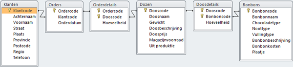
```

De klantgegevens staan in de tabel [Klanten]{.varname}. De orders van de klanten worden opgeslagen in de tabellen [Orders]{.varname} en [Orderdetails]{.varname}. De gegevens van een doos bonbons, bijvoorbeeld naam en prijs, staan in de tabel [Dozen]{.varname}. In de tabel [Doosdetails]{.varname} staat welke bonbons en hoeveel daarvan in elke doos zitten. De tabel [Bonbons]{.varname} bevat gegevens over de naam van de bonbons, het chocoladetype, de vulling en bevat zelfs een plaatje.

::: {.info data-latex=""}
Iedere tabel in de database moet een veld of een combinatie van velden hebben waarmee je elke regel in de tabel uniek kunt identificeren. Dit is vaak een nummer, zoals artikelnummer, personeelsnummer. In de database terminologie wordt deze informatie de primaire sleutel van de tabel genoemd. De waarde van de primaire sleutel kan maar één keer voorkomen in de tabel. Dubbele waarden voor de primaire sleutel zijn dus verboden. De meeste tabellen hebben een primaire sleutel die uit één veld bestaat, maar soms is een combinatie van velden nodig om tot een unieke combinatie te komen. In de tabellen [Klanten]{.varname}, [Orders]{.varname}, [Dozen]{.varname} en [Bonbons]{.varname} bestaat de sleutel uit 1 veld. En in de tabellen [Orderdetails]{.varname} en [Doosdetails]{.varname} vormen twee velden samen de sleutel. Zie figuur \@ref(fig:example-db-design).
:::

De zes tabellen worden hierna kort besproken.

#### Tabel Klanten {-#explore-tabel-klanten}

```{r table-customers, fig.cap="Tabel Klanten."}
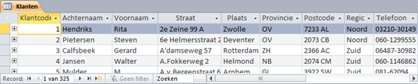
```

In de tabel [Klanten]{.varname} worden verschillende gegevens van een klant bijgehouden. Iedere klant heeft een unieke klantcode. Het veld [Klantcode]{.varname} is de primaire sleutel van de tabel. Iedere regel uit een tabel heet ook wel een record. De klanten zijn gesorteerd op de waarden in het sleutelveld.

Ga na dat er 325 klanten in de tabel [Klanten]{.varname} zitten.

#### Tabel Orders {-#explore-tabel-orders}

```{r table-orders, fig.cap="Tabel Orders.", out.width="60%"}
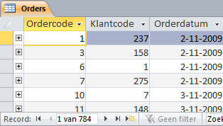
```

In de tabel [Orders]{.varname} is [Ordercode]{.varname} de primaire sleutel, de waarde van [Ordercode]{.varname} is uniek. Een bepaalde klantcode kan in deze tabel wel vaker voorkomen omdat een klant meerdere orders kan plaatsen. Een order hoort altijd bij één klant.

Ga na dat er 784 orders in de tabel [Orders]{.varname} zitten.

#### Tabel Orderdetails {-#explore-tabel-orderdetails}

```{r table-orderdetails, fig.cap="Tabel Orderdetails.", out.width="60%"}
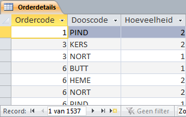
```

Een order kan meerdere dozen bevatten, maar in een order kan elke dooscode slechts één keer voorkomen. Wel kan een bepaalde doos in meerdere orders besteld zijn, zodat een dooscode bij meerdere ordercodes kan horen. De tabel [Orderdetails]{.varname} bevat 1537 records (orderregels).

Ga na dat op de order met ordercode 3 twee verschillende dozen besteld zijn, want de tabel bevat twee regels met ordercode 3. In totaal zijn drie dozen besteld op deze order, twee dozen met de dooscode KERS en 1 doos met de dooscode NORT.

De combinatie van [Ordercode]{.varname} en [Dooscode]{.varname} is steeds uniek. Daarom bestaat de sleutel in de tabel [Orderdetails]{.varname} uit de combinatie van deze twee velden.

::: {.info data-latex=""}
Het totale aantal bestelde dozen op alle orders is de som van alle getallen uit de kolom [Hoeveelheid]{.varname}. Dit aantal is in de tabel niet af te lezen. In een ander onderdeel in deze cursus wordt uitgelegd hoe je dit kunt laten berekenen.
:::

#### Tabel Dozen {-#explore-tabel-dozen}

```{r table-boxes, fig.cap="Tabel Dozen."}
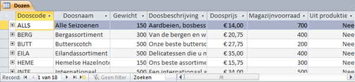
```

In de tabel [Dozen]{.varname} is [Dooscode]{.varname} de sleutel. Er zijn in totaal 18 soorten dozen die ieder een unieke dooscode hebben. Deze tabel vormt het artikelbestand van het bedrijf Snoopy.

#### Tabel Doosdetails {-#explore-tabel-doosdetails}

```{r table-boxdetails, fig.cap="Tabel Doosdetails", out.width="60%"}
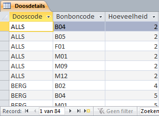
```

In de tabel [Doosdetails]{.varname} wordt bijgehouden welke soorten bonbons en hoeveel daarvan in een bepaalde doos zitten. Zo kun je aflezen dat in de doos ALLS zes soorten bonbons zitten, van elk twee stuks, totaal dus twaalf bonbons. In deze tabel bestaat de sleutel uit de combinatie van de velden [Dooscode]{.varname} en [Bonboncode]{.varname}.

#### Tabel Bonbons {-#explore-tabel-bonbons}

```{r table-pralines, fig.cap="Tabel Bonbons."}
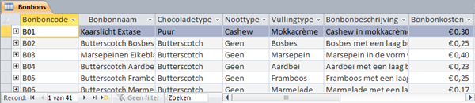
```

In de tabel [Bonbons]{.varname} wordt van elke bonbonsoort een aantal eigenschappen bijgehouden. De sleutel is het veld [Bonboncode]{.varname}. De tabel bevat 41 records (bonbonsoorten).

Aan de hand van de gegevens uit de tabellen kun je gemakkelijk een aantal berekeningen maken.

1. Wat is het gemiddelde aantal bonbonsoorten per doos? Hiervoor moet je het totaal aantal records in de tabel [Doosdetails]{.varname} delen door het totaal aantal doossoorten. Dus $\frac{84}{18}= 4,7$.

2. Wat is het gemiddelde aantal doossoorten per order? Hiervoor moet je het totaal aantal orderregels delen door het totaal aantal orders. Dus $\frac{1537}{784}$ = 2,0. 

Het gemiddeld aantal bonbons in een doos kun je niet zomaar uitrekenen. Hiervoor zou je het totaal aantal bonbons in alle dozen moeten weten. Dit is de som van alle getallen in de kolom [Hoeveelheid]{.varname} in de tabel [Doosdetails]{.varname}.

## Beveiliging en macro's {#explore-security}

Sommige databases zoals snoep365 bevatten macro's. Deze zijn in de meeste gevallen gemaakt om bepaalde taken in de database uit te voeren. Maar virusmakers kunnen deze mogelijkheden ook gebruiken om een virus te verspreiden. Wanneer een dergelijke database niet op een vertrouwde locatie staat of ondertekend is door een vertrouwde uitgever, dan toont Access bij het openen van de database een beveiligingswaarschuwing. De macro's in de database zijn dan uitgeschakeld.

```{r security-warning, fig.cap="Beveiligingswaarschuwing bij het openen van een database met macro's."}
knitr::include_graphics("images/common/security-warning.png")
```

Je kunt de macro's op een van de volgende manieren inschakelen.

#### Macro's eenmalig inschakelen {-}

Klik in het gebied met de beveiligingswaarschuwing op de knop [Inhoud inschakelen]{.uicontrol}.

Deze methode wordt niet aanbevolen omdat je iedere keer wanneer je de database opent deze waarschuwing krijgt en steeds weer opnieuw moet aangeven dat de macro's ingeschakeld moeten worden.

#### Uitgever toevoegen aan lijst met vertrouwde uitgevers {-}

Wanneer de maker van de database deze van een digitaal certificaat heeft voorzien, dan kun je de maker toevoegen aan de lijst met Vertrouwde uitgevers. Access schakelt dan automatisch alle macro's in die door deze maker gemaakt zijn, in alle databases. Dit is een heel veilige methode, maar meestal gebruiken alleen de grotere bedrijven een digitaal certificaat. De database snoep365 is niet van een certificaat voorzien.

#### Database op een vertrouwde locatie plaatsen {-}

Access kent vertrouwde locaties (mappen). Access schakelt automatisch alle macro's in van alle databases die op een vertrouwde locatie staan. Dit is de meest gemakkelijke manier om veilig te werken en niet voortdurend door beveiligingswaarschuwingen gestoord te worden en wordt ook aanbevolen voor de database snoep365. Voer deze actie als volgt uit.

Kies [Bestand > Opties > Vertrouwenscentrum > Instellingen voor het Vertrouwenscentrum > Vertrouwde locaties > Nieuwe locatie toevoegen]{.uicontrol}.

```{r security-trusted-location, fig.cap="Dialoogvenster Vertrouwde locatie van Microsoft Office", out.width="60%"}
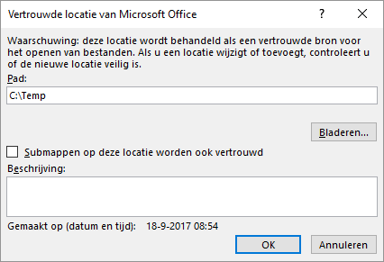
```

In het voorbeeldscherm wordt de map [C:\\Temp]{.filepath} als vertrouwde locatie toegevoegd..

#### Beveiliging voor alle macro's instellen

Eventueel kun je de manier wijzigen waarop Access met alle macro's in alle databases omgaat. Voer deze actie als volgt uit.

Kies [Bestand > Opties > Vertrouwenscentrum > Instellingen voor het Vertrouwenscentrum > Macro-instellingen]{.uicontrol}.

```{r security-trust-center, fig.cap="Dialoogvenster vertrouwenscentrum.", out.width="75%"}
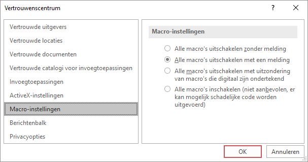
```

Het wordt niet aanbevolen om alle macro's in te schakelen, je bent dan de controle over de beveiliging kwijt.

## Database verkennen {#explore-database}

Voor deze verkenning moet je het bestand [snoep365.accdb]{.filepath} geopend hebben.

::: {.indo data-latex=""}
Wanneer er een beveiligingswaarschuwing getoond wordt moet je actie ondernemen, zie hiervoor \@ref(explore-security).
:::

```{r explore-access-window, fig.cap="Venster Access met database snoep365 met de groep Tabellen geopend.", out.width="75%"}
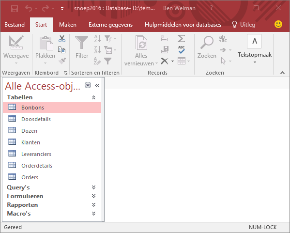
```

Het navigatievenster staat links en hierin zijn alle objecten van de database te vinden. De objecten worden onderverdeeld in groepen: [Tabellen]{.uicontrol}, [Query's]{.uicontrol}, [Formulieren]{.uicontrol}, [Rapporten]{.uicontrol}, [Macro's]{.uicontrol}. In figuur \@ref(fig:explore-access-window) is het venster van de groep [Tabellen]{.uicontrol} opengevouwen. Het navigatievenster zelf en de vensters voor de groepen kunnen open- en dichtgevouwen worden.

+  - selectie getoonde objecten

+ 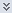 - groep openvouwen

+  - groep dichtvouwen

+ 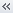 - navigatievenster dichtvouwen

+ 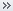 - navigatievenster openvouwen

Door dubbelklikken op een object in het navigatievenster wordt het object geopend en in het documentvenster getoond. Wanneer je nog meer objecten opent, dan toont Access deze standaard in de vorm van tabbladen.

```{r document-tabs, fig.cap="Documentvenster met de tabellen Klanten en Orders in tabbladen.", out.width="50%"}
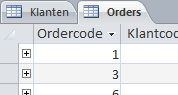
```

::: {.info data-latex=""}
Je kunt de manier waarop de objecten getoond worden wijzigen via [Bestand > Opties > Huidige database]{.uicontrol}. In figuur \@ref(fig:document-window-options) zie je de mogelijkheden voor de documentvensters.

```{r document-window-options, fig.cap="Opties voor documentvensters.", out.width="40%"}
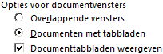
```

Wanneer je voor [Overlappende vensters]{.uicontrol} kiest, dan worden de objecten in een eigen venster getoond, waarbij de vensters boven elkaar liggen.
:::

Wanneer je meer ruimte in de breedte nodig hebt dan kun je het navigatievenster dichtvouwen. Heb je meer ruimte in de lengte nodig, dan kun je het lint verbergen door dubbel te klikken op een tab. Opnieuw dubbelklikken zorgt er voor dat het lint weer zichtbaar wordt.

## Taak: Tabel verkennen {#explore-tables}

Tabellen zijn de belangrijkste onderdelen van een database, want hierin zijn alle gegevens opgeslagen.

De twee belangrijkste weergaven van een tabel zijn:

Gegevensbladweergave
: In deze weergave kun je de inhoud van de records zien, deze wijzigen en ook kun je nieuwe records toevoegen.

Ontwerpweergave
: In deze weergave kun je het ontwerp van de tabel zien en deze aanpassen.

::: {.practice data-latex=""}
1. Open zonodig database [snoep365.accdb]{.filepath}.

2. Open de tabel [Klanten]{.varname}. De tabel wordt in de [Gegevensbladweergave]{.uicontrol} geopend.

3. Zet de tabel [Klanten]{.varname} in de Ontwerpweergave op een van de volgende manieren:

   + Klik rechtsonder in het programmavenster op de knop 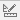.
   + Kies [tab Start > Weergave (groep Weergaven) > Ontwerpweergave]{.uicontrol}.
   + Rechter muisklik op de tabelnaam in het navigatievenster en dan [Ontwerpweergave]{.uicontrol}.

4. Zet de tabel [Klanten]{.varname} weer in de [Gegevensbladweergave]{.uicontrol} op een van de volgende manieren:

   + Klik rechtsonder in het programmavenster op de knop 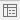.
   + Kies [tab Start > Weergave (groep Weergaven) > Gegevensbladweergave]{.uicontrol}.
   + Rechter muisklik op de tabelnaam in het navigatievenster en dan [Openen]{.uicontrol}.

5. Sluit de tabel [Klanten]{.varname} via de sluitknop [X]{.uicontrol} rechtsboven in het documentvenster.

6. Open de tabel [Orders]{.varname} in de [Gegevensbladweergave]{.uicontrol}.

::: {.info data-latex=""}
In de tabel [Orders]{.varname} staat voor de records een uitklapknopje [+]{.uicontrol}. Door hierop de klikken worden de detailgegevens van de order zichtbaar. Deze detailgegevens komen uit de tabel [Orderdetails]{.varname}. Dat bij een bepaalde order de bijbehorende orderdetails gevonden kunnen worden komt omdat in beide tabellen het veld [Ordercode]{.varname} voorkomt.
:::

7. Klik voor een paar records op het uitklapknopje om te zien welke dozen en hoeveel daarvan op deze order geleverd zijn.

```{r table-orders-details3, fig.cap="Orderdetails van order 3.", out.width="60%"}
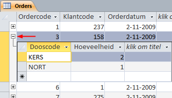
```

8. Sluit de tabel [Orders]{.varname}.
:::

## Taak: Formulier verkennen {#explore-forms}

Formulieren zijn vooral van belang bij het tonen, toevoegen en bewerken van gegevens.

De belangrijkste weergaven van een formulier zijn:

Formulierweergave
: In deze weergave worden de gegevens getoond en kun je deze bewerken en invoeren.

Gegevensbladweergave
: Een weergave die op die van de tabel lijkt

Ontwerpweergave
: In deze weergave kun je het ontwerp van het formulier zien en deze aanpassen.

::: {.practice data-latex=""}
1. Open zonodig database [snoep365.accdb]{.filepath}.

2. Open het formulier [Bonbons]{.varname}. Het formulier wordt in de Formulierweergave geopend.

```{r form-pralines-form-view, fig.cap="Formulier bonbons in formulierweergave. De gegevens van het eerste record worden weergegeven.", out.width="70%"}
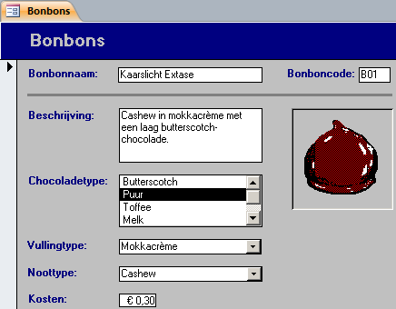
```

3. Zet het formulier [Bonbons]{.varname} in de [Ontwerpweergave]{.uicontrol} op een van de volgende manieren:

   + Klik rechtsonder in het programmavenster op de knop .
   + Kies [tab Start > Weergave (groep Weergaven) > Ontwerpweergave]{.uicontrol}.
   + Rechter muisklik op de formuliernaam in het navigatievenster en dan [Ontwerpweergave]{.uicontrol}.
   
```{r form-pralines-design-view, fig.cap="Formulier bonbons in ontwerpweergave.", out.width="70%"}
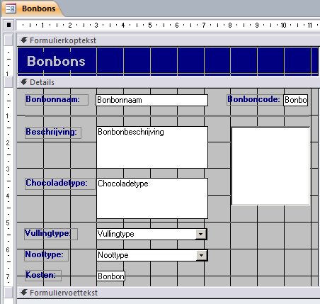
```

::: {.info data-latex=""}
In de ontwerpweergave kun je het formulier opmaken en besturingselementen toevoegen zoals tekstvakken, labelvakken, keuzelijsten, aankruisvakjes, enz.
:::

4. Zet het formulier [Bonbons]{.varname} weer in de Formulierweergave.

5. Blader door de records met de navigatieknoppen linksonder in het documentvenster.

   + 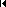 -Eerste record

   + 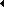 - Vorige record

   +  - Volgende record

   + 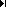 - Laatste record

   + 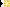 - Nieuw (leeg) record

6. Sluit het formulier.
:::

## Taak: Opdrachtknop gebruiken {#explore-commandbutton}

Het formulier [Dozen]{.varname} kan, behalve voor de invoer van gegevens, ook gebruikt worden voor het bekijken van gegevens. Op dit formulier staat een knop met de tekst [Verkoop]{.varname}.

::: {.practice data-latex=""}
1. Open zonodig database [snoep365.accdb]{.filepath}.

2. Open het formulier [Dozen]{.varname}.

3. Klik in het formulier op de knop [Verkoop]{.varname}. Het formulier [Doosverkoop]{.varname} wordt nu getoond. Je ziet nu alle orders die betrekking hebben op de geselecteerde doos uit het formulier [Dozen]{.varname} en zelfs de totale verkoop van deze doos.

4. Sluit alle formulieren.
:::

## Taak: Record zoeken {#explore-search-records}

Een formulier kan ook gebruikt worden om een record te zoeken. In de volgende stappen worden dozen met "herfst" in de naam opgezocht.

::: {.practice data-latex=""}
1. Open zonodig database [snoep365.accdb]{.filepath}.

2. Open het formulier [Dozen]{.varname}.

3. Klik in het veld [Doosnaam]{.varname} en kies in het lint [tab Start >]{.uicontrol} 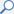 [Zoeken (groep Zoeken)]{.uicontrol}. Het dialoogvenster [Zoeken en vervangen]{.wintitle} verschijnt.

4. Typ [herfst]{.userinput} in het vak [Zoeken naar]{.uicontrol} en selecteer bij [Waar:]{.uicontrol} de keuze [Gedeelte van veld]{.uicontrol}.

```{r find-replace-dialogbox, fig.cap="Dialoogvenster zoeken en vervangen."}
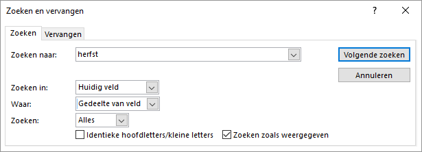
```

5. Klik op [Volgende zoeken]{.uicontrol}. De inhoud van de doos Herfstverrassing wordt getoond.

6. Klik op [Annuleren]{.uicontrol} om het zoekvenster te sluiten.

7. Sluit het formulier.
:::

## Taak: Query verkennen {#explore-queries}

Query's zijn van belang wanneer je gegevens uit tabellen wil selecteren of samenvatten. Een query is eigenlijk een gespecificeerde vraag aan de database om bepaalde informatie aan te leveren.

De twee belangrijkste weergaven van een query zijn:

Gegevensbladweergave
: In deze weergave kun je de inhoud van de query zien.

Ontwerpweergave
: In deze weergave kun je het ontwerp van de query zien en deze aanpassen.

::: {.practice data-latex=""}
1. Open zonodig database [snoep365.accdb]{.filepath}.

2. Open de query [Bonbons per doos]{.varname}.

::: {.info data-latex=""}
 Access voert de query uit en produceert een gegevensblad met daarin de resultaten van de query, zie figuur \@ref(fig:query-pralines-box-datasheet).
 
De resultaten van deze query zijn uit meerdere tabellen afkomstig. Om te weten welke tabellen gebruikt worden moet de query in de ontwerpweergave gezet worden.
:::

```{r query-pralines-box-datasheet, fig.cap="Query bonbons per doos in gegevensbladweergave.", out.width="75%"}
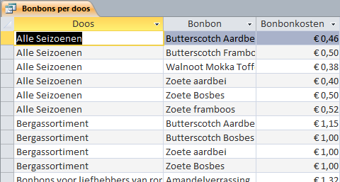
```

3. Zet de query [Bonbons per doos]{.varname} in de Ontwerpweergave op een van de volgende manieren:

   + Klik rechtsonder in het programmavenster op de knop .
   + Kies [tab Start > Weergave (groep Weergaven) > Ontwerpweergave]{.uicontrol}.
   + Rechter muisklik op de querynaam in het navigatievenster en dan [Ontwerpweergave]{.uicontrol}.

```{r query-pralines-box-design, fig.cap="Query bonbons per doos in ontwerpweergave.", out.width="75%"}
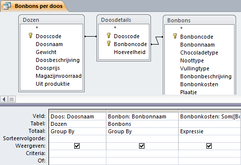
```

::: {.info data-latex=""}
In het bovenste deel van het venster zie je de tabellen die voor deze query gebruikt zijn. De lijn met pijltjes verbinden de veldnamen waarmee de tabellen aan elkaar gerelateerd zijn.

In het onderste deel van het venster tref je in de eerste rij de namen van de gebruikte velden aan. In de derde kolom staat een expressie, een soort formule waarmee bewerkingen op de velden worden uitgevoerd. De hier geformuleerde expressie is `Som([Bonbons].[Bonbonkosten]*[Doosdetails].[Hoeveelheid])`. Tussen de blokhaken staan de namen van de tabellen en velden.

Om de expressie in zijn geheel te kunnen zien kun je de kolom breder maken door de kolomrand naar rechts te slepen.
:::

4. Zet de query in de Gegevensbladweergave.

5. Sluit de query.
:::

## Taak: Rapport verkennen {#explore-reports}

Met rapporten kun je de informatie uit de tabellen mooi opgemaakt op het scherm tonen of op papier afdrukken. De getoonde gegevens kunnen afkomstig zijn uit meerdere tabellen en/of query's. Ook berekende waarden zijn mogelijk. Verder kun je een rapport opmaken met titels, kopjes en kop- en voetregels.

De belangrijkste weergaven van een rapport zijn:

Rapportweergave
: In deze weergave kun je de inhoud van het rapport zien.

Afdrukvoorbeeld
: De weergave van het rapport wanneer deze wordt afgedrukt.

Ontwerpweergave
: In deze weergave kun je het ontwerp van het rapport zien en deze aanpassen.

::: {.practice data-latex=""}
1. Open zonodig database [snoep365.accdb]{.filepath}.

2. Open het rapport [Bonbons per doos]{.varname}. Het rapport wordt in de Rapportweergave geopend.

```{r report-pralines-box-report, fig.cap="Rapport bonbons per doos in rapportweergave.", out.width="70%"}
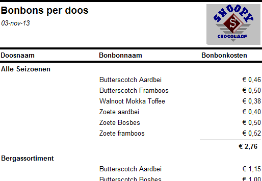
```

3. Zet het rapport [Bonbons per doos]{.varname} in Afdrukvoorbeeld op een van de volgende manieren:

   + Klik rechtsonder in het programmavenster op de knop 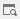.
   + Kies[tab Start > Weergave (groep Weergaven) > Afdrukvoorbeeld]{.uicontrol}.
   + Rechter muisklik op de rapportnaam in het navigatievenster en dan [Afdrukvoorbeeld]{.uicontrol}.

4. Zet het rapport [Bonbons per doos]{.varname} in de Ontwerpweergave.

```{r report-pralines-box-design, fig.cap="Rapport bonbons per doos in ontwerpweergave.", out.width="70%"}
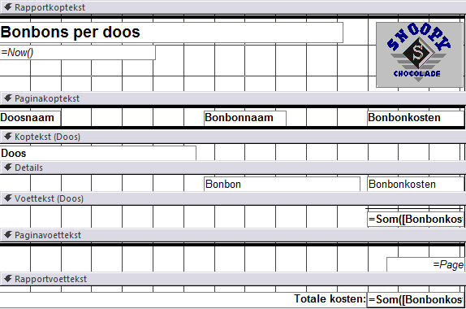
```

::: {.info data-latex=""}
In de ontwerpweergave lijkt het rapport veel op een formulier en kun je het rapport opmaken en besturingselementen toevoegen zoals tekstvakken, labelvakken, keuzelijsten, aankruisvakjes, enz.
:::

5. Zet het rapport weer in de Rapportweergave.

6. Sluit het rapport
:::

## Taak: Sorteren {#explore-sorting}

Je kunt de records in een tabel sorteren op basis van de waarden in een of meerdere velden. Het sorteren kan zowel in oplopende als aflopende volgorde.

In de volgende oefening moet de tabel [Klanten]{.varname} gewijzigd worden zodat een overzicht ontstaat van eerst de plaats, dan de achternaam en dan de voornaam.

```{r table-customers-sorted, fig.cap="Tabel klanten gesorteerd eerst op plaats, dan op achternaam en vervolgens op voornaam."}
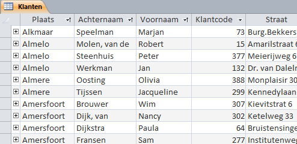
```

::: {.practice data-latex=""}
1. Open zonodig database [snoep365.accdb]{.filepath}.

2. Open de tabel [Klanten]{.varname}. De tabel wordt in de Gegevensbladweergave geopend.

3. Selecteer de kolom [Plaats]{.varname} via een klik op de kop van de kolom en sleep de kolom naar links zodat dit de eerste kolom in de tabel wordt.

4. Verplaats op dezelfde manier de kolommen [Achternaam]{.varname} en [Voornaam]{.varname} naar respectievelijk de 2e en 3e positie in de tabel.

5. Klik in de kolom [Plaats]{.varname} op het pijltje aan de rechterkant van de kolomkop en kies uit het snelmenu voor [Sorteren van A naar Z]{.uicontrol}.

::: {.info data-latex=""}
Access reorganiseert de records in alfabetische volgorde op plaatsnaam en toont een klein naar boven wijzend pijltje (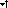) aan de rechterkant van de kolomkop om de sorteervolgorde aan te geven.
:::

6. Hef de sortering op via [tab Start > Sorteeracties verwijderen (groep Sorteren en filteren)]{.uicontrol}.

7. Om op meerdere velden te sorteren selecteer je de kolommen [Plaats]{.varname}, [Achternaam]{.varname} en [Voornaam]{.varname}.

8. Kies [tab Start > Oplopend]{.uicontrol} 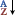 [(groep Sorteren en filteren)]{.uicontrol}.

::: {.info data-latex=""}
Access reorganiseert nu de records in oplopende alfabetische volgorde eerst op plaatsnaam, dan op achternaam en dan op voornaam. Aan de rechterkant van elk van deze drie kolomkoppen is nu het kleine naar boven wijzende pijltje te zien, zie figuur \@ref(fig:table-customers-sorted).
:::

9. Sluit de tabel [Klanten]{.varname} en kies bij de vraag om de wijzigingen op te slaan voor [Nee]{.uicontrol}.
:::

## Taak: Filteren {#explore-filtering}

Filteren is een actie waarbij records in een tabel getoond worden die aan bepaalde voorwaarden voldoen. Er zijn meerdere manieren om een filter in een tabel toe te passen. Een paar methodes komen in de volgende oefeningen aan de orde.

#### Eenvoudig filter {-}

Informatiebehoefte: Toon alle bonbons met het chocoladetype Wit.

::: {.practice data-latex=""}
1. Open zonodig database [snoep365.accdb]{.filepath}.

2. Open de tabel [Bonbons]{.varname}. De tabel wordt in de Gegevensbladweergave geopend.

3. Klik in de kolom [Chocoladetype]{.varname} op een waarde Wit.

4. Kies [tab Start > knop Selectie (groep Sorteren en filteren) > Is gelijk aan Wit]{.uicontrol}.

::: {.info data-latex=""}
Access toont nu de records (4 stuks) waarvan het chocoladetype Wit is. Dat op de tabel een filtering is toegepast kun je zien:

+ Aan de rechterkant van de kolomkop [Chocoladetype]{.varname} staat een symbool van een filter: 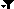
+ In de statusbalk zie je 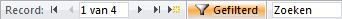
:::

:::

#### Wijziging filter {-}

Informatiebehoefte: Toon alle bonbons met het chocoladetype Melk.

Hiervoor wordt het vorige filter gewijzigd.

::: {.practice data-latex=""}
1. Klik op het filtersymbool aan de rechterkant in de kolomkop [Chocoladetype]{.varname}.

```{r filter-chocolatetype, fig.cap="Dialoogvenster filter.", out.width="50%"}
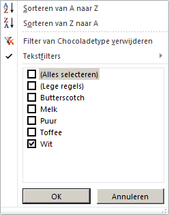
```

2. Selecteer in het dialoogvenster type Melk en deselecteer type Wit. Klik dan op [OK]{.uicontrol}. Er worden nu 18 records getoond met chocoladetype Melk.

::: {.info data-latex=""}
De opties die in figuur \@ref(fig:filter-chocolatetype) getoond worden hangen af van het type veld. Bij een tekstveld is er een submenu [Tekstfilters]{.uicontrol} en bij een numeriek veld is er een submenu [Getalfilters]{.uicontrol}.
:::

:::

#### Filter op 2 criteria {-}

Informatiebehoefte: Toon alle bonbons met het chocoladetype Melk en vullingtype Marsepein.

Hiervoor wordt een tweede selectiecriterium toegevoegd.

::: {.practice data-latex=""}
1. Klik in de kolom [Vullingtype]{.varname} op een waarde Marsepein.

2. Kies [tab Start > knop Selectie (groep Sorteren en filteren) > Is gelijk aan Marsepein]{.uicontrol}.

   Access toont nu 3 records met chocoladetype Melk en met vullingtype Marsepein.

3. Maak filtering ongedaan via [tab Start > knop]{.uicontrol} 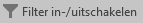 [(groep Sorteren en filteren)]{.uicontrol}.

::: {.info data-latex=""}
De filtering is nu opgeheven en alle records worden weer getoond.

De filtering wordt ook opgeheven door klikken op de knop [Gefilterd]{.uicontrol} in de statusbalk. De tekst op de knop verandert dan in [Niet gefilterd]{.uicontrol}. Door hier weer op te klikken wordt het laatst gebruikte filter toegepast.
:::

:::

#### Getalfilter {-}

Informatiebehoefte: Toon alle bonbons met kosten van € 0,25 t/m € 0,35.

::: {.practice data-latex=""}
1. Klik op het pijlpuntje aan de rechterkant in de kolomkop [Bonbonkosten]{.varname} en kies dan [Getalfilters > Tussen...]{.uicontrol}.

```{r filter-number-between, fig.cap="Dialoogvenster getalfilter Tussen getallen.", out.width="60%"}
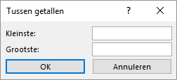
```

2. Voer in bij [Kleinste]{.uicontrol} 0,25 en bij [Grootste]{.uicontrol} 0,35 en klik dan op [OK]{.uicontrol}. Er worden nu 22 records getoond met bonbonkosten van 0,25 t/m 0,35.

3. Sluit de tabel [Bonbons]{.varname} en kies bij de vraag om de wijzigingen op te slaan voor [Nee]{.uicontrol}.
:::

## Afdrukken van Access onderdelen {#explore-printing}

Voor het afdrukken maakt Access gebruik van de printers die onder Windows beschikbaar zijn.

Afhankelijk van de gebruikte weergave van een Access object kan het resultaat afgedrukt worden. Zo kan bij tabellen en query's de gegevensbladweergave afgedrukt worden, bij rapporten de rapportweergave en bij formulieren de formulierweergave.

::: {.info data-latex=""}
Er is geen optie voor het afdrukken van de ontwerpweergave, maar Access heeft een hulpmiddel genaamd [Databasedocumentatie]{.uicontrol} waarmee je de ontwerp eigenschappen van de database objecten kunt afdrukken.
:::

De afdrukopties zijn beschikbaar via [Bestand > Afdrukken]{.uicontrol}. Je hebt dan de volgende mogelijkheden:

```{r print-options, fig.cap="Afdrukopties in Access.", out.width="60%"}
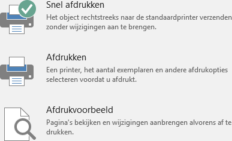
```

Via de keuze [Afdrukvoorbeeld]{.uicontrol} zijn er een aantal instellingen mogelijk, zoals paginaformaat, afdrukstand en marges.


## Opgaven {#explore-exercises}

```{r, child='exercises/ex-explore.Rmd'}
```

