# Tabellen {#tables}

::: {.intro data-latex=""}
+ Inrichting van tabellen en relaties tussen tabellen.
+ De verschillende manieren om tabellen te maken.
+ Eigenschappen van velden.
+ Validatie van de invoer van gegevens via invoermaskers en validatieregels.
+ Begrijpen wat referentiële integriteit inhoudt.
:::

## Over tabellen {#tables-about}

In een database worden gegevens opgeslagen in tabellen. De tabellen zelf bestaan uit velden voor de verschillende gegevens. Zo kan er een veld zijn voor de achternaam van een persoon en een ander veld voor de voornaam. De gegevens kunnen op verschillende manieren worden weergegeven maar zijn altijd opgeslagen in tabellen. In de praktijk maak je eerst een informatieanalyse om te bepalen welke tabellen en welke velden je nodig hebt. Dit wordt bij de wat grotere databases vastgesteld via een proces dat normaliseren heet. Naast de tabellen zelf moeten er meestal ook relaties tussen de tabellen gelegd worden, zodat gegevens uit de ene tabel gekoppeld kunnen worden aan gegevens in een andere tabel.

Met lege tabellen kun je niets. Dus zullen gegevens in tabellen ingevoerd moeten worden. Wanneer deze gegevens al beschikbaar zijn in andere bestanden, zoals een Excel werkblad, dan is het importeren vanuit Excel ook een mogelijkheid.

## Velden in tabellen {#tables-fields}

Velden vormen de ontwerponderdelen van een tabel. Gegevens worden in de velden opgeslagen. De eigenschappen van een veld bepalen de kenmerken en het gedrag van de gegevens die in het veld worden opgeslagen. Voor het maken van een veld is nodig:

+ Veldnaam (verplicht)
+ Gegevenstype (verplicht)
+ Beschrijving (optioneel)

### Veldnamen {-#tables-fields-names}

Het ontwerp van de database bepaalt welk soort gegevens in een veld wordt opgeslagen. Meestal hebben de velden daarin al een naam gekregen en neem je die naam over. Zorg altijd voor zinvolle namen. Weliswaar kun je ook een beschrijving bij een veld zetten, maar een duidelijke naam werkt nog altijd het beste.

Voor een veldnaam gelden de volgende eisen:

+ naam moet uniek zijn binnen de tabel
+ naam mag niet met een spatie beginnen
+ naam mag niet de volgende tekens bevatten: punt, uitroepteken en blokhaken [ en ]

### Gegevenstype {-#tables-fields-datatypes}

De belangrijkste eigenschap van een veld is het gegevenstype, omdat hiermee wordt bepaald welk soort gegevens in het veld kunnen staan. Gegevenstypen kunnen soms verwarrend zijn. Een veld van het gegevenstype `Tekst` kan bijvoorbeeld zowel tekst als cijfers (numerieke gegevens) bevatten, maar een veld van het gegevenstype `Numeriek` kan alleen numerieke gegevens bevatten. Wanneer je niet weet welke van deze twee gegevenstypen je moet gebruiken hanteer dan de volgende vuistregel:

Wanneer er met de inhoud van het veld gerekend moet worden, dan moet het gegevenstype `Numeriek` zijn. Zo is het veld voor de prijs van een artikel een numeriek veld en wordt het artikelnummer in een tekstveld opgeslagen.

De gegevenstypes in Access zijn:

|Gegevenstype|Waarden|Toelichting|
|------------|-------|-----------|
|`Korte tekst`|Alfanumeriek|Voor korte tekst, alfanumerieke waarden, maximaal 255 tekens.|
|`Lange tekst`| |Voor lange tekst, tot 1 GB. Voorheen bekend als Memo|
|`Getal`|Numeriek|Bereik van -2^31 tot 2^31 - 1.|
|`Groot getal`| |Bereik van -2^63 tot 2^63 - 1.|
|`Datum/tijd`|Datum- en tijdwaarden| |
|`Valuta`|Valutawaarden| |
|`Autonummering`|Nummers (uniek)|Nummers die automatisch gegenereerd worden voor elk record. Standaard is de veldlengte `Lange integer`. Autonummering wordt vaak als sleutelveld gebruikt.|
|`Ja/nee`|Ja of Nee|Boolean waarden, slechts twee waarden mogelijk, Ja of Nee. Op de achtergrond gebruikt Access de waarde -1 voor alle Ja-waarden en de waarde 0 voor alle Nee-waarden. Je gebruikt dit veld ook voor waarden als WAAR/ONWAAR, of AAN/UIT.|
|`OLE-object`|Objecten uit andere Windows programma's|Foto's, afbeeldingen, grafieken, Excel werkblad, Word document, ...|
|`Hyperlink`|Hyperlinks|Hyperlinks (ook email adressen).|
|`Bijlage`|Pad en naam van een bestand|Bestanden. Meerdere bestanden per bijlage is mogelijk.|
|`Berekend`|Verschillend|Expressie die gegevens uit een of meer velden gebruikt.|

::: {.info data-latex=""}
In Access kun je het gegevenstype van een veld ook zetten op `Wizard Opzoeken...`. Deze wizard helpt je om een opzoekveld te maken. Een opzoekveld toont of een lijst met waarden afkomstig uit een tabel of een query, of een lijst met waarden die je zelf invoert.
:::

### Eigenschappen van een veld {-#tables-fields-properties}

Bij een bepaald gegevenstype kun je extra veldeigenschappen instellen. Het gegevenstype van het veld bepaalt welke eigenschappen ingesteld kunnen worden. De belangrijkste en meest gebruikte eigenschappen zijn:

Veldlengte
: Van belang bij `Tekst`, `Numeriek` en soms ook bij `AutoNummering`. Voor een tekstveld kun je de maximale lengte van de tekst opgeven. Bij numeriek kun je aangeven welk soort getallen ingevoerd kunnen worden, zoals: `Byte`, `Integer`, `Lange Integer`, `Decimaal`, `Enkel` en `Dubbel`.

Notatie
: Kan bij de meeste gegevenstypes gebruikt worden. Hiermee kun je regelen hoe de inhoud van het veld eruitziet wanneer het wordt weergegeven in tabellen, query's, formulieren en rapporten. Je kunt alle geldige getalnotaties gebruiken en vaak is er ook een lijst met reeds gedefinieerde notaties beschikbaar.

Aantal decimalen
: Van belang bij `Numeriek` en `Valuta`. Hiermee geef je het aantal te gebruiken decimalen op voor de weergave van de getallen.

Standaardwaarde
: Kan bij de meeste gegevenstypes gebruikt worden. Hiermee ken je automatisch de opgegeven waarde toe aan dit veld wanneer er een nieuwe record wordt gemaakt. Erg handig wanneer de waarde vaak hetzelfde is. De waarde kan daarna weer gewijzigd worden.

Vereist
: Kan bij de meeste gegevenstypes gebruikt worden. De mogelijke waarden zijn Nee (standaard) en Ja.

::: {.info data-latex=""}
Een speciale rol vervullen de gegevenstypes `Invoermasker`, `Validatieregel` en `Validatietekst`. Deze kunnen gebruikt worden bij de validatie van gegevens waarmee je kunt regelen dat de invoer van gegevens aan bepaalde voorwaarden voldoet.
:::

### Veldlengte gegevenstype Getal {-#tables-fields-size}

Mogelijke waarden voor de veldlengte van het gegevenstype getal.

+ `Byte`: Voor gehele getallen tussen 0 en 255
+ `Integer`: Voor gehele getallen lopend van -32.768 t/m 32.767
+ `Lange integer`: Voor gehele getallen lopend van -2.147.483.648 t/m 2.147.483.647
+ `Enkel`: Voor decimale getallen lopend van -3,4 x 1038 t/m 3,4 x 1038 met maximaal 7 significante cijfers.
+ `Dubbel`: Voor decimale getallen lopend van -1,797 x 10308 en 1,797 x 10308 met maximaal 15 significante cijfers.
+ `Decimaal`: Voor decimale getallen lopend van tussen -9,999... x 1027 en 9,999... x 1027

## Validatie {#tables-validation}

Om er voor te zorgen dat een gebruiker gegevens op een bepaalde manier invoert kun je gebruik maken van een invoermasker. Daarnaast kun je nog via een validatieregel controleren of de ingevoerde waarde aan bepaalde eisen voldoet en zo niet via een validatietekst de gebruiker hierop wijzen.

### Invoermaskers {-#tables-fields-inputmasks}

Een invoermasker zorgt voor een vaste, verplichte indeling voor de invoer van gegevens in een veld. Een invoermasker bestaat uit een serie tekens en symbolen. De in te voeren gegevens moeten aan het patroon van het masker voldoen. Zo kun je er bijvoorbeeld voor zorgen dat een telefoonnummer uit precies 10 cijfers bestaat. Invoermaskers zijn mogelijk voor de gegevenstypen `Tekst`, `Numeriek`, `Valuta` en `Datum/tijd`.

Het invoermasker bepaalt ook het aantal tekens dat ingevoerd kan worden. Invoermaskers bestaan uit een verplicht onderdeel en twee optionele onderdelen. De onderdelen worden met een puntkomma gescheiden.

+ Het eerste onderdeel is verplicht. Dit onderdeel bevat het patroon met de tekens en symbolen.
+ Het tweede onderdeel is optioneel en geeft aan of ook de maskertekens moeten worden opgeslagen in het veld. Bij de waarde 0 worden de maskertekens samen met de gegevens opgeslagen. Bij de waarde 1 worden de tekens wel weergegeven maar niet opgeslagen.
+ Het derde onderdeel van het invoermasker is ook optioneel en bevat één teken of spatie dat als tijdelijke plaatsaanduiding wordt gebruikt. Standaard gebruikt Access het onderstrepingsteken (_). Alleen wanneer je een ander teken wilt gebruiken moet je dit teken in het derde gedeelte van het masker opnemen.

::: {.info data-latex=""}
Je kunt opslagruimte in de database besparen door het tweede onderdeel in te stellen op 1.
:::

In de volgende tabel staan de symbolen die in het masker gebruikt mogen worden en hun betekenis.

|Symbool|Betekenis|
|-------|---------|
|0|Gebruiker moet een cijfer (0 t/m 9) invoeren.|
|9|Gebruiker mag een cijfer (0 t/m 9) invoeren.|
|\#|Gebruiker kan een cijfer, een spatie of een plus- of minteken invoeren. Als dit wordt overgeslagen, wordt een spatie ingevoerd.|
|L|Gebruiker moet een letter invoeren.|
|?|Gebruiker mag een letter invoeren.|
|A|Gebruiker moet een letter of een cijfer invoeren.|
|a|Gebruiker mag een letter of een cijfer invoeren.|
|&|Er moet een teken of een spatie ingevoerd worden.|
|C|Gebruiker mag tekens of spaties invoeren.|
|. , : ; - /|Tijdelijke plaatsaanduidingen voor decimalen, duizendtallen, en scheidingstekens voor datum en tijd. Het teken dat je kiest hangt af van de landinstellingen van Windows.|
|\>|Alle tekens die hierop volgen, worden omgezet naar hoofdletters.|
|<|Alle tekens die hierop volgen, worden omgezet naar kleine letters.|
|!|Het invoermasker wordt van links naar rechts opgevuld in plaats van andersom.|
|\\|De tekens die hier rechtstreeks op volgen worden letterlijk weergegeven.|
|""|De tekens die tussen dubbele aanhalingstekens staan worden letterlijk weergegeven.|

Je kunt snel een invoermasker toevoegen via de `Wizard Invoermasker`, maar ook een masker handmatig specificeren door deze in te typen bij de eigenschap invoermasker van het veld. helemaal naar wens een invoermasker samenstellen en dat bij veldeigenschap invoeren.

::: {.demo data-latex=""}
**US telefoonnummer**

Invoermasker: `(999) 000-000;0;-`

Toelichting

+ `(999)` gebruiker kan drie cijfers invoeren voor het kengetal.
+ `000-000` gebruiker moet zes cijfers invoeren.
+ `;0` geeft aan dat de maskertekens samen met de gegevens worden opgeslagen.
+ `;-` geeft aan dat een minteken als tijdelijke plaatsaanduiding wordt gebruikt i.p.v. een onderstrepingsteken.
:::


::: {.demo data-latex=""}
**Postcode**

Invoermasker: `0000\ >LL`

Toelichting

+ `0000` gebruiker moet vier cijfers (0 t/m 9) achter elkaar invoeren.
+ `\` geeft aan dat er een spatie wordt weergegeven. Deze hoeft niet te worden ingevoerd.
+ `>LL` gebruiker moet twee letters invoeren die worden omgezet naar hoofdletters.
:::

### Validatieregel en tekst {-#tables-fields-validationrules}

Met validatieregels kun je beperkingen opleggen aan wat een gebruikers kan invoeren in een bepaald veld. Zo kun je ervoor zorgen dat alleen waarden kunnen worden ingevoerd die aan bepaalde voorwaarden voldoen. Voldoet de invoer niet aan de voorwaarden dan verschijnt een melding op het scherm.

Validatieregel
: Een expressie die Waar moet zijn voor de ingevoerde waarde in het veld. Wanneer je een waarde in het veld invoert of wijzigt, dan controleert Access of de expressie waar is. Zo niet, dan wordt de inhoud van de eigenschapValidatietekst weergegeven. Je moet dan de waarde aanpassen totdat aan de validatieregel voldaan wordt.

Validatietekst
: Hier komt de tekst die aan de gebruiker moet worden weergegeven wanneer deze een waarde invoert die niet voldoet aan de expressie in de eigenschap Validatieregel.


Bij het maken van expressies moet je rekening houden met het volgende:

+ Namen van tabelvelden moeten tussen vierkante haken staan, zoals bijvoorbeeld `[Orderdatum]`.
+ Datums moeten tussen hekjes (#) staan, zoals bijvoorbeeld `#31-12-2010#`.
+ Teksten moeten tussen dubbele aanhalingstekens staan, zoals bijvoorbeeld `"Amsterdam"`.
+ Jokertekens zijn toegestaan. De meest bekende zijn
  - `?` : één willekeurige letter
  - `*` : willekeurig aantal tekens
  - `#` : één willekeurig cijfer

In de volgende tabel staan de meest gebruikte operatoren.

|Operator|Functie|Voorbeeld|
|--------|-------|---------|
|<|Kleiner dan|<100|
|<=|Kleiner dan of gelijk aan|<=15|
|\>|Groter dan|\>10|
|\>=|Groter dan of gelijk aan|\>=0|
|=|Is gelijk aan|=21|
|<\>|Is niet gelijk aan|<\>0|
|AND|Logische EN|\>=1 AND <=9|
|OR|Logische OF|"m" OR "v"|
|NOT|Logische NIET|NOT \>10|
|IN|Moet voorkomen in een lijst|IN ("Berlijn","Londen","Parijs")|
|BETWEEN|Moet liggen tussen twee waarden|BETWEEN 1 AND 9|
|LIKE|Tekenreeks moet overeenkomen met patroon|LIKE "Ams\*"|

::: {.demo data-latex=""}
**Datum validatie**

+ Validatieregel: `>=#1-1-2010#`
+ Validatietekst: `Voer een datum vanaf 1 januari 2010 in.`
:::

::: {.demo data-latex=""}
**Factuurnummer validatie**

+ Validatieregel: `Like "[0-9][0-9][0-9][0-9]"`
+ Validatietekst: `Factuurnummer moet uit 4 cijfers bestaan.`
:::

::: {.demo data-latex=""}
**Eenvoudige emailadres validatie**

+ Validatieregel: `Like "*@*.???"`
+ Validatietekst: `Geen geldig email adres.`
:::

## Taak: Nieuwe tabel handmatig maken {#tables-new-manually}

Doel: Vanaf het begin een nieuwe tabel maken en een sleutel toekennen.

In een nieuw te maken tabel [Vervoerbedrijven]{.varname} moeten de contactgegevens van de vervoerder opgeslagen worden.

::: {.practice data-latex=""}
1. Open zonodig database [snoep365.accdb]{.filepath}.

2. Kies [tab Maken > Tabel (groep Tabellen)]{.uicontrol}. Een nieuwe tabel wordt aangemaakt. Er wordt automatisch één veld met de naam [ID]{.varname} aangemaakt. Deze kan verwijderd worden wanneer je het veld niet nodig hebt.

3. Zet de tabel in de [Ontwerpweergave]{.uicontrol}. Omdat de tabel nog geen naam heeft verschijnt het dialoogvenster [Opslaan als]{.wintitle}.

```{r t-saveas, fig.cap="Dialoogvenster tabel opslaan als.", out.width="60%"}
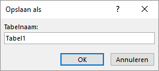
```

4. Voer als naam in Vervoerbedrijven en klik [OK]{.uicontrol}. De tabel [Vervoerbedrijven]{.varname} verschijnt nu in de ontwerpweergave.

5. Geef een rechter muisklik ergens in het veld [ID]{.varnamen} en kies dan [Rijen verwijderen]{.uicontrol} en bevestig het verwijderen.

6. Voeg de volgende velden toe:

```{r t-transport-companies-design, fig.cap="Velden tabel vervoerbedrijven.", out.width="75%"}
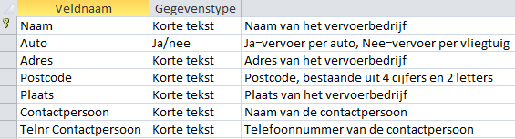
```

   De naam van ieder vervoerbedrijf is hier uniek en kan daarom als sleutel gebruikt worden.

7. Selecteer de eerste rij en klik [tab Ontwerpen > Primaire sleutel (groep Extra)]{.uicontrol}. Voor het begin van de eerste rij staat nu een sleutel 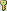.

8. Schakel over naar de [Gegevensbladweergave]{.uicontrol}. Beantwoord de vraag of de tabel moet worden opgeslagen met [Ja]{.uicontrol}.

9. Voeg de volgende records toe:

```{r t-transport-companies-records, fig.cap="Records tabel vervoerbedrijven.", out.width="100%"}
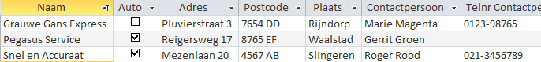
```

10. Sluit de tabel [Vervoerbedrijven]{.varname}.
:::

## Taak: Nieuwe tabel via Excel import {#tables-new-import-excel}

Hoe je gegevens in een Excel werkblad in een nieuwe Access tabel kunt importeren.

Access werkt goed samen met Excel. Zo kun je een heel werkblad importeren in een nieuwe of in een bestaande tabel.

::: {.practice data-latex=""}
1. Open zonodig database [snoep365.accdb]{.filepath}.

2.  Kies [tab Externe gegevens > Nieuwe gegevensbron (groep Importeren en koppelen) > Uit bestand > Excel]{.uicontrol}.

```{r import-excel-dialogbox, fig.cap="Dialoogvenster externe gegevens ophalen.", out.width="75%"}
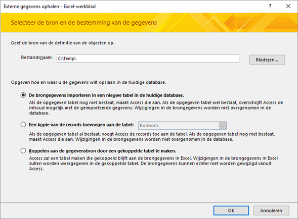
```

3.  Navigeer via de knop [Bladeren]{.uicontrol} naar het bestand [Vervoer.xlsx]{.filepath}.

4.  Kies [De brongegevens importeren in een nieuwe tabel in de huidige database > OK]{.uicontrol}. De Wizard `werkblad importeren` verschijnt.

5.  Kies [Eerste rij bevat kolomkoppen > Volgende]{.uicontrol}. In het scherm van de Wizard dat nu verschijnt kunnen een aantal eigenschappen van de velden gewijzigd worden.

6.  Klik op [Volgende]{.uicontrol}. De Wizard vraagt nu wat er als sleutel voor de nieuwe tabel gebruikt moet worden.

7.  Selecteer [Geen primaire sleutel > Volgende]{.uicontrol}. De Wizard vraagt vervolgens naar de naam van de tabel.

8.  Gebruik als naam voor de tabel [Vervoer]{.varname} en klik op [Voltooien]{.uicontrol}. De Wizard geeft nu aan dat de gegevens uit Excel geïmporteerd zijn.

9.  Klik op [Sluiten]{.uicontrol}.

10. Open de tabel, bekijk het resultaat en sluit daarna de tabel.
:::

## Taak: Keuzelijst maken {#tables-lookup-wizard}

Het maken van een keuzelijst bij een veld zodat de in te voeren waarden uit een lijst kunnen worden geselecteerd.

Wanneer in een veld alleen maar een beperkt aantal vooraf gedefinieerde waarden kunnen worden ingevoerd, dan kan het gebruik van een keuzelijst erg handig zijn. Zo heeft de tabel [Klanten]{.varname} een veld [Regio]{.varname} waarin alleen de waarden Noord en Zuid zijn toegestaan. In de volgende stappen wordt het gegevenstype voor dit veld gewijzigd in een keuzelijst.

::: {.warning data-latex=""}
De keuzelijst werkt helaas niet automatisch bij de formulieren die gebaseerd zijn op deze tabel zoals het formulier [Inschrijving]{.varname}. Om de keuzelijst wel te laten werken moet in het ontwerp van het formulier [Inschrijving]{.varname} het veld [Regio]{.varname} eerst verwijderd en daarna weer toegevoegd worden. Dat wordt in deze taak niet uitgevoerd.
:::

::: {.practice data-latex=""}
1. Open zonodig database [snoep365.accdb]{.filepath}.

2. Open tabel [Klanten]{.varname} in de [Ontwerpweergave]{.uicontrol}.

3. Klik in het vak [Gegevenstype]{.uicontrol} bij het veld [Regio]{.varname}.

4. Klik op de keuzepijl en selecteer [Wizard opzoeken...]{.uicontrol}. Het eerste dialoogvenster van de Wizard opzoeken verschijnt.

5. Kies [Ik typ de gewenste waarden > Volgende]{.uicontrol}. Het tweede dialoogvenster van de Wizard verschijnt. Hierin kunnen de waarden voor de lijst worden ingetypt.

6. Typ in de eerste cel `Noord` en in de tweede cel `Zuid`.

```{r lookup-wizard-region, fig.cap="Dialoogvenster Wizard Opzoeken.", out.width="75%"}
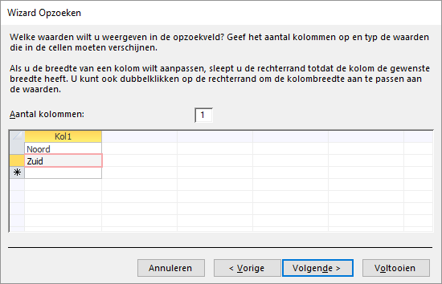
```

7. Klik op [Voltooien]{.uicontrol}.

8. Schakel over naar de [Gegevensbladweergave]{.uicontrol} en beantwoord de vraag of de tabel moet worden opgeslagen met [Ja]{.uicontrol}.

9. Controle van de werking van de keuzelijst.

10. Klik bij een willekeurige klant in het veld [Regio]{.varname} en controleer of de keuzelijst aanwezig is en werkt.

```{r listbox-region, fig.cap="Keuzelijst regio.", out.width="25%"}
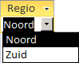
```
::: 
## Relaties tussen tabellen {#tables-relations}

Tussen twee tabellen bestaat een relatie wanneer een sleutelveld uit de ene tabel gekoppeld is aan een sleutelveld in de andere tabel. De gekoppelde velden hebben in beide tabellen meestal dezelfde naam en zijn van hetzelfde gegevenstype. Welke relaties er gelegd moeten worden volgt uit het normalisatieproces waarbij de redundante informatie verwijderd wordt door de informatie in meerdere tabellen onder te brengen.

Nadat de relaties tussen tabellen gelegd zijn kun je query's, formulieren en rapporten maken waarbij de informatie uit meerdere tabellen gecombineerd wordt en als één geheel aan de gebruiker getoond wordt.

### Een-op-veel relatie {-#tables-relations-one2many}

Bij één record uit de ene tabel kunnen meerdere gerelateerde records uit de andere tabel horen. Dit wordt soms ook wel een ouder-kind relatie genoemd en is het meest voorkomende relatietype.

Een voorbeeld is de relatie tussen de tabellen [Klanten]{.varname} en [Orders]{.varname}. Tussen deze twee tabellen is een koppeling op basis van het veld [Klantcode]{.varname}. Een klant uit de tabel [Klanten]{.varname} kan meerdere orders hebben in de tabel [Orders]{.varname}. Maar bij iedere order hoort maar één klant. De tabel [Klanten]{.varname} staat aan de één-kant van de relatie en de tabel [Orders]{.varname} aan de veel-kant. In de relatie heet de tabel [Klanten]{.varname} de [primaire tabel]{.term} en de tabel [Orders]{.varname} de [gerelateerde tabel]{.term. Door deze koppeling kunnen voor elke klant alle bijbehorende orders worden verzameld.

```{r relationship-customers-orders, fig.cap="Relatie tussen de tabellen klanten en orders.", out.width="60%"}
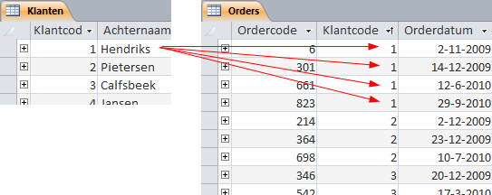
```

Voor dit relatietype moet het veld waarmee de koppeling gerealiseerd wordt uniek zijn aan de één-kant van de relatie. In bijna alle gevallen wordt hiervoor de [primaire sleutel (primary key)]{.term} van de tabel gebruikt. Het veld aan de veel-kant van de relatie wordt ook wel de [vreemde sleutel (foreign key)]{.term} genoemd.

```{r relationship-one2many, fig.cap="Voorbeeld van een een-op-veel relatie.", out.width="75%"}
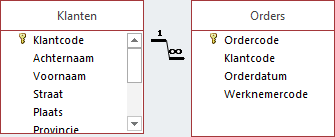
```

In Access wordt een een-op-veel relatie afgebeeld door een lijn tussen de primaire sleutel en de vreemde sleutel, met het cijfer 1 aan de een-kant en het symbool voor oneindig ∞ aan de veel-kant.

### Een-op-een relatie {-#tables-relations-one2one}

Bij één record uit de ene tabel kan één record uit een andere tabel horen. Deze situatie komt zeer weinig voor. Dit wordt een enkele keer gedaan om een tabel met zeer veel velden te splitsen in twee tabellen met elk minder velden. In het algemeen moet geprobeerd worden om deze situatie te voorkomen om te streven naar zo min mogelijk tabellen.

### Veel-op-veel relatie {-#tables-relations-many2many}

Bij dit relatietype hebben records in beide tabellen gekoppelde records in de andere tabel. Een veel-op-veel relatie kan niet rechtstreeks in Access gedefinieerd worden. Hiervoor is een derde tabel nodig die ook wel tussentabel, verbindingstabel of koppelingstabel (junction table) genoemd wordt. Deze tussentabel is aan elk van beide tabellen gerelateerd via een een-op-veel relatie.

Een voorbeeld is de tabel [Orders]{.varname} en de tabel [Dozen]{.varname}. Elke order bevat waarschijnlijk meerdere dozen en elke doos komt waarschijnlijk op meerdere orders voor. De tabel [Orderdetails]{.varname} vormt hier de tussentabel Deze tabel is gerelateerd aan de tabel [Orders]{.varname} in een een-op-veel relatie via het veld [Ordercode]{.varname}. En de tabel [Orderdetails]{.varname} is ook gerelateerd aan de tabel [Dozen]{.varname} in een een-op-veel relatie via het veld [Dooscode]{.varname}.

```{r relationship-many2many, fig.cap="Voorbeeld van een veel-op-veel relatie.", out.width="75%"}
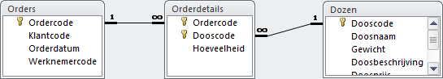
```

### Relaties maken, bewerken of verwijderen {-#tables-relations-edit}

In Access kunnen relaties aangebracht worden in het venster [Relaties]{.wintitle}. In dit venster kun je ook een bestaande relatie bewerken of verwijderen. Het venster kun je zichtbaar maken door klikken op [tab Hulpmiddelen voor databases > Relaties (groep Weergeven/verbergen)]{.uicontrol}.

```{r relationships-window, fig.cap="Venster Relaties.", out.width="75%"}
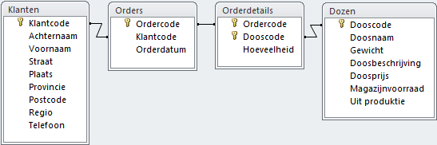
```

Het lint bevat de opdrachten voor het bewerken van de relaties.

```{r relationships-ribbon-design, fig.cap="Lint ontwerp relaties.", out.width="75%"}
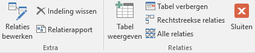
```

Wanneer er nog geen relaties zijn aangebracht dan is het venster [Relaties]{.wintitle} leeg. Via de knop [Tabel weergeven]{.uicontrol} wordt een venster met tabellen (en query's) getoond waarmee tabellen aan het venster [Relaties]{.wintitle} kunnen worden toegevoegd.

Een relatie tussen twee tabellen kun je aanbrengen door in het venster de primaire sleutel uit de ene tabel te slepen naar de vreemde sleutel in de andere tabel. Het dialoogvenster [Relaties bewerken]{.wintitle} verschijnt dan.

```{r relationship-edit-boxes-boxdetails-1, fig.cap="Dialoogvenster Relaties bewerken.", out.width="60%"}
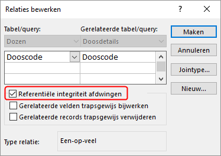
```

Wanneer je de referentiële integriteit voor deze relatie wilt afdwingen dan schakel je het vakje [Referentiële integriteit afdwingen]{.uicontrol} in.

Een relatie kun je wijzigen door eerst de relatielijn te selecteren. Deze lijn wordt dan dikker weergegeven. Vervolgens geef je een dubbelklik waardoor het venster [Relaties]{.wintitle} bewerken verschijnt.

Een relatie kun je verwijderen door de relatielijn te selecteren en dan op de toets [DELETE]{.uicontrol} te drukken.

### Referentiële integriteit {-#tables-referential-integrity}

Referentiële integriteit is een systeem van regels waarmee er voor gezorgd wordt dat de interne consistentie tussen de tabellen wordt gewaarborgd. Access zorgt er dan voor dat relaties tussen records in gerelateerde tabellen geldig zijn en dat gerelateerde gegevens niet onbedoeld kunnen worden verwijderd of gewijzigd.

De referentiële integriteit kun je instellen door in het dialoogvenster [Relaties bewerken]{.wintitle} het vakje [Referentiële integriteit afdwingen]{.uicontrol} in te schakelen.

Wanneer referentiële integriteit wordt ingesteld dan gelden de volgende regels:

+ Je kunt geen waarde opgeven voor de vreemde sleutel in de gerelateerde tabel wanneer die waarde niet voorkomt in de primaire sleutel van de primaire tabel. Zo kun je bijvoorbeeld geen order invoeren voor een niet-bestaande klant. Bij een order voor een nieuwe klant moet je dus eerst de klant aanmaken en daarna pas de order.

+ Een record uit een primaire tabel kan niet worden verwijderd als er overeenkomstige records bestaan in een gerelateerde tabel. Zo kun je geen record uit de tabel [Klanten]{.varname} verwijderen als er in de tabel [Orders]{.varname} nog records voor deze klant bestaan.

+ Een waarde van de primaire-sleutel in de primaire tabel kan niet worden gewijzigd wanneer dit record gerelateerde records in de gerelateerde tabel heeft. Zo kun je de klantcode in de tabel [Klanten]{.varname} niet wijzigen als er records in de tabel [Orders]{.varname} aan deze klant zijn toegewezen.

Wanneer de referentiële integriteit is afgedwongen en een van de voorgaande regels wordt bij een actie geschonden, dan wordt een passende foutmelding weergegeven. In de volgende afbeelding zie je een voorbeeld hiervan.

```{r warning-referential-integrity, fig.cap="Foutmelding bij het invoeren van een order voor een niet bestaande klant.", out.width="100%"}
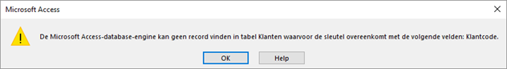
```

Je kunt referentiële integriteit bij een relatie tussen twee tabellen instellen onder de volgende voorwaarden:

+ Beide tabellen zitten in dezelfde Access database.
+ Het gekoppelde veld in de primaire tabel is een primaire sleutel of heeft een unieke index.
+ De gekoppelde velden zijn van hetzelfde gegevenstype en numerieke velden moeten dezelfde veldlengte hebben.
+ Bestaande gegevens in beide tabellen overtreden niet de regels voor referentiële integriteit.

::: {.warning data-latex=""}
AutoNummering velden kunnen gekoppeld worden aan velden van het type Numeriek mits hiervan de eigenschap [Veldlengte]{.uicontrol} de waarde `Lange integer` heeft.
:::

Wanneer bestaande gegevens in de tabellen de regels voor referentiële integriteit overtreden, dan moeten deze overtredingen eerst opgelost worden. Meestal ontstaan de problemen door een van de volgende oorzaken.

1. De velden die via de relatie aan elkaar gekoppeld worden zijn niet van hetzelfde gegevenstype of hebben niet dezelfde lengte. Dit is relatief gemakkelijk op te lossen door wijzigingen in het ontwerp van een of beide tabellen.

2. In de tabel aan de veel-kant komen records voor waarvan de waarde van het koppelveld niet voorkomt in de tabel aan de een-kant. Dit ontstaat wanneer je in de tabel aan de een-kant een record verwijdert en daarna niet de bijbehorende records in de tabel aan de veel-kant verwijdert. In feite ontstaan er dan een soort wezen in de tabel aan de veel-kant. Gelukkig kent Access een querytype waarmee je deze wezen kunt vinden en waarna je ze alsnog kunt verwijderen. Kies in dat geval [tab Maken > Wizard Query (groep Query's) > Wizard niet-gerelateerde records]{.uicontrol}.

### Taak: Relatie Dozen-Doosdetails maken {-#tables-relationship-boxes-boxdetails}

Een relatie koppelt twee velden in verschillende tabellen aan elkaar. Voordat je begint het maken van de relatie moet je eerst vaststellen welke tabel de primaire tabel wordt, welke de gerelateerde tabel en via welke velden de relatie gelegd gaat worden. In een goed ontworpen database is dat in de primaire tabel meestal het primaire sleutel veld.

In de database bestaat nog geen relatie tussen de tabellen [Dozen]{.varname} en [Doosdetails]{.varname}. Dat is wel nodig, want anders kan immers niet bepaald worden welke bonbons en de hoeveelheid daarvan in een bepaalde doos zitten.

+ Primaire tabel: [Dozen]{.varname}, veld [Dooscode]{.varname}
+ Gerelateerde tabel: [Doosdetails]{.varname}, veld [Dooscode]{.varname}

::: {.practice data-latex=""}
1. Open zonodig database [snoep365.accdb]{.filepath}.

2. Klik [tab Hulpmiddelen voor databases > Relaties (groep Weergeven/verbergen)]{.uicontrol}. Access opent een nieuwe tab [Relaties]{.wintitle}. Hierin zijn de bestaande relaties te zien. Ook is zichtbaar dat tussen de tabellen [Dozen]{.varname} en [Doosdetails]{.varname} nog geen relatie bestaat.

```{r relationships-window-boxes-boxdetails, fig.cap="Venster relaties.", out.width="60%"}
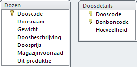
```

3. Selecteer in de tabel [Dozen]{.varname} het veld  [Dooscode]{.varname}, druk de linker muisknop in en sleep deze naar het veld  [Dooscode]{.varname} in de tabel [Doosdetails]{.varname}.

```{r relationship-edit-boxes-boxdetails-2, fig.cap="Dialoogvenster relatie bewerken.", out.width="60%"}

```

4. Schakel het vakje [Referentiële integriteit afdwingen]{.uicontrol} in en klik dan op [Maken]{.uicontrol}. De relatie is nu zichtbaar in het venster.

5. Sluit het venster [Relaties]{.wintitle} en beantwoord de vraag of de wijzigingen moeten worden opgeslagen met Ja.
:::

## Opgaven {#tables-exercises}

```{r, child='exercises/ex-tables.Rmd'}
```
