# Query's {#queries}

::: {.intro data-latex=""}
+ Waarvoor je query's kunt gebruiken en welke soorten query's er zijn.
+ Het maken van een eenvoudige selectiequery met behulp van de wizard.
+ Voorwaarden in een query.
+ Groeperen en berekeningen in een query.
+ Parameterquery, bijwerkquery, tabelmaakquery en kruistabelquery.
:::

Het opvragen van informatie uit een database is de meest voorkomen actie van eindgebruikers. Om de gewenste informatie te leveren zijn query's nodig. Eenvoudige query's maakt de eindgebruiker vaak zelf, voor de wat complexere query's is hulp van een professional meestal gewenst.

## Over query's maken {#queries-about}

De meest bekende vorm van een query is de selectiequery, dat is een soort vraag aan de database naar een bepaald verzameling gegevens. Een query kan echter meer dan een lijst met records produceren. Zo kunnen er in een query functies voorkomen die berekeningen (som, gemiddelde, ...) uitvoeren op de gegevens. En er zijn verschillende soorten query's. De volgende types komen in deze cursus aan bod:

Selectiequery
: Haalt gegevens uit een of meerdere tabellen en toont het resultaat in een gegevensbladweergave. Je kunt deze query ook gebruiken om records te groepen en berekeningen uit te voeren zoals som, gemiddelde, aantal, ... Dit is de meest voorkomende soort query.

Parameterquery
: Hierbij wordt eerst aan de gebruiker om een bepaalde waarde voor een of meerdere velden gevraagd. Daarna wordt het antwoord gebruikt om een selectiequerie uit te voeren. Een voorbeeld is een overzicht van orders vanaf een bepaalde datum.

Bijwerkquery
: Hierbij is het mogelijk om via één actie een of meerdere wijzigingen in records aan te brengen die aan bepaalde voorwaarden voldoen. Een voorbeeld is een prijsverhoging van 10% voor een serie producten.


Voor het maken van een query is het nodig dat eerst de informatiebehoefte goed gespecificeerd wordt. Na de analyse van deze informatiebehoefte kan dan begonnen worden met het maken van de query.

## Taak: Klanten en orders {#queries-customername-ordercodes}

INFORMATIEBEHOEFTE

Maak een gesorteerd overzicht van alle klanten met hun achternaam, voornaam en bijbehorende ordercodes.

ANALYSE

De achternaam en voornaam van de klant zitten in de tabel [Klanten]{.varname}. De ordercodes van de klant zitten in de tabel [Orders]{.varname}. Omdat dit een eenvoudige rechttoe rechtaan selectiequery is wordt gebruik gemaakt van de Wizard.

::: {.practice data-latex=""}
1. Open zonodig database [snoep365.accdb]{.filepath}.

2. Kies [tab Maken > Wizard Query (groep Query's)]{.uicontrol}. Het dialoogvenster [Nieuwe Query]{.wintitle} verschijnt. Hierin kan de soort query gekozen worden.

3. Kies [Wizard Selectiequery > OK]{.uicontrol}. In het volgende scherm kun je de velden kiezen die je in de query wilt hebben.

4. Selecteer bij [Tabellen/query's]{.uicontrol} via de keuzelijst [Tabel: Klanten]{.varname}. De velden van de tabel [Klanten]{.varname} worden getoond in het vak [Beschikbare velden]{.uicontrol}.

```{r q-wizard-t-customers, fig.cap="Wizard Selectiequery met tabel Klanten.", out.width="75%"}
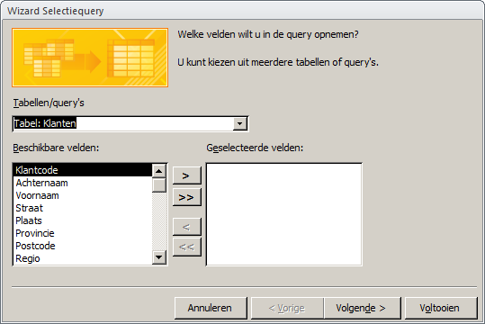
```

5. Selecteer het veld [Achternaam]{.varname} en klik op de knop ![]images/common/button-add-field.png). Het veld [Achternaam]{.varname} wordt verplaatst naar de geselecteerde velden.

6. Voeg op dezelfde manier het veld [Voornaam]{.varname} toe.

7. Selecteer [Tabel: Orders]{.varname} in het vak [Tabellen/query's]{.uicontrol. De velden van de tabel [Orders]{.varname} worden getoond in het vak [Beschikbare velden]{.uicontrol}.

8. Voeg het veld [Ordercode]{.varname} toe.

```{r q-customername-ordercodes-fields, fig.cap="Wizard selectiequery met geselecteerde velden.", out.width="75%"}
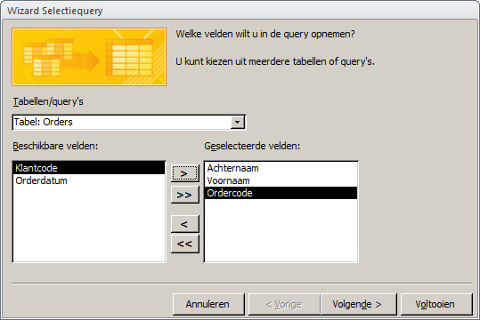
```

9. Klik op [Volgende]{.uicontrol}. In het weergegeven scherm kun je aangeven of [Details]{.uicontrol} of [Totalen]{.uicontrol} getoond moeten worden.

10. Selecteer [Details (alle velden van alle records weergeven)]{.uicontrol} en klik op [Volgende]{.uicontrol}.

11. Geef de query als naam [Klantnaam+Ordercodes]{.varname}, selecteer [Het queryontwerp wijzigen]{.uicontrol} en klik [Voltooien]{.uicontrol}. Het ontwerp van de query wordt weergegeven.

12. Klik in het vak [Sorteervolgorde]{.uicontrol} van de kolom [Achternaam]{.varname} en kies [Oplopend]{.uicontrol}.

```{r q-customername-ordercodes-design-1, fig.cap="Ontwerp query klanten en ordercodes.", out.width="70%"}
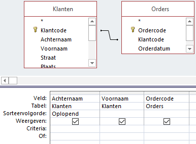
```

13. Schakel over naar de [Gegevensbladweergave]{.uicontrol}.

```{r q-customername-ordercodes-result, fig.cap="Resultaat query klantnaam met ordercodes.", out.width="60%"}
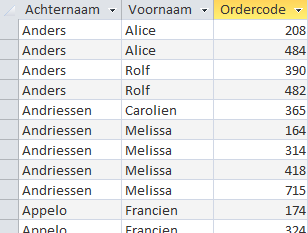
```

14. Sluit de query en beantwoord de vraag om de wijzigingen op te slaan met [Ja]{.uicontrol}.
:::

## Criteria in query's {#queries-criteria}

In een query kunnen voorwaarden worden opgenomen zodat alleen records worden opgenomen die aan deze voorwaarden voldoen. In het queryraster is daarvoor de rij Criteria beschikbaar.

Een criterium lijkt op een formule en kan verwijzingen naar velden, operatoren en constante waarden (waarden die altijd hetzelfde zijn) bevatten. Zo'n formule wordt in Access ook wel een expressie genoemd. Wat in een criterium mag staan hangt af van het gegevenstype van het veld (tekst, numeriek, datum/tijd, ja/nee).

Table: (\#tab:crit-operators) Operatoren in criteria

|Categorie   |Operatoren|
|------------|----------|
|Rekenkundig |`+`, `-`, `*`, `/`, `\`, `^`, `Mod`|
|Vergelijking|`=`, `>`, `>=`, `<`, `<=`, `<>`|
|Logisch     |`And`, `Or`, `Not`, `Xor`, `Eqv`|
|Samenvoeging|`&`, `+`|
|Speciaal    |`Is Null`, `Is Not Null`, `Like`, `Between`, `In`|

Je kunt hiermee eenvoudige criteria maken, maar ook zeer ingewikkelde.

Een speciale rol is er voor de `Like` operator. Deze vergelijkt een waarde met een bepaald patroon. Dat patroon kan de letterlijke tekenreeks zijn waarmee vergeleken moet worden, bijvoorbeeld Like "Noord". Maar het patroon mag ook jokertekens (wildcards) bevatten, bijvoorbeeld `Like "He*"`. Dit maakt het gebruik van de `Like` operator erg krachtig.

Datumwaarden moeten omringd worden met het symbool `#`. Enkele voorbeelden van criteria met datums: `#5-12-2010#`,` >#1-9-2010#`, `>#1-9-2010# And <#15-9-2010#`.

Jokertekens zijn tijdelijke aanduidingen voor andere tekens, die je gebruikt wanneer je niet het hele zoekpatroon kent maar slechts een deel daarvan. De drie meest gebruikte jokertekens zijn:

+ `*`: Voor een willekeurig aantal tekens. Voorbeelden: `"A*"`, `"*dam"`

+ `?`: Voor één willekeurig teken. Voorbeeld: `"b?k"`

+ `#`: Voor één willekeurig cijfer. Voorbeeld `"1#5"`

Zie verder [Voorbeelden van querycriteria (artikel Microsoft)](http://office.microsoft.com/nl-nl/access-help/voorbeelden-van-querycriteria-HA010066611.aspx)

## Taak: Orders Utrechtse klanten {#queries-utrecht-dec2009}

Aan een bestaande query worden handmatig velden en criteria toegevoegd waarna de query onder een andere naam wordt opgeslagen.

Om deze taak te kunnen uitvoeren is het noodzakelijk dat eerst \@ref(queries-customername-ordercodes) is uitgevoerd.

INFORMATIEBEHOEFTE

Maak een gesorteerd overzicht met achternaam, voornaam en ordercodes van alle klanten die in de provincie Utrecht wonen en waarvan de orderdatum in december 2009 lag.

ANALYSE

Alle gewenste informatie wordt al geleverd door de query die je gemaakt hebt in \@ref(queries-customername-ordercodes). Er zijn echter twee aanvullende voorwaarden (criteria):

+ Het veld Provincie (in de tabel Klanten) moet de waarde `UT` hebben.
+ Het veld Orderdatum (in de tabel Orders) moet een waarde hebben die kan lopen van 1-12-2009 t/m 31-12-2009.

::: {.practice data-latex=""}
1. Open zonodig database [snoep365.accdb]{.filepath}.

2. Open de query [Klantnaam+Ordercodes]{.varname} in de [Ontwerpweergave]{.uicontrol}.

```{r q-customername-ordercodes-design-2, fig.cap="Ontwerpweergave query Klantnaam+Ordercodes.", out.width="70%"}

```

3. Sleep het veld [Provincie]{.varname} uit de tabel [Klanten]{.varname} naar de kolom naast [Ordercode]{.varname}. Sleep het veld [Orderdatum]{.varname} uit de tabel [Orders]{.varname} naar de volgende kolom.

```{r q-utrecht-dec2009-fields, fig.cap="Velden in het queryraster.", out.width="80%"}
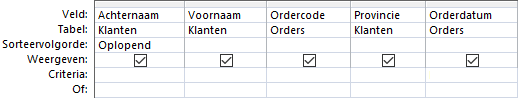
```

4. Typ onder [Provincie]{.varname} in het vak [Criteria]{.uicontrol} in ["UT"]{.userinput}.

5. Typ onder [Orderdatum]{.varname} in het vak [Criteria]{.uicontrol} in [Like "*12-2009"]{.userinput}.

```{r q-utrecht-dec2009-criteria, fig.cap="Orderdatum met Like operator.", out.width="80%"}
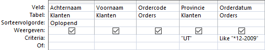
```

::: {.info data-latex=""}

+ Het sterretje `*` heet een [joker]{.term} en betekent dat op deze plaatst willekeurige tekst mag staan. In dit geval heeft het daardoor de betekenis van "een willekeurige dag".
+ Op computers waar een Amerikaanse datumweergave (maand-dag-jaar) is ingesteld moet deze eerst op de Nederlandse datumweergave (dag-maand-jaar) worden ingesteld.
:::
    
6. Schakel naar de [Gegevensbladweergave]{.uicontrol} en controleer dat alle klanten uit de provincie Utrecht komen en dat alle orderdata in december 2009 liggen.

7. Schakel naar de [Ontwerpweergave]{.uicontrol} en deselecteer de selectievakjes [Weergeven]{.uicontrol} onder [Provincie]{.varname} en [Orderdatum]{.varname}.

8. Schakel naar de [Gegevensbladweergave]{.uicontrol}.

9. Sla de query onder een andere naam op via [Bestand > Object opslaan als]{.uicontrol} en geef in het dialoogvenster als naam op [Utrecht en orderdatum dec 2009]{.varname}.

10. Klik op [OK]{.uicontrol} en sluit daarna de query.
:::

## Taak: Klanten met doos Kers {#queries-customers-cher}

Een selectiequery met drie tabellen.

INFORMATIEBEHOEFTE

In de laatste maand van het kalenderjaar wordt geconstateerd dat de uiterste verkoopdatum van de dozen KERS in zicht is. De verkoopafdeling wil daarom een “direct mail” campagne organiseren naar de klanten die ooit een doos KERS gekocht hebben. Maak een overzicht van alle klanten met hun achternaam, voornaam en volledige adres die ooit minstens 1 doos KERS gekocht hebben.

ANALYSE

De benodigde klantgegevens (voornaam, achternaam, straat, postcode, plaats) staan in de tabel [Klanten]{.varname}. De soort dozen die afgenomen zijn, zijn te vinden in het veld [Dooscode]{.varname} in de tabel [Orderdetails]{.varname}. Om een order aan een klant kunnen koppelen is ook nog de tabel [Orders]{.varname} nodig. De tabel [Orders]{.varname} vormt de verbindende schakel tussen de tabellen [Klanten]{.varname} en [Orderdetails]{.varname}. Verder moet als criterium in de query gebruikt worden dat het veld [Dooscode]{.varname} de waarde `KERS` heeft.

Bij het gebruik van de Wizard om de query te maken, kan volstaan worden met alleen de benodigde velden uit de tabellen [Klanten]{.varname} en [Orderdetails]{.varname} toe te voegen. De Wizard zorgt er dan voor dat automatisch de tabel [Orders]{.varname} wordt toegevoegd omdat deze de verbinding vormt tussen de tabellen [Klanten]{.varname} en [Orderdetails]{.varname}. Bij het handmatig vanaf nul maken van de query moet je er zelf aan denken om de tabel [Orders]{.varname} toe te voegen. Daarom wordt in deze taak de voorkeur gegeven aan het gebruik van de Wizard.

::: {.info data-latex=""}
Dat er minimaal 1 doos is afgenomen hoeft niet als criterium te worden opgenomen omdat bij gekoppelde tabellen automatisch hieraan voldaan wordt.
:::

::: {.practice data-latex=""}
1. Open zonodig database [snoep365.accdb]{.filepath}.

2. Kies [tab Maken > Wizard Query (groep Query's)]{.uicontrol}. Het dialoogvenster [Nieuwe Query]{.wintitle} verschijnt. Hierin kan de soort query gekozen worden.

3. Selecteer [Wizard Selectiequery]{.uicontrol} en klik op [OK]{.uicontrol}. In het volgende scherm kun je de velden kiezen die je in de query wilt hebben.

4. Selecteer bij [Tabellen/query's]{.uicontrol} via de keuzelijst [Tabel: Klanten]{.varname}. De velden van de tabel [Klanten]{.varname} worden getoond in het vak [Beschikbare velden]{.uicontrol}, zie figuur \@ref(fig:q-wizard-t-customers).

5. Voeg de volgende velden toe: [Voornaam]{.varname}, [Achternaam]{.varname}, [Straat]{.varname}, [Postcode]{.varname}, [Plaats]{.varname}. Selecteer het veld en gebruik dan de knop ![]images/common/button-add-field.png).

::: {.info data-latex=""}
Je kunt ook dubbelklikken op een veld om deze toe te voegen of weer te verwijderen.
:::

6. Selecteer onder [Tabellen/query's]{.uicontrol} [Tabel: Orderdetails]{.varname}. De velden van de tabel [Orderdetails]{.varname} worden getoond in het vak [Beschikbare velden]{.uicontrol}.

7. Voeg het veld [Dooscode]{.varname} toe.

```{r q-customers-cher-fields, fig.cap="Wizard selectiequery met toegevoegde velden.", out.width="60%"}
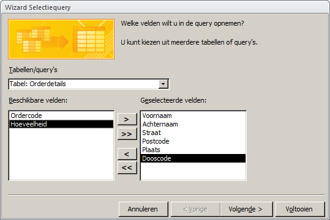
```

8. Klik op [Volgende]{.uicontrol}. Je kunt nu aangegeven of Details of Totalen getoond moeten worden.

9. Selecteer [Details (alle velden van alle records weergeven)]{.uicontrol} en klik op [Volgende]{.uicontrol}.

10. Geef de query als naam [Klanten en Kers]{.varname}, selecteer [Het queryontwerp wijzigen]{.uicontrol} en klik op [Voltooien]{.uicontrol}. De query wordt opgeslagen en verschijnt daarna in de ontwerpweergave.

```{r q-customers-cher-design, fig.cap="Ontwerpweergave query Klanten en Kers.", out.width="80%"}
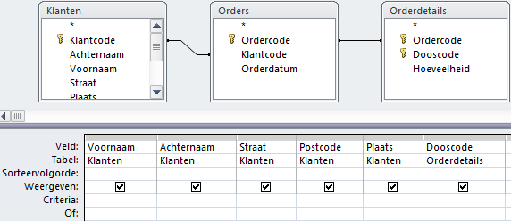
```

11. Typ [KERS]{.userinput} onder [Dooscode]{.varname} in het vak [Criteria]{.uicontrol} en laat dit veld niet weergeven.

```{r q-customers-cher-criteria, fig.cap="Selectiecriterium in ontwerp query, criterium dooscode wordt kers.", out.width="80%"}
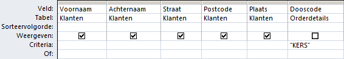
```

12. Schakel naar de [Gegevensbladweergave]{.uicontrol}.

13. Sluit de query en beantwoord de vraag om de wijzigingen op te slaan met [Ja]{.uicontrol}.
:::

## Groeperen en Berekeningen {#queries-summarizing}

De eenvoudige selectiequery's werken met individuele records. Wanneer je via een query bepaalde klanten uit de tabel Klanten selecteert dan zie je in het resultaat een record voor elke klant die hieraan voldoet. Je kunt echter records ook groeperen en dan berekeningen uitvoeren op de deelgroepen. Dat kun je vergelijken met het berekenen van totalen en subtotalen.

Wanneer een query in de ontwerpweergave staat dan zie je op het lint [tab Ontwerp > Totalen (groep Weergeven/verbergen)]{.uicontrol} het symbool 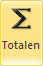.

Met deze knop kun je de rij [Totaal]{.uicontrol} in het queryraster zichtbaar en onzichtbaar maken. Access voegt een vak [Totaal]{.uicontrol} toe voor elk veld, net onder het vak [Tabel]{.uicontrol}.

```{r q-pralines-box-design, fig.cap="Query ontwerp met de zichtbare rij totaal.", out.width="80%"}
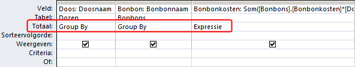
```

Voor elk toegevoegd veld is een keuzevak beschikbaar. De gemaakte keuze bepaalt of een veld gebruikt wordt voor een berekening of voor groeperen of voor filteren. De beschikbare mogelijkheden zijn in drie categorieën onder te brengen:

Groeperen
: De keuze is dan: `Group By`. Het veld wordt gebruikt voor het maken van kleinere groepen waarop de berekeningen worden uitgevoerd. Deze keuze is ook de standaardwaarde.

Filteren
: De keuze is dan: `Waar` (Engels: *Where*). Het vakje voor [Weergeven]{.uicontrol} wordt ook automatisch gewist en dat moet zo blijven. In het vak [Criteria]{.uicontrol} kun je met een expressie aangeven waarop gefilterd moet worden.

Berekeningen
: Je kunt dan kiezen uit: `Som`, `Gem`, `Min`, `Max`, `Aantal`, `StDev`, `Var`, `Eerste`, `Laatste`, `Expressie`. De gekozen berekening wordt dan voor het veld uitgevoerd.

Table: (\#tab:grouping-options) Opties voor het samenvatten

|Keuze Totaal|Toelichting                     |
|------------|--------------------------------|
|`Group By`|Maakt subgroepen van records gebaseerd op de waarden in dit veld.|
|`Som`|Telt de waarden in dit veld op.|
|`Gem`|Berekent het gemiddelde van de waarden in dit veld.|
|`Min`|Bepaalt de kleinste waarde in dit veld.|
|`Max`|Bepaalt de grootste waarde in dit veld.|
|`Aantal`|Telt het aantal records.|
|`StDev`|Berekent de standaarddeviatie van de waarden in dit veld.|
|`Var`|Berekent de variantie van de waarden in dit veld.|
|`Eerste`|Bepaalt de eerste waarde in dit veld.|
|`Laatste`|Bepaalt de laatste waarde in dit veld.|
|`Expressie`|Berekent een expressie voor de waarden in dit veld.|
|`Waar`|Voor het filteren op waarden in dit veld.|

### Berekend veld {-}

Een berekend veld haalt waarden uit een of meerdere velden en voert er een berekening mee uit om nieuwe informatie te produceren. Je kunt eenvoudige berekeningen uitvoeren zoals optellen en vermenigvuldigen, maar ook de ingebouwde functies van Access gebruiken zoals `Som` en `Gem`. Je kunt alleen velden gebruiken die aan de query zijn toegevoegd. Ga als volgt te werk om een berekend veld te maken.

1.  Klik in de rij [Veld]{.uicontrol} van een lege kolom.
2.  Typ een naam voor berekening (het resultaat) in gevolgd door een dubbele punt (`:`).
3.  Typ de expressie voor de berekening in.

::: {.info data-latex=""}
+ Je kunt veldnamen in de expressie opnemen. Veldnamen moeten tussen blokhaken staan: `[veldnaam]`. Wanneer een veldnaam geen spaties bevat dan zet Access deze blokhaken wanneer je de naam ingetypt hebt. Zitten er wel spaties in de naam dan zul je zelf deze blokhaken moeten intypen.

+ Wanneer je een van de berekeningsopties voor het samenvatten gebruikt is het ook aan te bevelen om een nieuwe naam voor de veldnaam in te typen, anders genereert Access een naam voor het resultaat in de gegevensweergave. Deze nieuwe naam moet ook eindigen met een dubbele punt.
:::

Hierna volgen een paar voorbeelden. Bestudeer ze goed. Maak ze na en experimenteer er mee.

::: {.demo data-latex=""}
**Gemiddelde bonbonkosten per chocoladetype**

In dit voorbeeld wordt het veld [Chocoladetype]{.varname} gebruikt om te groeperen en het veld [Bonbonkosten]{.varname} voor de berekening van de gemiddelde bonbonkosten. Het resultaat bestaat uit een record per chocoladetype met daarin de gemiddelde prijs.

```{r q-pralinecosts-chocolatetype-design, fig.cap="Ontwerp query gemiddelde bonbonkosten per chocoladetype.", out.width="50%"}
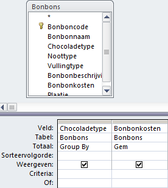
```

```{r q-pralinecosts-chocolatetype-result, fig.cap="Resultaat query gemiddelde bonbonkosten per chocoladetype.", out.width="50%"}
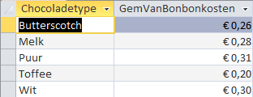
```

Omdat voor de kolom met de gemiddelde kosten geen nieuwe naam is opgegeven, genereert Access een naam hiervoor: [GemVanBonbonkosten]{.varname}.
:::

::: {.demo data-latex=""}
**Doosprijs statistieken**

In dit voorbeeld wordt het veld [Doosprijs]{.varname} 4 keer gebruikt met verschillende berekeningen. Het resultaat van de query is één record met daarin de 4 uitkomsten van de berekeningen.

```{r q-boxprice-statistics-design, fig.cap="Ontwerp query doosprijs statistieken.", out.width="80%"}
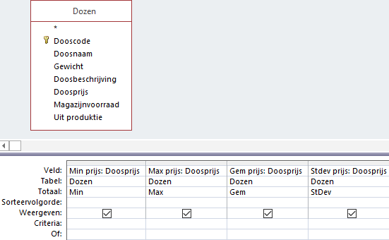
```

```{r q-boxprice-statistics-result, fig.cap="Resultaat query doosprijs statistieken.", out.width="60%"}
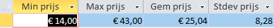
```
:::

::: {.demo data-latex=""}
**Gemiddelde doosprijs voor dozen van meer dan 200 gram**

In dit voorbeeld wordt het veld [Doosprijs]{.varname} gebruikt om het gemiddelde te berekenen. Het veld [Gewicht]{.varname} wordt gebruikt om te filteren op dozen van meer dan 200 gram.

```{r q-boxprice-200g-design, fig.cap="Ontwerp query gemiddelde doosprijs dozen zwaarder dan 200 gram.", out.width="50%"}
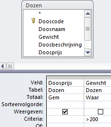
```

```{r q-boxprice-200g-result, fig.cap="Resultaat query gemiddelde doosprijs dozen zwaarder dan 200 gram.", out.width="40%"}
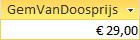
```
:::

## Taak: Aantal klanten per provincie {#queries-customers-province}

Oefening van een selectiequery met groeperen en berekening met de functie `Aantal`.

INFORMATIEBEHOEFTE

Maak een overzicht van het aantal klanten per provincie.

ANALYSE

Alle benodigde gegevens staan in de tabel [Klanten]{.varname}. Uiteraard is het veld [Provincie]{.varname} nodig. Een klant wordt uniek geïdentificeerd door de [Klantcode]{.varname}, zodat het aantal klantcodes per provincie geteld moet worden. Hiervoor moet er gegroepeerd worden per [Provincie]{.varname}.

::: {.practice data-latex=""}
1. Open zonodig database [snoep365.accdb]{.filepath}.

2.  Kies [tab Maken > Queryontwerp (groep Query's)]{.uicontrol}.  Access maakt een nieuw leeg queryvenster en toont het dialoogvenster [Tabel weergeven]{.wintitle}.

```{r q-show-table, fig.cap="Dialoogvenster Tabel weergeven.", out.width="70%"}
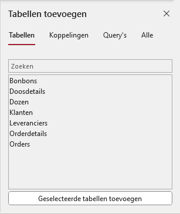
```

3.  Selecteer de tabel [Klanten]{.varname} en klik op [Toevoegen]{.uicontrol} en daarna op [Sluiten]{.uicontrol}. De tabel [Klanten]{.varname} is nu aan het queryvenster toegevoegd.

4.  Voeg achtereenvolgens de velden [Provincie]{.varname} en [Klantcode]{.varname} aan het queryraster toe door dubbel te klikken op het veld.

```{r q-customers-province-design, fig.cap="Ontwerp query klanten per provincie", out.width="50%"}
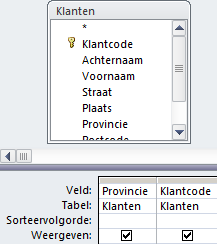
```

5.  Klik op [tab Ontwerp > knop Totalen (groep Weergeven/verbergen)]{.uicontrol}. Er wordt een rij [Totaal]{.uicontrol} aan het queryraster toegevoegd:

```{r q-customers-province-design-total, fig.cap="Totaalrij aan ontwerp query toegevoegd.", out.width="50%"}
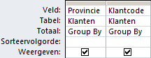
```

6.  Klik in het vak onder de kolom [Klantcode]{.varname} in de rij [Totaal]{.uicontrol}. Er verschijnt dan een keuzepijl. Selecteer hiermee `Aantal`.

```{r q-customers-province-design-count, fig.cap="Groepering met aantal.", out.width="50%"}
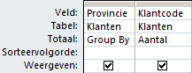
```

7.  Schakel over naar de [Gegevensbladweergave]{.uicontrol}.

```{r , fig.cap="Resultaat query aantal klanten per provincie.", out.width="50%"}
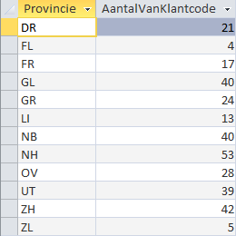
```

8.  Sluit de query en beantwoord de vraag of de wijzigingen bewaard moeten worden met [Ja]{.uicontrol}. Het venster [Opslaan als]{.wintitle} verschijnt zodat de naam van de query kan worden opgegeven.

9.  Typ als naam in [Aantal klanten per provincie]{.varname} en klik op [OK]{.uicontrol}.
:::

## Taak: Kolomtitel wijzigen {#queries-column-heading}

Om deze taak uit te kunnen voeren is het noodzakelijk dat eerst \@ref(queries-customers-province) is uitgevoerd.

Standaard gebruikt Access de veldnamen als kolomkop in de gegevensbladweergave. En voor samenvattings gegevens wordt een titel gegenereerd. Het is aan te bevelen om duidelijker namen te gebruiken.

::: {.practice data-latex=""}
1. Open zonodig database [snoep365.accdb]{.filepath}.

2. Open de query [Aantal klanten per provincie]{.varname} in de [Ontwerpweergave]{.uicontrol}.

3. Plaats de cursor in het vak met de veldnaam [Klantcode]{.varname} voor het begin van de naam, dus voor de `K` en typ in [Aantal klanten:]{.userinput}.

```{r q-customers-province-columnhead-design, fig.cap="Ontwerp gewijzigde kolomtitel.", out.width="60%"}
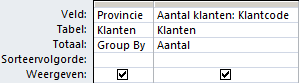
```

4. Schakel over naar de [Gegevensbladweergave]{.uicontrol}.

```{r q-customers-province-columnhead-result, fig.cap="Resultaat gewijzigde kolomtitel.", out.width="50%"}
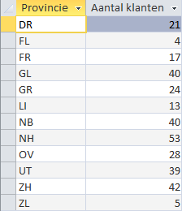
```

5. Sluit de query en beantwoord de vraag om de wijzigingen op te slaan met [Ja]{.uicontrol}.
:::

## Taak: Berekend veld {#queries-calculated-field}

INFORMATIEBEHOEFTE

Maak een gesorteerd overzicht van alle orderregels met daarop per order: ordercode, dooscode, aantal dozen, doosprijs en het regelbedrag.

ANALYSE

Voor elke order kun je de ordercode, dooscode en het aantal dozen vinden in de tabel [Orderdetails]{.varname}. De doosprijs zit in de tabel [Dozen]{.varname. Het bedrag van de orderregel zit in geen enkele tabel omdat dit bedrag uit de andere gegevens berekend kan worden: `Orderregelbedrag = Hoeveelheid * Doosprijs`.

::: {.practice data-latex=""}
1. Open zonodig database [snoep365.accdb]{.filepath}.

2. Kies [tab Maken > Queryontwerp (groep Query's)]{.uicontrol}. Access maakt een nieuw leeg queryvenster en toont het dialoogvenster [Tabel weergeven]{.wintitle} (zie eventueel figuur \@ref(fig:q-show-table)).

3. Voeg achtereenvolgens de tabellen [Orderdetails]{.varname} en [Dozen]{.varname} aan het queryvenster toe en klik daarna op [Sluiten]{.uicontrol}.

4. Voeg achtereenvolgens de velden [Ordercode]{.varname}, [Dooscode]{.varname}, [Hoeveelheid]{.varname} (uit tabel [Orderdetails]{.varname}) en [Doosprijs]{.varname} (uit tabel [Dozen]{.varname}) aan het queryraster toe door dubbel te klikken op het veld.

```{r q-orderrow-amount-design1, fig.cap="Ontwerp met tabellen en velden.", out.width="70%"}
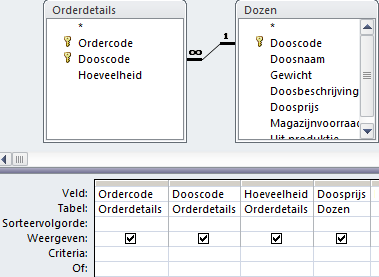
```

5. Zet de sorteervolgorde bij [Ordercode]{.varname} en [Dooscode]{.varname} op [Oplopend]{.uicontrol}. Klik in rij veld van de eerste lege kolom en typ in [Regelbedrag: Hoeveelheid*Doosprijs]{.userinput}. Access zet blokhaken om de veldnamen.

```{r q-orderrow-amount-design2, fig.cap="Ontwerp uitgebreid met berekend veld.", out.width="80%"}
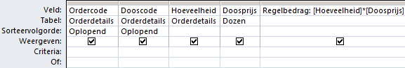
```

6. Schakel naar de [Gegevensbladweergave]{.uicontrol}. De bedragen moeten nog in een financiële getalnotatie worden opgemaakt.

```{r q-orderrow-amount-result-unformatted, fig.cap="Resultaat query zonder financiële opmaak van de bedragen.", out.width="75%"}
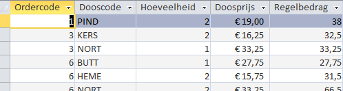
```

7. Schakel over naar de [Ontwerpweergave]{.uicontrol}.

::: {.info data-latex=""}
Alle objecten in Access hebben eigenschappen. Deze eigenschappen bepalen onder andere het uiterlijk van het object. De instellingen van de eigenschappen en het wijzigen ervan gaat via het [Eigenschappenvenster]{.uicontrol}. Het in- en uitschakelen van de zichtbaarheid van het eigenschappenvenster gaat via [tab Ontwerp > Eigenschappenvenster (groep Weergeven/verbergen)]{.uicontrol}. Nog sneller is het gebruik van de sneltoets [F4]{.uicontrol}.

Om geldbedragen van een valutasymbool te voorzien moet de eigenschap [Notatie]{.uicontrol} van het veld [Regelbedrag]{.varname} gewijzigd worden.
:::

8. Zorg dat het [Eigenschappenvenster]{.uicontrol} zichtbaar is. Klik ergens in het veld [Regelbedrag]{.varname}. Klik in het vak [Notatie]{.uicontrol} en kies dan met de keuzelijst voor `Euro`.

```{r field-format-currency, fig.cap="Eigenschappenvenster van het veld Regelbedrag.", out.width="50%"}
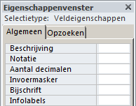
```

9. Schakel over naar de [Gegevensbladweergave]{.uicontrol}.

```{r q-orderrow-amount-result-formatted, fig.cap="Resultaat query met financiële opmaak van de bedragen.", out.width="75%"}
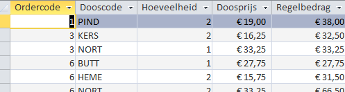
```

10. Sluit de query en beantwoord de vraag of de wijzigingen bewaard moeten worden met [Ja]{.uicontrol}. Het venster [Opslaan als]{.wintitle} verschijnt zodat de naam van de query kan worden opgegeven.

11. Typ als naam in [Orderregelbedrag]{.varname} en klik op [OK]{.uicontrol}.
:::

## Taak: Eerste order per klant {#queries-first-order-dates}

INFORMATIEBEHOEFTE

Maak een overzicht van de eerste order per klant. Geef per klant de klantcode, de naam en de datum waarop deze klant de eerste order heeft geplaatst.

ANALYSE

De benodigde gegevens staan in de tabellen Klanten en Orders. Er moet dus een query gemaakt te worden die de klantgegevens en de orderdata toont. Het vinden van de eerste order kan gerealiseerd worden door in de Totalen rij de [Group By]{.uicontrol} te vervangen door [Min]{.uicontrol}.

::: {.practice data-latex=""}
1. Open zonodig database [snoep365.accdb]{.filepath}.

2. Kies [tab Maken > Queryontwerp (groep Query's)]{.uicontrol}.

3. Voeg achtereenvolgens de tabellen [Klanten]{.varname} en [Orders]{.varname} aan het queryvenster toe en klik daarna op [Sluiten]{.uicontrol}.

4. Voeg achtereenvolgens de velden [Klantcode]{.varname}, [Achternaam]{.varname} en [Voornaam]{.varname} (uit [Klanten]{.varname}) en [Orderdatum]{.varname} (uit [Orders]{.varname}) aan het queryraster toe door dubbel te klikken op de velden.

5. Klik op [tab Ontwerp > knop Totalen (groep Weergeven/verbergen)]{.uicontrol}.

6. Wijzig de kolomtitel voor [Orderdatum]{.varname} door aan het begin van de veldnaam in te typen [Eerste orderdatum:]{.userinput}.

```{r q-first-order-dates-design1, fig.cap="Tabellen en velden voor query Eerste order per klant.", out.width="70%"}
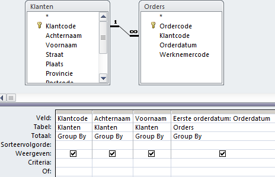
```

7. Klik in de kolom [Orderdatum]{.varname} in het vak [Totaal]{.uicontrol}, klik dan op de keuzepijl die verschijnt en selecteer `Min`.

8. Zet de sorteervolgorde bij [Achternaam]{.varname} en [Voornaam]{.varname} op [Oplopend]{.uicontrol}.

```{r q-first-order-dates-design2, fig.cap="Ontwerp query eerste order per klant.", out.width="70%"}
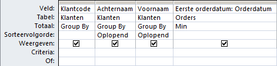
```

9. Schakel naar de [Gegevensbladweergave]{.uicontrol}.

```{r q-first-order-dates-result, fig.cap="Resultaat query eerste order per klant.", out.width="70%"}
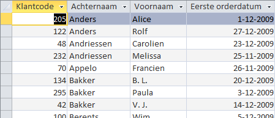
```

10. Sluit de query en beantwoord de vraag of de wijzigingen bewaard moeten worden met [Ja]{.uicontrol}. Het venster [Opslaan als]{.wintitle} verschijnt zodat de naam van de query kan worden opgegeven.

11. Typ als naam in [Datum eerste order per klant]{.varname} en klik op [OK]{.uicontrol}.
:::

## Taak: Parameterquery {#queries-parameters}

Een parameterquery is een query die tijdens de uitvoering een dialoogvenster toont waarin aan de gebruiker om aanvullende informatie wordt gevraagd, zoals criteria voor het ophalen van records of een waarde die je wilt invoegen in een veld. Je kunt de query zo ontwerpen dat er meerdere gegevens worden gevraagd, bijvoorbeeld een begin- en een einddatum. Vervolgens kunnen alle records worden opgehaald die tussen deze twee datums vallen.

Parameterquery’s zijn ook gemakkelijk als basis voor formulieren en rapporten. Op basis van een parameterquery kun je bijvoorbeeld een maandelijks inkomstenrapport maken. Bij het afdrukken van het rapport wordt via een dialoogvenster gevraagd voor welke maand je het rapport wilt afdrukken. Je geeft de maand op en vervolgens wordt het juiste rapport afgedrukt.

INFORMATIEBEHOEFTE

In het bedrijf Snoopy krijgt men regelmatig vragen van klanten over een bepaalde order via de telefoon. Je wilt dan snel een antwoord kunnen geven op zo’n vraag. Het doel is nu om de gegevens van een bepaalde order snel op het scherm te krijgen. Via een parameterquery die tijdens de uitvoering naar het ordernummer vraagt, is dat mogelijk.

ANALYSE

De benodigde gegevens over een bepaalde order staan in de tabellen [Orders]{.varname} en [Orderdetails]{.varname}. Vragen naar de ordercode kan geregeld worden via een criterium.

::: {.practice data-latex=""}
1. Open zonodig database [snoep365.accdb]{.filepath}.

2. Kies [tab Maken > Queryontwerp (groep Query's)]{.uicontrol}.

3. Voeg de tabellen [Orders]{.varname} en [Orderdetails]{.varname} aan het queryvenster toe en klik daarna op [Sluiten]{.uicontrol}.

4. Voeg achtereenvolgens de velden [Ordercode]{.varname}, [Klantcode]{.varname}, [Orderdatum]{.varname} (uit [Orders]{.varname}), [Dooscode]{.varname} en [Hoeveelheid]{.varname} (uit [Orderdetails]{.varname}) aan het queryraster toe door dubbel te klikken op de velden.

```{r q-information-order-design1, fig.cap="Tabellen en velden voor de query.", out.width="70%"}
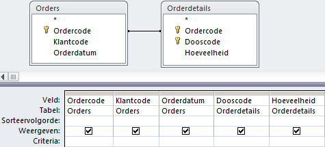
```

5. Klik in de kolom [Ordercode]{.varname} in het vak [Criteria]{.uicontrol} en typ in [[Voer ordercode in]]{.userinput}.

```{r q-information-order-design2, fig.cap="Tabellen en velden voor de query.", out.width="70%"}
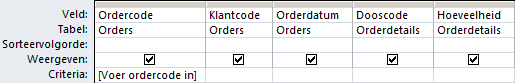
```

6. Schakel naar de [Gegevensbladweergave]{.uicontrol}. Het dialoogvenster [Parameterwaarde opgeven]{.wintitle} verschijnt.

7. Voer een waarde in, bijvoorbeeld [30]{.userinput} en klik op [OK]{.uicontrol}.

```{r q-information-order-result, fig.cap="Resultaten voor de order met ordercode 30.", out.width="70%"}
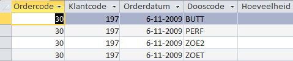
```

8. Sluit de query en beantwoord de vraag of de wijzigingen bewaard moeten worden met [Ja]{.uicontrol}. Het venster [Opslaan als]{.wintitle} verschijnt zodat de naam van de query kan worden opgegeven.

9. Typ als naam in [Informatie bepaalde order]{.varname} en klik op [OK]{.uicontrol}.
:::

## Actiequery's {#queries-actions}

De meeste query’s zijn selectiequery’s, die gebruikt worden om gegevens te verzamelen en te tonen, maar deze gegevens niet veranderen. Maar Access heeft ook een andere categorie query's waarmee je gegevens kunt wijzigen of bijwerken en records kunt toevoegen. Deze categorie staat bekend als actiequery's. Het grote voordeel van een actiequery is dat je hiermee een grote hoeveelheid records kunt wijzigen zonder dat je programmeerkennis nodig hebt. De manier waarop je deze query’s  maakt en de wijze van werken is nagenoeg steeds hetzelfde: eerst maak je een selectiequery en daarna wijzig je het type van de query.

Access kent vier soorten actiequery’s:

Tabelmaak
: Selecteert een of meer records en maakt dan een nieuwe tabel hiervoor aan. Deze nieuwe tabel kan in de geopende database geplaatst worden, maar ook in een andere database. Je kunt een tabelmaakquery bijvoorbeeld gebruiken om verouderde gegevens naar een archief database te kopiëren.

Toevoeg
: Selecteert een of meerdere records en voegt deze aan een andere tabel toe. Wanneer je bijvoorbeeld dat je nieuwe klanten hebt verworven waarvan de gegevens in een afzonderlijke tabel staan, dan kun je een toevoegquery gebruiken om de records naar de bestaande tabel klanten te verplaatsen.

Verwijder
: Verwijdert een of meerdere records die aan een filter met voorwaarden voldoen. Je kunt bijvoorbeeld met een verwijderquery producten verwijderen die niet meer worden aangeboden.

Bijwerk
: Verandert waarden in een of meerdere records. De bestaande waarden worden dan vervangen door nieuwe waarden, een soort zoek en vervang actie. De veranderingen kunnen niet teruggedraaid worden en daarom is het aan te bevelen om altijd eerst een backup of kopie van de database of van de tabel te maken voordat een toevoeqquery uitgevoerd wordt.

Omdat actiequery's gegevens in de database veranderen kunnen deze query's een beveiligingsrisico vormen. Om een beveiliging hiertegen te bieden worden in Access en het Vertrouwenscentrum een aantal controles uitgevoerd. Het vertrouwenscentrum kan inhoud uitschakelen. Bij het openen van een dergelijke database geeft Access de berichtenbalk met een beveiligingswaarschuwing weer.

```{r securitywarning, fig.cap="Berichtenbalk met beveiligingswaarschuwing.", out.width="80%"}
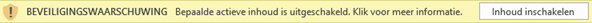
```

Wanneer je de uitgeschakelde inhoud wilt inschakelen, klik dan op [Inhoud inschakelen > Opties]{.uicontrol} en kies de gewenste optie in het dialoogvenster dat verschijnt. Access schakelt uitgeschakelde inhoud in en de database wordt opnieuw geopend met volledige functionaliteit.

Verder is het raadzaam om altijd eerst een backup te maken van de tabellen die gewijzigd worden. Dat gaat het gemakkelijkste met kopieren en plakken.

::: {.demo data-latex=""}
**Kopie tabel maken**

1. Geef in het navigatievenster een rechter muisklik op de naam van de tabel en kies uit het snelmenu voor [Kopiëren]{.uicontrol}.
2. Geef opnieuw een rechter muisklik en kies nu voor [Plakken]{.uicontrol} en geef de nieuwe tabel een verschillende naam.

Om een tabel weer te herstellen na een wijziging ga je als volgt te werk:

1. Geef in het navigatievenster een rechter muisklik op de naam van de gewijzigde tabel en kies uit het snelmenu voor [Knippen]{.uicontrol}.
2. Geef een rechter muisklik op de naam van de kopietabel en kies nu voor [Naam wijzigen]{.uicontrol} en geef de tabel de oorspronkelijke naam.
:::

## Taak: Bijwerkquery {#queries-action-update}

Een voorbeeld van een eenvoudige bijwerkquery waarmee in alle records van een tabel die aan een bepaalde voorwaarde voldoen de waarde van een veld gewijzigd wordt.

INFORMATIEBEHOEFTE

De bonbonkosten van alle bonbons met het witte chocoladetype moeten met 10% verhoogd worden.

ANALYSE

Alle benodigde gegevens staan in de tabel [Bonbons]{.varname}. Hiervan hebben we de velden [Chocoladetype]{.varname} en [Bonbonkosten]{.varname} nodig. Selecteren op chocoladetype wit kan door een criterium toe te voegen. De bonbonkosten met 10% verhogen kan door de bestaande waarde te vermenigvuldigen met `1,1`.

::: {.practice data-latex=""}
1. Open zonodig database [snoep365.accdb]{.filepath}.

2. Kies [tab Maken > Queryontwerp (groep Query's)]{.uicontrol}.

3. Voeg de tabel [Bonbons]{.varname} aan het queryvenster toe en klik daarna op [Sluiten]{.uicontrol}.

4. Voeg achtereenvolgens de velden [Chocoladetype]{.varname} en [Bonbonkosten]{.varname} aan het queryraster toe door dubbel te klikken op de velden.

5. Wijzig het type query via [tab Ontwerp > Bijwerken (groep Querytype)]{.uicontrol}. De rijen [Sorteervolgorde]{.uicontrol} en [Weergeven]{.uicontrol} verdwijnen en er komt een nieuwe rij [Wijzigen]{.uicontrol}.

```{r q-increase-costs-design1, fig.cap="Tabellen en velden voor de bijwerkquery.", out.width="50%"}
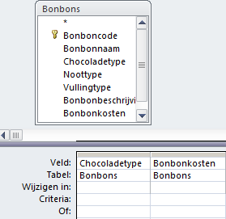
```

6. Klik in de kolom [Chocoladetype]{.varname} in het vak [Criteria]{.uicontrol} en typ in [Wit]{.userinput}.

7. Klik in de kolom [Bonbonkosten]{.varname} in het vak [Wijzigen in]{.uicontrol} en typ in [[Bonbonkosten]*1,1]{.userinput}.

```{r q-increase-costs-design2, fig.cap="Ontwerp bijwerkquery.", out.width="50%"}
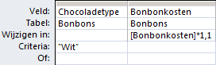
```

::: {.info data-latex=""}
Wanneer de waarde uit een veld gebruikt moet worden, dan moet de veldnaam tussen blokhaken `[ ... ]` gezet worden.
:::

8. Sla de query op via de knop [Opslaan]{.uicontrol} ![]images/common/button-save.png) op de werkbalk [Snelle toegang]{.uicontrol} linksboven en geef de query de naam [Verhogen kosten witte bonbons met 10%]{.varname}.

9. Klik op  [tab Ontwerp > Uitvoeren (groep Resultaten)]{.uicontrol}. Er verschijnt nu een dialoogvenster waarin om een bevestiging gevraagd wordt om records bij te werken.

10. Klik op [Ja]{.uicontrol}.

11. Sluit de query.
:::

## Taak: Tabelmaakquery {#queries-action-maketable}

INFORMATIEBEHOEFTE

De afdeling marketing wil alle klanten uit Friesland een speciaal aanbod doen. Ze hebben daarvoor een Access tabel nodig met daarin de klantgegevens van alleen de klanten uit de provincie Friesland.

ANALYSE

Alle benodigde gegevens staan in de tabel [Klanten]{.varname}. Het selecteren op Friesland kan via een criterium in de query. Allereerst moet deze selectiequery gemaakt worden. Daarna kan de selectiequery omgezet worden in een tabelmaakquery.

::: {.practice data-latex=""}
**Selectiequery maken**

1. Open zonodig database [snoep365.accdb]{.filepath}.

2. Kies [tab Maken > Queryontwerp (groep Query's)]{.uicontrol}.

3. Voeg de tabel [Klanten]{.varname} aan het queryvenster toe en klik daarna op [Sluiten]{.uicontrol}.

4. Voeg alle velden toe door een dubbelklik op het sterretje (`*`) en voeg daarna nog een keer afzonderlijk het veld [Provincie]{.varname} toe.

5. Voer als criterium ["FR"]{.userinput} in onder het veld [Provincie]{.varname}. Laat verder dit veld [Provincie]{.varname} niet weergeven, omdat deze immers al wordt weergegeven via de tabel [Klanten]{.varname}.

```{r q-customers-friesland-design, fig.cap="Ontwerp tabelmaakquery.", out.width="50%"}
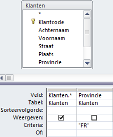
```

6. Controleer de uitvoer van de query via de [Gegevensbladweergave]{.uicontrol}.

7. Bewaar de query onder de naam [Klanten Friesland]{.varname}.
:::

::: {.practice data-latex=""}
**Selectiequery omzetten naar Tabelmaakquery**

1. Open de query [Klanten Friesland]{.varname} in de [Ontwerpweergave]{.uicontrol}.

2. Klik op [Ontwerp > Tabel maken (groep Querytype)]{.uicontrol}. Het dialoogvenster [Tabel maken]{.wintitle} wordt geopend.

3. Geef de nieuwe tabel als naam [Friese klanten]{.varname} en geef aan dat deze in de huidige database geplaatst moet worden..

```{r q-maketable-dialogbox, fig.cap="Naam specificeren van de nieuwe tabel en de database waarin deze terecht moet komen.", out.width="70%"}
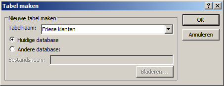
```

4. Klik op [OK]{.uicontrol}.

5. Klik op 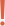 (Uitvoeren). Er verschijnt een waarschuwingsscherm met de vraag of de nieuwe tabel gemaakt moet worden.

6. Klik op [Ja]{.uicontrol}. De nieuwe tabel wordt gemaakt.

7. Sluit de query. Er verschijnt een dialoogvenster met de vraag of de wijzigingen in het ontwerp moeten worden opgeslagen.

8. Klik op [Ja]{.uicontrol}.

::: {.info data-latex=""}
wijzigingen bestaan er uit dat het type query van een selectiequery in een tabelmaakquery veranderd is. Dit is ook te zien in het navigatievenster onder [Query's]{.uicontrol}.

Het icoon 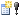 voor de querynaam geeft aan dat het hier om een actiequery gaat.
:::

:::

## Taak: Kruistabelquery {#queries-crosstab}

Een kruistabelquery berekent de som, gemiddelde of een andere samenvattingswaarde en groepeert de resultaten in rijen en kolommen. Een kruistabel is vergelijkbaar met een draaitabelrapport in Excel. Een kruistabelquery is vaak eenvoudiger leesbaar dan een gewone selectiequery met dezelfde gegevens. Door de horizontale en verticale groepering is het overzicht compacter.

Wanneer je een kruistabelquery maakt, moet je opgeven welke velden de rijkoppen bevatten, welk veld de kolomkoppen bevat en welk veld de waarden bevat die moeten worden samengevat. Voor de rijkoppen kun je meerdere velden gebruiken (maximaal 3), maar voor de kolomkoppen en de samen te vatten gegevens kun je maar één veld gebruiken. Verder kun je ook expressies gebruiken voor de rijkoppen, kolomkoppen en samen te vatten gegevens.

De gemakkelijkste en snelste manier om een kruistabelquery te maken is met behulp van de [Wizard Kruistabelquery]{.uicontrol}. Voor complexere query's kun je vaak wel met deze Wizard beginnen, maar moet je daarna voor het fijnere werk overstappen naar de ontwerpweergave.

INFORMATIEBEHOEFTE

Bepaal het aantal klanten per provincie en per regio en toon het resultaat in een kruistabel.

ANALYSE

Alle benodigde gegevens staan in de tabel [Klanten]{.varname}.

::: {.practice data-latex=""}
1. Open zonodig database [snoep365.accdb]{.filepath}.

2.  Kies [tab Maken > Wizard Query (groep Query's) > Wizard Kruistabelquery > OK]{.uicontrol}.  
    In het scherm dat getoond wordt kun je de tabel of query selecteren welke de velden voor de kruistabel bevat.

3.  Selecteer de tabel [Klanten]{.varname} en klik op [Volgende]{.uicontrol}. Nu kun je de velden kiezen die de waarden voor de rijkoppen bevatten.

4.  Voeg [Provincie]{.varname} toe.

```{r q-crosstab-rowhead, fig.cap="Selectie velden voor rijkoppen", out.width="70%"}
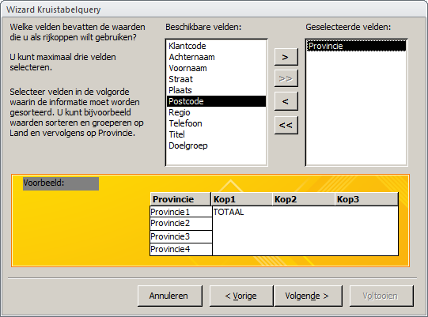
```

5.  Klik op [Volgende]{.uicontrol}. Nu moet je het veld opgeven dat de waarden voor de kolomkoppen bevat.

6.  Selecteer veld [Regio]{.varname}.

```{r q-crosstab-columnhead, fig.cap="Selectie veld voor kolomkop.", out.width="70%"}
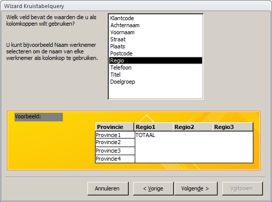
```

7.  Klik op [Volgende]{.uicontrol}. Nu kun je het veld kiezen dat de waarden voor de samen te vatten gegevens bevat alsmede de functie voor het samenvatten.

8.  Selecteer veld [Klantcode]{.varname} en functie `Aantal`. Deselecteer tevens de optie om een totaal te berekenen voor elke rij.

```{r q-crosstab-values, fig.cap="Selectie veld en functie voor samenvatting.", out.width="70%"}
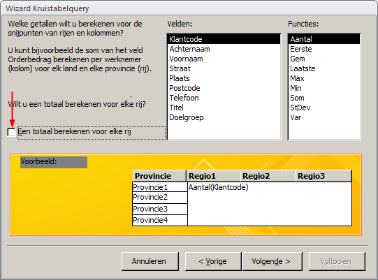
```

9.  Klik op [Volgende]{.uicontrol}.

10. Noem de query [Aantal klanten per provincie per regio]{.varname}. Selecteer [Bekijk de query]{.uicontrol} en klik op [Voltooien]{.uicontrol}.

```{r q-crosstab-result, fig.cap="Resultaat kruistabel.", out.width="50%"}
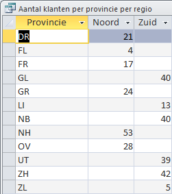
```
:::

## Opgaven {#queries-exercises}

```{r, child='exercises/ex-queries.Rmd'}
```
