# Rapporten {#reports}

::: {.intro data-latex=""}
+ Waarvoor je rapporten kunt gebruiken.
+ Hoe je etiketten met de Wizard kunt maken.
+ Het maken van een automatisch gegenereerd rapport met handmatige aanpassingen.
+ Het maken van een gegroepeerd rapport.
+ Het maken van een rapport met afbeeldingen van bonbons op etiketten.
:::

Rapporten zijn overzichten die meestal bedoeld zijn om af te drukken. Ook etiketten zijn een vorm van rapporten.

## Over rapporten maken {#reports-about}

Rapporten zijn meestal overzichten en samenvattingen van grote hoeveelheden informatie.

Als je een verkoopoverzicht op een overzichtelijke manier op papier willen afdrukken dan gebruik je een rapport. In een rapport kun je ook subtotalen en eindtotalen berekenen en afdrukken. Rapporten kun je vanaf nul met de hand maken, maar het is gemakkelijker om de Wizard te gebruiken.

Een rapport kan ook dynamisch worden door gebruik te maken van parameters. Bij het genereren van het rapport wordt dan eerst om aanvullende informatie gevraagd. Als voorbeeld hiervan zie het rapport [Verkoop per doos]{.varname}. Wanneer je dit rapport opent dan word je achtereenvolgens eerst gevraagd om de begin- en einddatum in te voeren.

## Taak: Etiketten maken {#reports-labels}

In deze taak worden adresetiketten van de klanten gemaakt met de [Wizard etiketten]{.uicontrol}. Eerst moet de tabel geselecteerd worden waarin de velden voorkomen die op het etiket moeten verschijnen. Daarna kan de [Wizard etiketten]{.uicontrol} gestart worden.

::: {.practice data-latex=""}
1. Open zonodig database [snoep365.accdb]{.filepath}.

2. Selecteer de tabel [Klanten]{.varname}.

3. Kies [tab Maken > Etiketten (groep rapporten)]{.uicontrol}.

4. Selecteer maateenheid `Engels`, fabrikant `Avery` en dan product `Avery L7160`, zie figuur \@ref(fig:label-wizard-avery7160).

```{r label-wizard-avery7160, fig.cap="Keuze etikettype Avery L7160.", out.width="75%"}
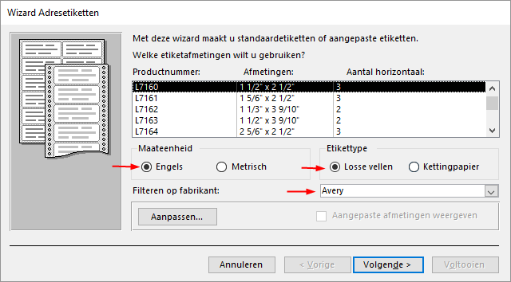
```

5. Klik op [Volgende]{.uicontrol}. In het scherm dat nu getoond wordt kun je het lettertype en de kleur voor de tekst wijzigen.

6. Accepteer de standaardinstellingen en klik op [Volgende]{.uicontrol}.

```{r label-wizard-fields, fig.cap="Gegevens op het etiket.", out.width="75%"}
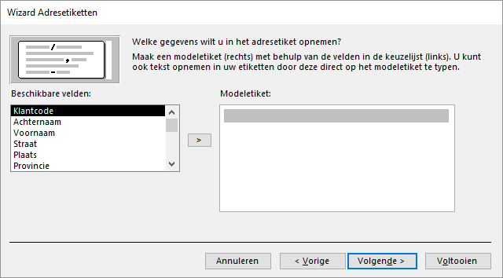
```

::: {.info data-latex=""}
Door dubbel te klikken op een veldnaam wordt deze op de plaats van de cursor ingevoegd. De veldnaam verschijnt dan tussen accolades op het modeletiket. Ook tekst en spaties kunnen worden ingetypt. Door op de Enter toets te drukken wordt een nieuwe regel gemaakt.
:::

7. Maak het volgende Modeletiket (met tussen de voor- en achternaam 1 spatie en tussen postcode en plaats 2 spaties):

   ```
   {Voornaam} {Achternaam}
   {Straat}
   {Postcode}  {Plaats}
   ```

8. Klik op [Volgende]{.uicontrol}. In het scherm dat nu getoond wordt kun je aangeven of de etiketten gesorteerd moeten worden en zo ja, op welke velden.

9. Er moet op [Postcode]{.varname} gesorteerd worden. Voeg dit veld toe en klik op [Volgende]{.uicontrol}. Het laatste scherm van de Wizard wordt nu getoond. Hier kun je de naam voor het rapport specificeren.

10. Geef het rapport de naam [Adresetiketten klanten]{.varname} en klik op [Voltooien]{.uicontrol}.

```{r report-customers-printpreview, fig.cap="Afdrukvoorbeeld.", out.width="75%"}
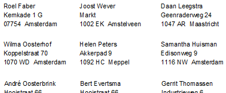
```

11. Sluit het rapport.
:::

## Taak: Automatisch rapport {#reports-autoreport}

Access kan automatisch een rapport genereren op basis van een tabel of een query. Soms is het gegenereerde rapport voldoende, maar vaak zullen toch wat handmatige aanpassingen gedaan moeten worden.

::: {.practice data-latex=""}
1. Open zonodig database [snoep365.accdb]{.filepath}.

2. Selecteer de query [Verkoop per regio per doos]{.varname}.

3. Klik [tab Maken > Rapport (groep Rapporten)]{.uicontrol}. Het rapport wordt aangemaakt en geopend in de [Indelingsweergave]{.uicontrol}.

Niet fraai is dat de waarde van [Regio]{.varname} voor elk record herhaald wordt en dat de geldbedragen niet juist opgemaakt zijn. In de volgende stappen worden hiervoor wijzigingen aangebracht.

4. Sluit het rapport en beantwoord de vraag of de wijzigingen bewaard moeten worden met [Ja]{.uicontrol}. Het venster [Opslaan als]{.wintitle} verschijnt.

5. Typ als naam in [Verkoop per regio per doos]{.varname} en klik op [OK]{.uicontrol}.

6. Open het rapport [Verkoop per regio per doos]{.varname} in de [Ontwerpweergave]{.uicontrol}.

7. Selecteer in de sectie [Details]{.uicontrol} het vak [Regio]{.varname}. Wijzig in het [Eigenschappenvenster]{.uicontrol} de waarde van eigenschap [Duplicaten verbergen]{.uicontrol} in `Ja`.

::: {.info data-latex=""}
Het [Eigenschappenvenster]{.uicontrol} staat aan de rechterkant van het scherm en kan zichtbaar en onzichtbaar gemaakt worden via sneltoets [F4]{.uicontrol}.
:::

8. Selecteer in de sectie [Details]{.uicontrol} het veld [omzet]{.varname}. Wijzig in het [Eigenschappenvenster]{.uicontrol} de waarde van eigenschap [Notatie]{.uicontrol} in `Valuta`.

9. Schakel naar de [Rapportweergave]{.uicontrol}. De waarde van het veld [Regio]{.varname} wordt nu maar één keer getoond en de omzet is als geldbedragen opgemaakt.

10. Sluit het rapport en bewaar de wijzigingen.
:::

## Taak: Groepsrapport {#reports-grouping}

INFORMATIEBEHOEFTE
: Maak een rapport waarop over een op te geven periode de verkoop per doos te zien is, alsmede de detailgegevens van elke order. Zie als voorbeeld figuur \@ref(fig:group-report-result) waarin een gedeelte van het rapport te zien is over november 2009.

```{r group-report-result, fig.cap="Rapport November 2009 (gedeeltelijke weergave).", out.width="60%"}
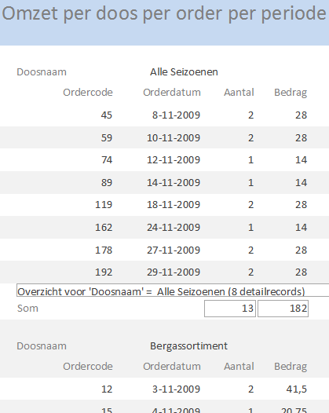
```

ANALYSE
: De benodigde gegevens zijn [Doosnaam]{.varname}, [Ordercode]{.varname}, [Orderdatum]{.varname}, [Aantal]{.varname} en een veld [Bedrag]{.varname} wat berekend wordt met de expressie `[Hoeveelheid]*[Doosprijs]`. Een query gemaakt voor deze gegevens is reeds beschikbaar onder de naam [Omzet per doos per order per periode]{.varname}.

::: {.practice data-latex=""}
1. Open zonodig database [snoep365.accdb]{.filepath}.

2. Selecteer query [Omzet per doos per order per periode]{.varname}.

3. Kies [tab Maken > Wizard rapport (groep Rapporten)]{.uicontrol}.

```{r group-wizard-fields, fig.cap="Selecteer de op te nemen velden.", out.width="70%"}
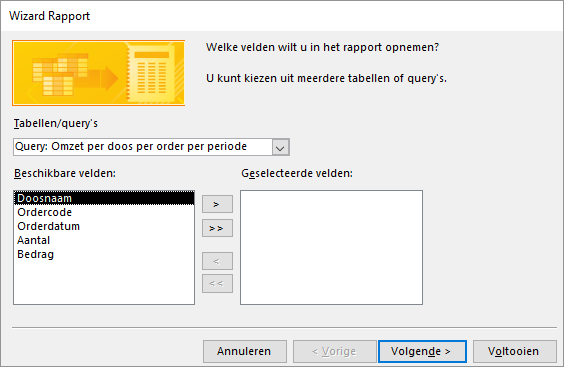
```

4. Voeg alle velden van de query toe. Klik [Volgende]{.uicontrol}. In het scherm dat nu getoond wordt kun je aangeven of je groepeerniveaus wilt toevoegen.

5. Verwijder eventuele reeds aanwezige groepeerniveaus ([Ordercode]{.varname}) en voeg [Doosnaam]{.varname} als groepeerniveau toe.

```{r group-wizard-levels, fig.cap="Selecteer de velden waarop gegroepeerd moet worden.", out.width="70%"}
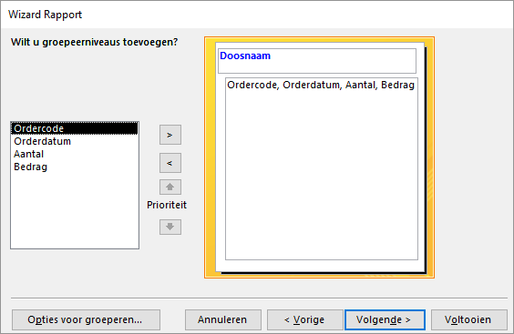
```

6. Klik [Volgende]{.uicontrol}. In het scherm dat nu getoond wordt kun je de sorteervolgorde aangeven.

7. Geef aan dat oplopend op [Ordercode]{.varname} gesorteerd moet worden.

```{r group-wizard-sort, fig.cap="Sorteervelden en opties voor totalen specificeren.", out.width="70%"}
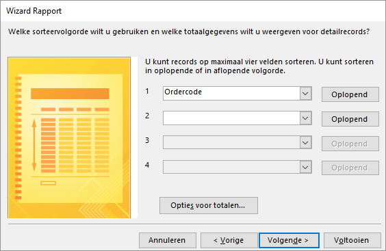
```

8. Klik op de knop [Opties voor totalen...]{.uicontrol} en geef aan dat voor de velden [Aantal]{.varname} en [Bedrag]{.varname} ook de `Som` moet worden afgedrukt.

```{r group-wizard-summary, fig.cap="Totaalwaarden specificeren.", out.width="60%"}
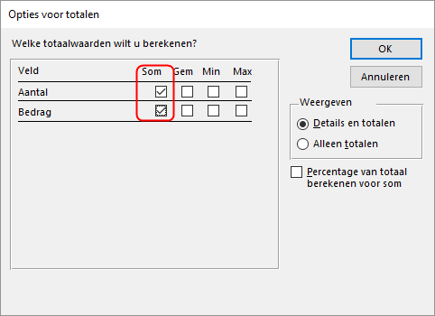
```

9. Klik op [OK]{.uicontrol} en daarna op [Volgende]{.uicontrol}. Nu kun je aangeven hoe je het rapport opgemaakt wilt hebben.

10. Selecteer indeling [Overzicht]{.uicontrol}.

```{r group-wizard-layout, fig.cap="Opmaak van het rapport aangeven.", out.width="70%"}
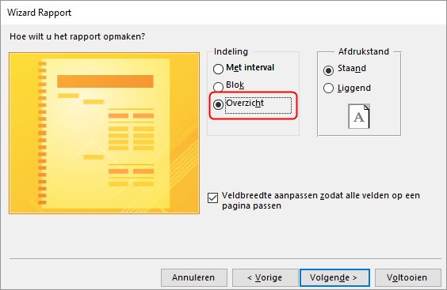
```

11. Klik op [Volgende]{.uicontrol}. Het laatste scherm van de Wizard wordt nu getoond. Hier kun je de naam voor het rapport specificeren.

12. Geef het rapport de naam [Omzet per doos per order per periode]{.varname} en klik op [Voltooien]{.uicontrol}.

Het rapport wordt gemaakt en in weergave [Afdrukvoorbeeld]{.uicontrole} geopend. Omdat de query de parameters begindatum en einddatum kent vraagt Access om een waarde hiervoor.

13. Test met begindatum `1-11-2009` en einddatum `30-11-2009`.

14. Sluit het rapport.
:::

## Taak: Bonbon afbeeldingen {#reports-pictures}

In deze opdracht wordt een rapport gemaakt met de afbeeldingen van de bonbons en de bijbehorende bonbonnaam en bonboncode. Daarvoor worden etiketten gebruikt met op elk etiket de gegevens van de bonbon.

::: {.practice data-latex=""}
1. Open zonodig database [snoep365.accdb]{.filepath}.

2. Selecteer de tabel [Bonbons]{.varname}.

3. Kies [tab Maken > Etiketten (groep Rapporten)]{.uicontrol}.

4. Selecteer maateenheid `Metrisch`, fabrikant `Zweckform` en dan product `Zweckform 3415`.

```{r label-wizard-zweckform3415, fig.cap="Keuze etikettype Zweckform 3415.", out.width="75%"}
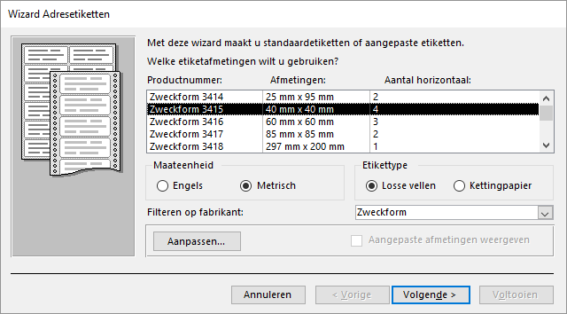
```

5. Klik op [Volgende]{.uicontrol}. In het scherm dat nu getoond wordt kun je het lettertype en de kleur voor de tekst wijzigen.

6. Accepteer de standaardinstellingen en klik op [Volgende]{.uicontrol}.

7. Maak het volgende Modeletiket, met tussen de velden 1 spatie):

   ```
   {Bonboncode} {Bonbonnaam}
   ```

8. Klik op [Volgende]{.uicontrol}. Specificeer oplopend sorteren op [Bonboncode]{.varname}.

9. Klik op [Volgende]{.uicontrol}. Noem het rapport [Overzicht bonbons]{.varname}.

10. Klik op [Voltooien]{.uicontrol}. Het rapport wordt gegenereerd en verschijnt in de weergave [Afdrukvoorbeeld]{.uicontrol}.

11. Schakel over naar de [Ontwerpweergave]{.uicontrol}.

12. Klik op [tab Ontwerp > Kader voor afhankelijk object (groep Besturingselementen)]{.uicontrol}   en teken hiermee op het etiket een kader van ca. 2,5 cm bij 2,5cm.

```{r label-praline-objectframe, fig.cap="Kader voor het object.", out.width="50%"}
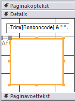
```

13. Zorg dat het kader geselecteerd blijft en breng dan via het [Eigenschappenvenster]{.uicontrol} de volgende wijzigingen aan:

    + In tab [Opmaak]{.uicontrol}: zet [Breedte]{.uicontrol} en [Hoogte]{.uicontrol} op `2,5 cm`. Het is mogelijk dat Access de afmetingen iets aanpast.

```{r label-praline-dimensions, fig.cap="Afmetingen van het objectkader instellen.", out.width="60%"}
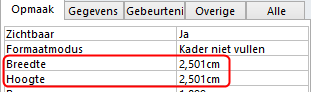
```

    + In tab [Gegevens]{.uicontrol}: stel eigenschap [Besturingselementbron]{.uicontrol} in op  `Plaatje`.

```{r label-praline-controlsource, fig.cap="Besturingsbron voor het object instellen.", out.width="60%"}
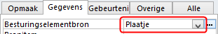
```

14. Selecteer op het etiket het bijschrift dat zich grotendeels achter het kader bevindt.

```{r label-praline-label, fig.cap="Bijschrift selecteren.", out.width="50%"}
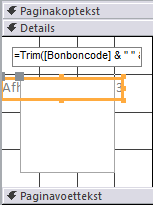
```

15. Verwijder het bijschrift met de [Delete]{.uicontrol} toets.

16. Schakel over naar [Afdrukvoorbeeld]{.uicontrol}.

Het is nu bijna goed. Alleen de afbeeldingen beginnen niet allemaal op dezelfde hoogte waardoor het beeld er wat schots en scheef uitziet. Voor de tekst van de [Bonboncode]{.varname} en [Bonbonnaam]{.varname} moet nu nog een vaste hoogte ingesteld worden zodat alle plaatjes op dezelfde hoogte geplaatst worden.

17. Schakel over naar de [Ontwerpweergave]{.uicontrol}, selecteer het tekstvak en zet de eigenschap [Hoogte]{.uicontrol} op `1cm`. Stel ook de eigenschappen [Te vergroten]{.uicontrol} en [Te verkleinen]{.uicontrol} in op `Nee`.

```{r label-praline-textbox, fig.cap="Eigenschappen van het tekstvak.", out.width="60%"}
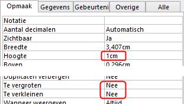
```

18. Lijn het plaatje en het tekstvak links uit.

```{r label-praline-alignment, fig.cap="Uitlijning van de objecten.", out.width="50%"}
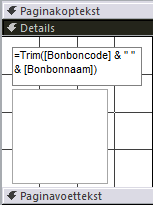
```

19. Schakel over naar [Afdrukvoorbeeld]{.uicontrol}.

```{r report-pralines-result, fig.cap="Afdrukvoorbeeld bonbonsoorten.", out.width="80%"}
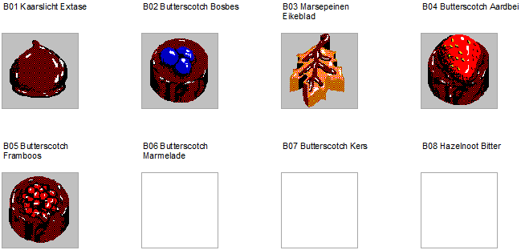
```

20. Sluit het rapport en bewaar de wijzigingen.
:::

## Opgaven {#reports-exercises}

```{r, child='exercises/ex-reports.Rmd'}
```
