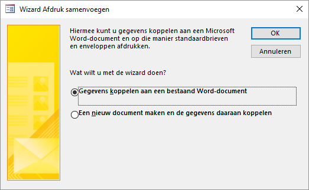
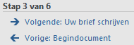
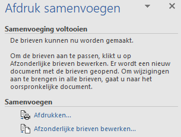
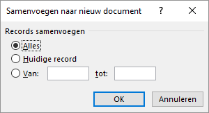

# (PART) Gevorderd {-}
# Integratie met Office {#integration}

::: {.intro data-latex=""}
+ Uitwisselen van gegevens van Access met Excel en Word.
+ Een standaardbrieven in Word maken met een adressenbestand in Access.
+ Een tabel exporteren naar een nieuw RTF document.
+ Een tabel exporteren naar Excel.
:::

Access, Excel, Powerpoint en Word zijn voor veel gebruikers op zich zelf staande programma's. Voor veel zakelijke toepassingen is een samenwerking tussen de programma's van belang. En daar zijn voldoende mogelijkheden voor.

## Over integratie met Office {#integration-about}

De afzonderlijke programma's binnen het Microsoft Office pakket kunnen goed met elkaar samenwerken, zodat integratie binnen processen mogelijk is. Voor veel gebruikers echter zijn Access, Excel en Word afzonderlijke programma's, elk met hun sterke en zwakke kanten. Access voor databases, Excel voor het rekenwerk en Word voor tekstverwerking.

Access kan gegevens uit tabellen, query's en formulieren exporteren naar Excel, zodat je daar het rekenwerk kunt doen wat in Access niet kan. Daarnaast kan Acess gegevens uit Excel werkbladen importeren.

Access kan ook gegevens van tabellen, query's en formulierenexporteren naar tabellen in een Word RTF bestand. Verder kan een Access database uitstekend dienen als gegevensbron bij het maken van standaardbrieven en etiketten in Word via de Wizard samenvoegen. Deze Wizard kan zowel vanuit Access als vanuit Word opgestart worden.

## Taak: Mailmerge {#integration-mailmerge}

In deze taak wordt aan klanten een standaardbrief gestuurd met daarin de aankondiging van een nieuwe bonbondoos met de naam [Sneeuwwitje]{.varname}. Als bron voor de adressen wordt de tabel [Klanten]{.varname} gebruikt. Het is desgewenst ook mogelijk om een query als gegevensbron te gebruiken.

::: {.practice data-latex=""}
1. Open de database [snoep365.accdb]{.filepath}.

2. Selecteer de tabel [Klanten]{.varname}.

3. Geef een rechter muisklik op de tabelnaam en kies [Exporteren > Word Merge]{.uicontrol}.

```{r word-mailmerge-wizard, fig.cap="Wizard Afdruk samenvoegen.", out.width="70%"}

```

4. Selecteer [Gegevens koppelen aan een bestaand Word document]{.uicontrol} en klik op [OK]{.uicontrol}.

5. Selecteer in het dialoogvenster [Microsoft Word-document selecteren]{.wintitle} het hulpbestand [Sneeuwwitje.docx]{.filepath} en klik op [Openen]{.uicontrol}. Microsoft Word wordt opgestart en verschijnt met het document. Op het lint is de [tab Verzendlijsten]{.uicontrol} geactiveerd en aan de rechterkant is het paneel [Afdruk samenvoegen]{.wintitle} verschenen. Onder in dit paneel is te zien dat de Wizard zich in stap 3 van de 6 zit.

```{r mailmerge-wizard-step3, fig.cap="Voortgang wizard samenvoegen: stap 3 van 6.", out.width="50%"}

```

6. Klik op de link [Volgende: Uw brief schrijven]{.uicontrol}.

7. Plaats de cursor in de eerste regel, kies dan [tab Verzendlijsten > Samenvoegvelden invoegen (groep Velden beschrijven en invoegen) > {.uicontrol}Voornaam]{.varname}.

8. Voeg daarna de velden [Achternaam]{.varname}, [Straat]{.varname}, [Postcode]{.varname} en [Plaats]{.varname} zoals in het model hierna te zien is.

   ```
   <<Voornaam>> <<Achternaam>>
   <<Straat>>
   <<Postcode>>  <<Plaats>>
   ```

9. Klik in het paneel [Afdruk samenvoegen]{.wintitle} onder Stap 4 van 6 op de link [Volgende: Briefvoorbeeld]{.uicontrol}. Een voorbeeldbrief voor de eerste klant wordt getoond.

10. Klik in het paneel [Afdruk samenvoegen]{.wintitle} onder Stap 5 van 6 op de link [Volgende: Samenvoeging voltooien]{.uicontrol}. De samenvoeging kan nu afgerond worden.

```{r mailmerge-wizard-finishing, fig.cap="Voltooing van de samenvoeging.", out.width="50%"}

```

::: {.info data-latex=""}
Je hebt nu twee keuzenogelijkheden:

+ Met [Afdrukken]{.uicontrol} stuur je de brieven naar de printer.
+ Met [Afzonderlijke brieven bewerken]{.uicontrol} wordt er één Word document gemaakt.
:::

11. Klik op de link [Afzonderlijke brieven bewerken]{.uicontrol.

```{r mailmerge-wizard-records, fig.cap="Selectie van records.", out.width="60%"}

```

12. Geef aan dat je voor de eerste 10 klanten de de standaardbrief wilt maken en klik dan op [OK]{.uicontrol}. Er wordt een nieuw Word-document gemaakt met daarin 10 brieven.

13. Bewaar het document onder de naam [Uitnodiging nieuwe doos]{.varname} en sluit daarna Word af.
:::

## Taak: Export naar Word {#integration-export-word}

Wanneer je de inhoud van een tabel of het resultaat van een query in een bestaand Word document wilt plaatsen, dan is kopiëren en plakken de meest simpele methode. Maar je kunt de gegevens ook exporteren naar een nieuw Word document. Er wordt dan een document in het RTF formaat (Rich Text Format) gemaakt dat door Word geopend kan worden.

::: {.practice data-latex=""}
1. Open de database [snoep365.accdb]{.filepath}.

2. Selecteer de tabel [Dozen]{.varname}.

3. Geef een rechter muisklik op de tabelnaam en kies [Exporteren > Word RTF-bestand]{.uicontrol}. Het dialoogvenster [Exporteren - RTF-bestand]{.wintitle} verschijnt.

4. Geef de bestandsnaam met pad op en klik op [OK]{.uicontrol}. Het dialoogvenster [Exportstappen opslaan]{.wintitle} verschijnt.

5. De exportstappen hoeven niet opgeslagen te worden. Klik op [Sluiten]{.uicontrol}.

6. Controleer het exporteren door het bestand in Word te openen.
:::

## Taak: Export naar Excel {#integration-export-excel}

Je kunt eenvoudig een tabel vanuit Access naar Excel exporteren.

::: {.practice data-latex=""}
1. Open de database [snoep365.accdb]{.filepath}.

2. Selecteer de tabel [Dozen]{.varname}.

3. Geef een rechter muisklik op de tabelnaam en kies [Exporteren > Excel]{.uicontrol}. Het dialoogvenster [Exporteren - Excel-werkblad]{.wintitle} verschijnt.

4. Geef de bestandsnaam met pad op, selecteer de optie [Gegevens exporteren met opmaak en indeling]{.uicontrol} en klik op [OK]{.uicontrol}. Het dialoogvenster [Exportstappen opslaan]{.wintile} verschijnt.

5. De exportstappen hoeven niet opgeslagen te worden. Klik op [Sluiten]{.uicontrol}.

6. Controleer het exporteren door het bestand in Excel te openen.
:::

## Opgaven {#integration-exercises}

```{r, child='exercises/ex-integration.Rmd'}
```
