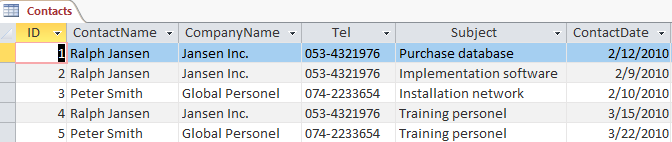
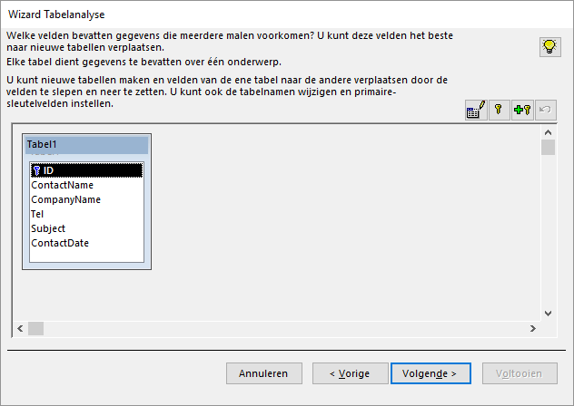
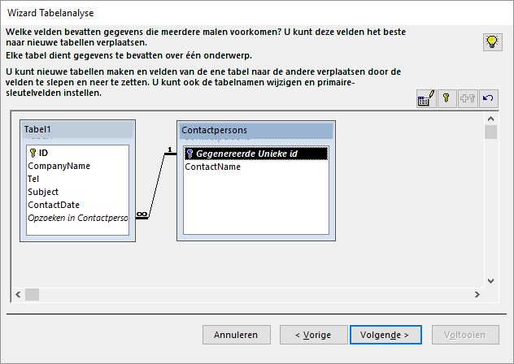
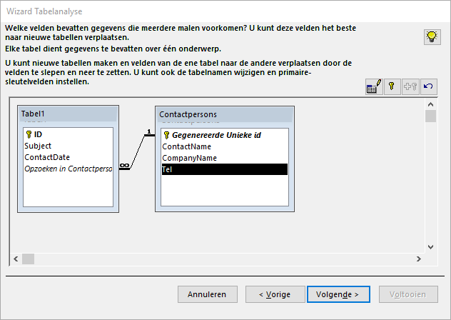

# Hulpmiddelen {#tools}

::: {.intro data-latex=""}
+ Tabellen kunnen analyseren en inconsistenties opsporen.
+ Het kunnen defragmenteren en repareren van databases.
:::

## Over hulpmiddelen {#tools-about}

Access kent een aantal hulpmiddelen om de database te analyseren, problemen op te sporen en te corrigeren. In dit onderwerp komt het volgende aan bod:

+ Analyse van een tabel
+ Comprimeren van een database

Andere hulpmiddelen binnen Access:

+ Analyseren van prestaties
+ Documenteren van de database
+ Versleutelen met een wachtwoord
+ Het maken van een schakelbord

## Taak: Analyse van een tabel {#tools-analyse-tables}

Wanneer dezelfde informatie vaker dan één keer wordt opgeslagen dan wordt dit [redundantie]{.term} genoemd. Dat is onwenselijk, want wanneer de informatie wijzigt, moet deze wijziging op al die plaatsen worden doorgevoerd. Als je dat niet doet dan wordt de database [inconsistent]{.term}.

Access beschikt over het hulpmiddel [Tabelanalyse]{.uicontrol} om redundante gegevens op te sporen en een tabel met redundante gegevens op te splitsen in meerdere, gerelateerde tabellen zodat de informatie efficiënter wordt opgeslagen. Dit proces wordt ook wel normalisatie genoemd.

Je kunt opgeven welke tabellen je de wizard wilt laten maken of je kunt jouw tabel door de wizard laten normaliseren. Nadat je de voorgestelde nieuwe tabellen hebt opgegeven, helpt de wizard de gegevens te saneren die in de oorspronkelijke tabel op inconsistente wijze werden herhaald. In de laatste stap kun je een query maken waarmee alle informatie in de gesplitste tabellen kan worden weergegeven in een enkel gegevensblad dat overeenkomt met de oorspronkelijke tabel.

In figuur \@ref(fig:tools-table-contacts) is een voorbeeld van een tabel [Contacts]{.varname} te zien. Hierin is te zien dat veel gegevens meervoudig worden opgeslagen. Deze tabel is niet dus niet genormaliseerd. Access kan deze tabel splitsen in twee tabellen zo dat zo min mogelijk gegevens meervoudig worden opgeslagen.

```{r tools-table-contacts, fig.cap="Tabel contacten.", out.width="75%"}

```

::: {.practice data-latex=""}
1. Open het hulpbestand [tools.accdb]{.filepath}.

2. Selecteer de tabel [Contacts]{.varname}.

3. Kies [tab Hulpmiddelen voor databases > Tabel analyseren (groep Analyseren)]{.uicontrol. De wizard [Tabelanalyse]{.wintitle} verschijnt met wat algemene uitleg over dubbele informatie.

4. Klik op [Volgende]{.uicontrol}. Een nieuw scherm van de wizard Tabelanalyse verschijnt met algemene uitleg over hoe dit probleem opgelost kan worden.

5. Klik op [Volgende]{.uicontrol}. De wizard vraagt nu welke tabel de redundante gegevens bevat.

6. Selecteer tabel [Contacts]{.varname} en klik op [Volgende]{.uicontrol}. Nu kun je aangeven wie de keuze van de velden bepaalt, de wizard of jij.

7. Selecteer [Zelf een keuze maken]{.uicontrol} en klik op [Volgende]{.uicontrol}.

```{r table-analyzer-wizard, fig.cap="Wizard tabelanalyse", out.width="75%"}

```

::: {.info data-latex=""}
In deze stap kun je nieuwe tabellen maken en velden daaraan toevoegen.
:::

8. Selecteer veld [ContactName]{.varname} en sleep deze uit de tabel. Er wordt een nieuwe tabel gemaakt met daarin het veld [ContactName]{.varname}. De wizard vraagt nu om de naam van de nieuwe tabel.

9. Geef de nieuwe tabel de naam [Contactpersons]{.varname} en klik [OK]{.uicontrol}.

```{r table-generated, fig.cap="Nieuw aangemaakte tabel contactpersoon", out.width="75%"}

```

::: {.info data-latex=""}
+ Er is tevens een relatie tussen de twee tabellen aangemaakt.

+ De plaats en de afmetingen van de getoonde tabellen kunnen gewijzigd worden door de tabel zelf of de randen te verslepen.
:::

10. Sleep de velden [CompanyName]{.varname} en [Tel]{.varname} naar de nieuwe tabel [Contactpersons]{.varname}.

```{r tables-splitted, fig.cap="Eindresultaat tabel Contactpersons", out.width="75%"}

```

11. Klik op [Volgende]{.uicontrol}. In het scherm dat nu verschijnt kan een bijbehorende query gemaakt worden.

12. Laat geen query maken en klik op [Voltooien]{.uicontrol}. Er zijn nu drie tabellen: [Contacts]{.varname} (oorspronkelijke tabel), [Contactpersons]{.varname} (nieuwe tabel), [Tabel1]{.varname} (nieuwe tabel)

::: {.warning data-latex=""}
Er kan een waarschuwingsvenster verschijnen met de mededeling dat de opdracht of actie [OnderElkaar]{.uicontrol} niet beschikbaar is. Klik in dat geval op [OK]{.uicontrol}.
:::

13. Sluit de tabellen en wanneer daarom gevraagd wordt, laat dan de gewijzigde indelingen opslaan.

14. Verwijder de tabel [Contacts]{.varname}.

15. Wijzig de naam van [Tabel1]{.varname} in [Contacts]{.varname}.
:::

## Database comprimeren {#tools-compact-repair}

Bij het veelvuldig gebruik van een database waarbij je records toevoegt, wijzigt of verwijderd kunnen op den duur meerdere problemen optreden. Bij het openen van een database onderzoekt Access de conditie ervan en bij eventuele problemen wordt geprobeerd deze te repareren. Niet altijd worden de problemen ontdekt en in dat geval moet de gebruiker een actie tot comprimeren en herstellen starten.

Comprimeren heeft ook invloed op automatische nummeringen in een Access-database. Als je records hebt verwijderd aan het einde van een tabel met een AutoNummering veld, wordt de waarde voor AutoNummering opnieuw ingesteld. Deze start dan bij het eerstvolgende hogere nummer bij het toevoegen van records.

Om een database te comprimeren kies je [tab Hulpmiddelen voor databases > Database comprimeren en herstellen (groep Extra)]{.uicontrol}.
