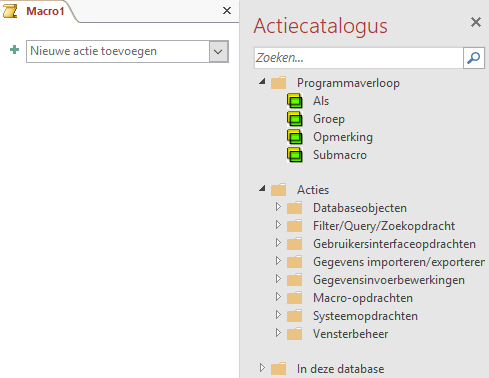
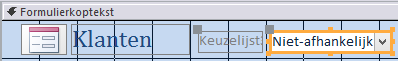
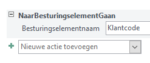
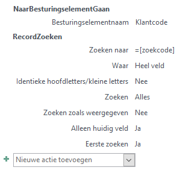
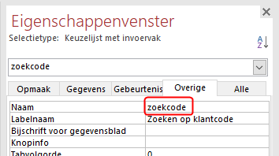
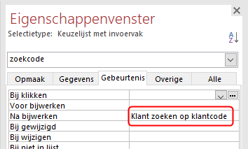
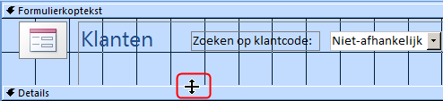
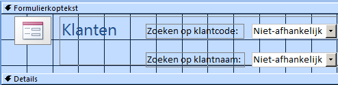
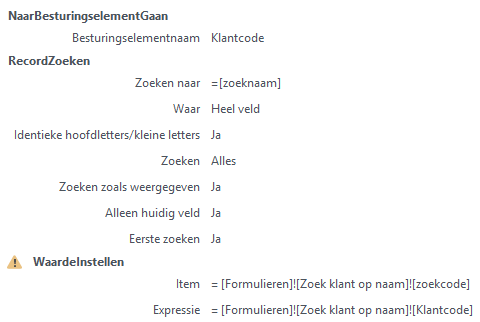

# Macro's {#macros}

::: {.intro data-latex=""}
+ Wat je met macro's kunt.
+ Hoe je macro's maakt.
+ Hoe je macro's combineert met een formulier.
:::

## Over macro's maken {#macros-about}

Macro's kunnen handelingen automatiseren die veel voorkomen of vrij complex zijn. Een macro is een klein programmaatje dat bepaalde acties kan uitvoeren. Zo kun je een macro de opdracht geven om een formulier te openen of om een record op te zoeken. De uitvoering van een macro wordt vaak aan een besturingselement zoals een opdrachtknop toegekend. Bij het klikken op de knop worden dan de opdrachten die in de macro zitten uitgevoerd. Zo kun je extra functies aan formulieren en rapporten toekennen. Een macro wordt als een object in de database zelf opgeslagen.

In feite bestaat een macro in Access uit een lijst van achter elkaar uit te voeren acties. Voor de meeste acties zijn een of meer argumenten nodig. Voor het maken van macro's heb je geen programmeerkennis nodig. 

```{r macro-window-1, fig.cap="Macrovenster met actiecatalogus.", out.width="75%"}

```

Een aandachtspunt bij macro's is het aspect van veiligheid. Access verdeelt de mogelijke macro acties in twee soorten:

+ onschadelijke acties, ongeacht hoe ze worden gebruikt
+ gevaarlijke acties

Zelfs een actie als [Afdrukken]{.uicontrol} wordt als gevaarlijk beschouwd, omdat je ook ongewenste opdrachten naar de printer kunt sturen.

Bij het toevoegen van acties in het macrovenster toont Access standaard alleen de acties die volkomen veilig zijn. Om een volledige lijst met acties te krijgen, inclusief de gevaarlijke acties, moet je een instelling wijzigen. Kies dan in het macro venster [tab Design > Alle acties weergeven (groep Weergeven/verbergen)]{.uicontrol}.

## Taak: Klant zoeken op code {#macros-customercode}

Er moet een formulier gemaakt worden met daarop de gegevens van een klant. Om het de gebruiker wat gemakkelijker te maken om een bepaalde klant waarvan je de klantcode kent, op te zoeken, moet er een keuzelijst op het formulier gemaakt worden waarop je de klantcode kunt invoeren waarna de gegevens van de bijbehorende klant in het formulier worden getoond.

ANALYSE

De basis van het formulier kan via een standaarsformulier gemaakt worden. De keuzelijst is het besturingselement[Keuzelijst met invoervak]{.uicontrol}. Verder dient er een macro gemaakt te worden die twee taken uitvoert. Allereerst naar de keuzelijst gaan en daarna het record opzoeken dat hoort bij de ingevoerde klantcode.

::: {.practice data-latex=""}
1. Selecteer de tabel [Klanten]{.varname}. Deze hoeft niet geopend te worden.

2. Klik [tab Maken > Formulier (groep Formulieren)]{.uicontrol}. Het formulier wordt aangemaakt en geopend in de Indelingsweergave.

3. Sla het formulier op onder de naam [Zoek klant op code]{.varname}. Het gemakkelijkste gaat dit via de knop [Opslaan]{.uicontrol}  in de [werkbalk Snelle toegang]{.uicontrol}.

4. Schakel over naar de Ontwerpweergave.

5. Selecteer [Ontwerp > Keuzelijst met invoervak (groep Besturingselementen)]{.uicontrol}  en teken daarna rechts in het deel van de formulierkoptekst een rechthoekig kader voor de keuzelijst.

```{r customercode-combobox-framework, fig.cap="Formulier met keuzelijst.", out.width="75%"}

```

   Na het tekenen van het kader wordt automatisch de Wizard keuzelijst met invoervak opgestart.

6. Beantwoord de achtereenvolgende vragen van de Wizard als volgt:

   + De waarden voor de keuzelijst met invoervak moeten worden opgezocht in een tabel of query.
   + Tabel: Klanten levert de waarden voor de keuzelijst met invoervak.
   + Alleen het veld Klantcode moet worden toegevoegd aan de keuzelijst met invoervak.
   + Records oplopend sorteren op klantcode.
   + De voorgestelde breedte van de kolom in de keuzelijst accepteren.
   + De waarde bewaren voor later gebruik.
   + Tekst voor het label bij de keuzelijst: Zoeken op klantcode:
   
   Na het Voltooien van de Wizard ben je weer terug in de Ontwerpweergave.

7. Wanneer het label en de keuzelijst gedeeltelijk over elkaar heen liggen moet je een van beide of beide wat verplaatsen. Dit doe je door het vierkantje in de linkerbovenhoek van het object met een ingedrukte linkermuisknop te verslepen.

8. Sluit het formulier [Zoek klant op code{.varname} en bewaar de wijzigingen.

9. Kies [tab Maken > Macro (groep Macro's en code)]{.uicontrol}.

```{r macro-window-2, fig.cap="Macro venster.", out.width="75%"}

```

10. Klik op de keuzepijl in het vak [Nieuwe actie toevoegen]{.uicontrol} en selecteer uit de lijst de actie [NaarBesturingselementGaan]{.uicontrol}.

11. Typ [Klantcode]{.userinput} in het vak [Besturingselementnaam]{.uicontrol}.

```{r macro-customercode-gotocontrol-1, fig.cap="Actie NaarBesturingselementGaan.", out.width="75%"}

```

12. Klik op de keuzepijl in het vak [Nieuwe actie toevoegen]{.uicontrol} en selecteer actie [RecordZoeken]{.uicontrol}.

13. Typ de waarde `=[zoekcode]` in het vak [Zoeken naar]{.uicontrol}. De andere argumenten zijn al automatisch door Access van een standaardwaarde voorzien en kunnen blijven staan.

```{r macro-customer-by-code, fig.cap="Macro Klant zoeken op klantcode.", out.width="60%"}

```

14. Sluit het macrovenster en bewaar de macro onder de naam [Klant zoeken op klantcode]{.varname}.

15. Open formulier [Zoek klant op code]{.varname} in de Ontwerpweergave.

16. Selecteer de [Keuzelijst met invoervak]{.uicontrol} en wijzig in [Eigenschappenvenster (tab Overige)]{.wintitle} de naam van het besturingselement in [zoekcode]{.userinput}.

```{r customercode-combobox-name, fig.cap="Naam keuzelijst gewijzigd in zoekcode.", out.width="75%"}

```

17. Met nog steeds de keuzelijst geselecteerd klik in [Eigenschappenvenster (tab Gebeurtenis)]{.uicontrol} in het vak [Na bijwerken]{.uicontrol} en selecteer via de keuzepijl de macro [Klant zoeken op klantcode]{.varname}.

```{r customercode-combobox-afterupdate, fig.cap="Keuzelijst eigenschap Na bijwerken.", out.width="75%"}

```

18. Sluit het formulier en bewaar de wijzigingen.

19. Open formulier [Zoek klant op code]{.varname} en test of de keuzelijst goed werkt.
:::

## Taak: Klant zoeken op naam {#macros-customer-name}

Om deze taak uit te kunnen voeren is het noodzakelijk dat je eerst de taak in \@ref(macros-customercode) hebt uitgevoerd. Hierin heb je het formulier [Zoek klant op code]{.varname} gemaakt dat in deze taak gebruikt wordt.

Er moet een formulier gemaakt worden met daarop de gegevens van een klant en met twee keuzelijsten. Via de eerste keuzelijst moet een klant op basis van de klantcode gezocht worden en via de tweede lijst via de naam. Bij dit laatste moet in de gesorteerde lijst eerst de achternaam getoond worden, met daarachter de voornaam. Na het maken van een keuze via een van beide lijsten moet de gegevens van de klant in het formulier getoond worden.

ANALYSE

Als basis van het nieuwe formulier kan het eerder gemaakte formulier [Zoek klant op code]{.varname} genomen worden. In Access kun je een kopie van een formulier maken en dat onder een andere naam opslaan. Hierop moet dan de tweede keuzelijst gemaakt worden. Verder dient er een macro gemaakt te worden die de taken uitvoert. Allereerst naar de keuzelijst gaan en daarna het bijbehorende record opzoeken.

::: {.practice data-latex=""}
1. Geef een rechter muisklik op het formulier [Zoek klant op code]{.varname} en kies dan uit het snelmenu voor [Kopiëren]{.uicontrol}. Geef dan een nieuwe rechter muisklik en kies dan uit snelmenu voor [Plakken]{.uicontrol}.

2. Noem het nieuwe formulier [Zoek klant op naam]{.varname} en open het formulier in de Ontwerpweergave.

3. Maak het gedeelte voor de formulierkoptekst wat groter. Positioneer de muis boven de bovenrand van Details totdat deze wijzigt zoals in figuur \@ref(fig:customername-formheader) is weergegeven. Druk dan de linker muisknop in en sleep de rand wat naar beneden zodat er voldoende ruimte is voor de tweede keuzelijst.

```{r customername-formheader, fig.cap="Vergroten ruimte formulierkoptekst.", out.width="75%"}

```

4. Maak een tweede [Keuzelijst met invoervak]{.uicontrol} onder de eerste keuzelijst.

5. Beantwoord de vragen van de Wizard achtereenvolgens als volgt:

   + De waarden voor de keuzelijst met invoervak moeten worden opgezocht in een tabel of query.
   + Tabel: [Klanten]{.varname} levert de waarden voor de keuzelijst met invoervak.
   + Voeg aan de keuzelijst met invoervak achtereenvolgens de volgende velden toe: [Achternaam]{.varname}, [Voornaam]{.varname}, [Klantcode]{.varname}.
   + Records oplopend sorteren eerst op achternaam en dan op voornaam.
   + De voorgestelde breedte van de kolom in de keuzelijst accepteren en aanvinken dat de sleutelkolom (dat is de [Klantcode]{.varname}) verborgen moet worden.
   + De waarde bewaren voor later gebruik.
   + Tekst voor het label bij de keuzelijst: [Zoeken op klantnaam:]{.userinput}
   
   Na het Voltooien van de Wizard ben je weer teug in de Ontwerpweergave.

6. Zorg ervoor dat labels en keuzelijsten netjes onder elkaar zijn uitgelijnd.

```{r customername-comboboxes, fig.cap="Formulier met twee keuzelijsten.", out.width="75%"}

```

7. Selecteer de tweede Keuzelijst met invoervak en wijzig in [Eigenschappenvenster (tab Overige)]{.wintitle} de naam van het besturingselement in [zoeknaam]{.varname}. Klik op de keuzepijl in het vak [Na bijwerken]{.uicontrol} en typ [Klant zoeken op naam]{.varname}.

::: {.info data-latex=""}
Deze macro bestaat nog niet en wordt in de volgende stap gemaakt.
:::

8. Sluit het formulier en bewaar de wijzigingen.

9. Kies [tab Maken > Macro (groep Macro's en code)]{.uicontrol}.

```{r macro-window, fig.cap="Macro venster.", out.width="75%"}

```

10. Klik op de keuzepijl in het vak [Nieuwe actie toevoegen]{.uicontrol} en selecteer uit de lijst de actie [NaarBesturingselementGaan]{.uicontrol} en voer als Argument in [Klantcode]{.varname}.

11. Typ [Klantcode]{.varname} in het vak [Besturingselementnaam]{.uicontrol}.

```{r macro-customercode-gotocontrol-2, fig.cap="Actie NaarBesturingselementGaan.", out.width="60%"}

```

12. Klik op de keuzepijl in het vak [Nieuwe actie toevoegen]{.uicontrol} en selecteer actie [RecordZoeken]{.uicontrol}.

13. Typ de waarde `=[zoeknaam]` in het vak [Zoeken naar]{.uicontrol}. De andere argumenten zijn al automatisch door Access van een standaardwaarde voorzien en kunnen blijven staan.

::: {.info data-latex=""}
Om er voor te zorgen dat de waarde van de eerste keuzelijst mee verandert bij het kiezen van een naam, moet hiervoor nog een actie ingesteld worden. De waarde voor zoekcode moet gelijk worden aan de klantcode van het gevonden record.
:::

14. Voeg een actie toe met de naam [WaardeInstellen]{.varname}. Deze actie beschouwt Access als een gevaarlijke actie welke standaard niet getoond wordt. Deze moet eerst in de lijst zichtbaar gemaakt worden door de instelling [Alle acties weergeven (groep Weergeven/verbergen)]{.uicontrol}. Deze Actie heeft twee parameters, Item en Expressie, welke de volgende waarden dienen te krijgen.

   + Item: `[Formulieren]![Zoek klant op naam]![zoekcode]`
   + Expressie: `[Formulieren]![Zoek klant op naam]![Klantcode]`

```{r macro-customer-by-name, fig.cap="Macro customer by name.", out.width="75%"}

```

15. Sluit het macrovenster en bewaar de macro onder de naam [Klant zoeken op naam]{.varname}.

16. Open formulier [Zoek klant op naam]{.varname} en test de werking van beide keuzelijsten.

::: {.info data-latex=""}
Wanneer de eerste keuzelijst gebruikt wordt, verschijnt niet de bijbehorende naam in de tweede keuzelijst. Om dit voor elkaar te krijgen moet aan de bijbehorende macro ook een actie [WaardeInstellen]{.uicontrol} worden toegevoegd. Maar dat heeft consequenties voor de werking van de keuzelijst op formulier [Zoek klant op code]{.varname}.
:::

:::

## Taak: Keuzelijst dooscode {#macros-boxcode}

Deze taak is een variant op de taak waarbij de klant op basis van de klantcode gezocht wordt. Er moet nu een formulier gemaakt worden met daarop de gegevens van een doos en op dat formulier een keuzelijst om de dooscode te zoeken.

ANALYSE

De basis van het formulier kan via een standaardformulier gemaakt worden. De keuzelijst is het besturingselement [Keuzelijst met invoervak]{.uicontrol}. Je moet een macro maken die twee taken uitvoert. Allereerst naar de keuzelijst gaan en de dooscode ophalen. Daarna het bijbehorende record opzoeken.

::: {.practice data-latex=""}
1.  Maak een nieuw formulier met keuzelijst en noem deze [Zoek doos op code]{.varname}.

2.  Maak de macro en noem deze [Zoek doos op code]{.varname}

3.  Open formulier [Zoek doos op code]{.varname} en test of de keuzelijst goed werkt.
:::
