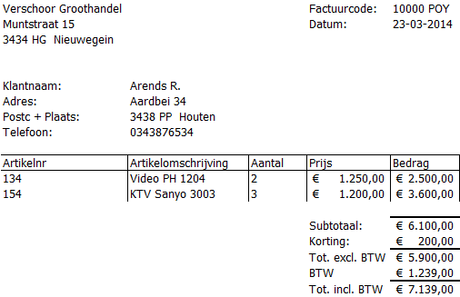
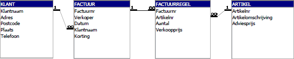
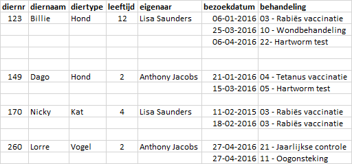

# Normaliseren {#normalization}

::: {.intro data-latex=""}
Ontwerpen van een relationele database via een normalisatieproces tot en met de derde normaalvorm.
:::

In een database worden gegevens over een bepaald onderwerp bijgehouden. Dit zou in principe in één grote tabel kunnen, maar dat is niet erg efficiënt. Gebruikers hebben vaak een specifieke informatiebehoefte, ze willen slechts bepaalde gegevens zien die aan bepaalde voorwaarden voldoen. Het ontwerp moet er voor zorgen dat je aan de informatiebehoefte van de databasegebruiker kunt voldoen. Dat kan niet goed met één grote tabel. Ook het onderhoud van gegevens verloopt moeizaam in een dergelijke tabel.

In een relationele database worden de gegevens in afzonderlijke tabellen ondergebracht. Door middel van [sleutelvelden]{.term} worden de tabellen met elkaar verbonden. Hierdoor kunnen gerelateerde gegevens uit verschillende tabellen opgevraagd worden. Hierbij is het van belang dat de gegevens goed over logisch samenhangende tabellen verdeeld zijn en dat de gegevens maar op één plaats worden opgeslagen, dus in één veld in één tabel. Ook mogen gegevens niet tegenstrijdig ([inconsistent]{.term}) zijn, zoals bijvoorbeeld de vermelding van een niet bestaand klantnummer in een tabel facturen.

::: {.info-data-latex=""}
Als hetzelfde gegeven vaker dan 1 keer worden opgeslagen, dan heet dat ook wel [redundantie]{.term}.
:::

Elk record moet iets unieks hebben waarmee je het record in de tabel kunt vinden. Dit unieke is de inhoud (waarde) van een of meerdere velden en wordt de [primaire sleutel]{.term} van de tabel genoemd.

Een goed ontwerp van de database is van belang. En dit ontwerp wordt gemaakt voordat met de bouw van de database begonnen wordt. Vergelijk het met de bouw van een huis waar de architect eerst een tekening maakt en pas dan gaat de aannemer het huis bouwen. Om tot een goed ontwerp te komen heeft Edgar Codd een ontwerptechniek bedacht die bekend staat onder de naam [normaliseren]{.term}. Via een aantal stappen wordt de tabellenstructuur van de database vastgesteld. Na elke stap ontstaat een nieuwe vorm van de database die daardoor steeds verder genormaliseerd wordt. Er bestaan 5 [normaalvormen]{.term}, waarbij de eerste normaalvorm het minst en de vijfde normaalvorm het meest genormaliseerd is. In de praktijk zijn de meeste databases genormaliseeerd tot de derde normaalvorm.

De notatiewijze voor een gegevensverzameling (tabel), de verzamelde gegevens (velden in de tabel) en de sleutel ziet er als volgt uit:

[KLANT]{.term}([klantnr]{.key}, naam, straat, huisnr, postcode, plaats)

Hierbij is [KLANT]{.term} de naam van de gegevensverzameling, de tabelnaam dus. En tussen de haakjes staan de veldnamen. De onderstreepte veldnamen vormen de sleutel van de tabel.

## Sleutel {#norm-sleutel}

In de tabellen van een relationele database zijn gelijksoortige gegevens opgeslagen in de velden van records (rijen). Records moeten gevonden kunnen worden via een unieke waarde van deze gegevens. Zo'n unieke waarde wordt een [kandidaatsleutel]{.term} genoemd. Vaak is er in een tabel maar één kandidaatsleutel, maar het is mogelijk dat er meerdere kandidaatsleutels zijn. Uit de beschikbare kandidaatsleutels wordt er eentje gekozen tot de [(primaire) sleutel]{.term}. Een tabel moet daarom zo ontworpen worden dat er een sleutel gedefinieerd kan worden. Wanneer zo'n sleutel niet uit de gegevens samengesteld kan worden moet er een kunstmatig sleutelveld gemaakt worden. Vaak is dat een nummer, een id. Enkele voorbeelden van mogelijke sleutelvelden:

+ Artikelnummer
+ Klantnummer
+ Ordernummer
+ Factuurnummer
+ Burgerservicenummer (BSN)
+ IBAN

Een sleutel bestaat uit 1 of meerdere veldnamen uit een tabel. Iedere sleutelwaarde is uniek; d.w.z. dat iedere sleutelwaarde slechts één keer in de tabel mag voorkomen. Verder moet de sleutel minimaal zijn, uit zo min mogelijk veldnamen bestaan.

#### Voorbeeld 1 {-#norm-vb1}

Mogelijke unieke kenmerken voor een auto zijn het chassisnummer en het kenteken. Hierdoor kan bijvoorbeeld het kenteken een sleutel zijn in een tabel met gegevens van auto's:

[AUTO]{.term}([kenteken]{.key}, merk, type, gewicht, brandstof, kleur)

#### Voorbeeld 2 {-#norm-vb2}

Een tabel [PRODUCTEN]{.term} heeft de volgende inhoud:

```{r vb2, echo=FALSE}
mydf <- data.frame(afmeting = c(8, 10, 12, 14, 8, 10, 12, 14),
				   kleur = c("rood", "groen", "blauw", "geel", "rood", "groen", "blauw", "geel"),
				   lengte = c(rep(50, 4), rep(100, 4)))
mydf %>%
	kbl() %>% 
	kable_styling(full_width = FALSE, bootstrap_options = "condensed", font_size = 14, position = "left")
```

Zowel afmeting, kleur als lengte kan niet als sleutel voor de tabel dienen, omdat in elk veld (kolom) geen unieke waarde voorkomt. Via een combinatie van velden is wel een unieke waarde te vinden. Ga na dat de volgende combinaties geschikte kandidaatsleutels voor deze tabel zijn:

+ [afmeting]{.key}, [lengte]{.key}
+ [kleur]{.key}, [lengte]{.key}

#### Voorbeeld 3 {-#norm-vb3}

Een deel van de inhoud van een tabel met adresgegevens ziet er als volgt uit:

```{r vb3, echo=FALSE}
mydf <- data.frame(straat = c("Dorpstraat", "Dorpstraat", "Dorpstraat"),
				   huisnummer = c(12, 14, 12),
				   postcode = c("1234 AB", "1234 AB", "4321 BA"),
				   plaats = c("Janstad", "Janstad", "Karelsdijk"))
mydf %>%
	kbl() %>% 
	kable_styling(full_width = FALSE, bootstrap_options = "condensed", font_size = 14, position = "left")
```

Ga na dat de sleutel niet uit één veld kan bestaan en dat [postcode]{.key}, [huisnr]{.key} een geschikte kandidaatsleutel is:

#### Voorbeeld 4 {-#norm-vb4}

Een bedrijf heeft de volgende gegevensverzameling voor klanten:

[KLANTEN]{.term}(naam, adres, postcode, plaats, telnr)

Het kan voorkomen dat twee klanten op hetzelfde adres wonen. Indien dit het geval is hebben ze echter verschillende namen: bijvoorbeeld H. Linde sr. en H. Linde jr. Het kan ook voorkomen dat exact dezelfde klantnaam tweemaal in de tabel voorkomt. In dat geval betreft het twee klanten die op verschillende adressen wonen.

Ga na dat de sleutel hier niet uit één veld kan bestaande te vinden en dat de volgende combinaties geschikte kandidaatsleutels voor deze tabel zijn:

+ [naam]{.key}, [telnr]{.key}
+ [naam]{.key}, [adres]{.key}, [postcode]{.key}

In de praktijk wordt vaak een uniek klantnummer voor elke klant ingevoerd.

#### Voorbeeld 5 {-#norm-vb5}

```{r bieb, echo=FALSE}
LID <- data.frame(Lidnr = c(1, 2, 3),
				  Naam = c("G. Hannes","G. Rotgans", "R. Wagner"),
				  Adres = c("Orion 2", "Venus 23", "Jupiter 2"),
				  Postcode = c("3434 TT", "3434 RR", "3434 SP"),
				  Plaats = c(rep("Tiel", 3)))

BOEK <- data.frame(Boeknr = c(1, 2, 3),
				   ISBN = c("9080022217", "9062552277", "9062552277"),
				   Titel = c("Praktijk van het zweefvliegen", "De wolken en het weer", "De wolken en het weer"),
				   Auteur = c("W. Adriaansen", "G. de Bont", "G. de Bont"))

UITLEEN <- data.frame(Lidnr  = c(2, 2, 3),
					  Boeknr = c(1, 2, 3),
					  Terugdatum = c("12-10-2011", "12-10-2011", "11-10-2011"))
```

Een kleine bibliotheek heeft ongeveer 9000 boeken (dubbele exemplaren mogelijk) en 400 leden. Men heeft de volgende informatiebehoeften:

+ Eens per jaar moeten etiketten geprint kunnen worden voor alle leden.
+ Eens per half jaar moet een lijst uitgedraaid kunnen worden met alle boeken die de bibliotheek bezit en die er als volgt uitziet (het aantal wordt berekend bij het maken van deze lijst):

```{r vb5-boeken, echo=FALSE}
mydf <- data.frame(ISBN = c("9080022217", "9062552277"),
				   Titel = c("Praktijk van het zweefvliegen", "De wolken en het weer"),
				   Auteur = c("W. Adriaansen", "G. de Bont"),
				   Aantal = c(1, 2))
mydf %>%
	kbl() %>% 
	kable_styling(full_width = FALSE, bootstrap_options = "condensed", font_size = 14)
```

+ Van ieder boek dat uitgeleend wordt moet bijgehouden worden: het nummer van het boek, het nummer van het lid en de datum waarop het boek uiterlijk terug bezorgd dient te worden. Eens per week worden er etiketten en brieven uitgeprint betreffende de boeken die minstens 1 maand te laat zijn.
+ Op het etiket staan de gegevens van het lid waarvan 1 of meerdere boeken minstens 1 maand te laat zijn. In de brief staan de gegevens van het lid en de gegevens van de boeken die minstens 1 maand te laat zijn.
+ De database met leden-, boeken- en uitleenadministratie heeft drie tabellen:

[LID]{.term}([Lidnr]{.key}, Naam, Adres, Postcode, Plaats)

[BOEK]{.term}([Boeknr]{.key}, ISBN, Titel, Auteur)

[UITLEEN]{.term}([Boeknr]{.key}, Lidnr, Terugdatum)

Een gedeeltelijke invulling van deze tabellen is hierna te zien.

```{r vb5-lid, echo=FALSE}
LID %>%
	kbl(caption = "tabel LID") %>% 
	kable_styling(full_width = FALSE, bootstrap_options = "condensed", font_size = 14, position = "left")
```

```{r vb5-boek, echo=FALSE}
BOEK %>%
	kbl(caption = "tabel BOEK") %>% 
	kable_styling(full_width = FALSE, bootstrap_options = "condensed", font_size = 14, position = "left")
```


```{r vb5-uitleen, echo=FALSE}
UITLEEN %>%
	kbl(caption = "tabel UITLEEN") %>% 
	kable_styling(full_width = FALSE, bootstrap_options = "condensed", font_size = 14, position = "left")
```

In de tabel [UITLEEN]{.term} is [Terugdatum]{.varname} de datum waarop de uitleentermijn afloopt. Als een boek terug wordt gebracht, wordt het betreffende record (= rij uit de tabel) uit de tabel [UITLEEN]{.term} verwijderd. In de tabel [UITLEEN]{.term} staan dus alleen gegevens over boeken die op dit moment uitgeleend zijn. Wanneer het boek opnieuw uitgeleend wordt dan wordt er een nieuw record met een nieuwe [Terugdatum]{.varname} aangemaakt. Er is een plan voor een nieuwe opzet waarbij alle uitleenrecords gedurende een jaar bewaard worden. De opzet van de tabel moet hierdoor gewijzigd worden.

Ga na dat in de huidige opzet van de tabel [UITLEEN]{.term} het veld [Boeknr]{.varname} inderdaad als sleutel kan dienen, dat dit in de nieuwe opzet niet meer kan en dat de combinatie [Boeknr]{.key}, [Terugdatum]{.key} in de nieuwe opzet een kandidaatsleutel is.

## Normalisatieproces {#norm-proces}

Bij het normalisatieproces worden de verzamelde gegevens ([attributen]{.term}) verdeeld in afzonderlijke gegevensgroepen en wordt er voor verbindingen tussen deze groepen gezorgd. Het uiteenrafelen en groeperen van gegevens wordt [normaliseren]{.term} genoemd.

::: {.info}
In plaats van de term gegevensgroep wordt ook de term [objecttype]{.term}, [entiteit]{.term} of [tabel]{.term} gebruikt.
:::

Het normalisatieproces bestaat uit een aantal stappen waarin de structuur van de database vastgesteld. Het resultaat van zo'n stap wordt een [normaalvorm]{.term} genoemd. Gestart wordt met de nulde normaalvorm (0 NV). Daarna ontstaan achtereenvolgens de eerste normaalvorm (1 NV), de tweede normaalvorm (2 NV) en tot slot de derde normaalvorm (3 NV).

Aan de hand van een voorbeeld wordt het normaliseren besproken.

INFORMATIEBEHOEFTE

De informatiebehoefte van groothandel Verschoor bestaat uit het genereren van facturen. Een voorbeeld van zo'n factuur is in de volgende afbeelding te zien.

```{r example-invoice, fig.cap="Voorbeeld van een factuur van Verschoor.", echo=FALSE}

```

### Nulde normaalvorm (0 NV) {#norm-0nv}

De eerste stap is het bepalen van de benodigde gegevens, uitgaande van de informatiebehoefte. Op de factuur zijn verschillende soorten gegevens te zien. Deze kunnen onderscheiden worden in:

#### Constante gegevens {-}

Dit zijn gegevens die steeds hetzelfde zijn. Op de factuur zijn dit de gegevens van de groothandel zelf (naam en adresgegevens). Deze gegevens kunnen in de loop van de tijd wel veranderen, maar gedurende een bepaalde periode mogen ze als constant beschouwd worden. Het is zelfs mogelijk deze gegevens vooraf op de factuur te drukken.

::: {.info data-latex=""}
**Constante gegevens worden niet opgenomen naar de database.**
:::

#### Procesgegevens {-}

Procesgegevens zijn gegevens die uit andere gegevens kunnen worden afgeleid, bijvoorbeeld doordat ze uit die andere gegevens berekend kunnen worden. Op de factuur komen de volgende procesgegevens voor:

+ `Bedrag`, wordt berekend via `Aantal` x `Prijs`
+ `Subtotaal`, wordt berekend door alle bedragen op te tellen.
+ `Tot. excl. BTW`, berekend uit `Subtotaal` - `Korting`
+ `BTW`, wordt berekend via 21% x `Tot. excl. BTW`
+ `Tot. incl. BTW`, berekend uit `Tot. excl. BTW` - `BTW`

::: {.info data-latex=""}
**Procesgegevens worden niet opgenomen in de database.**
:::

#### Elementaire gegevens {-}

Elementaire gegevens zijn alle essentiële gegevens die niet opgesplitst kunnen worden. Op de factuur komen de volgende elementaire gegevens voor: `datum`, `Klantnaam`, `Adres`, `Postcode`, `Plaats`, `Telefoon`, `Artikelnr`, `Artikelomschrijving`, `Aantal`, `Prijs` en `Korting`.

::: {.info data-latex=""}
**Elementaire gegevens worden in de database opgenomen.**
:::

#### Samengestelde gegevens {-}

Dit zijn gegevens die opgesplitst kunnen worden in elementaire gegevens. De zo ontstane elementaire gegevens worden in de database opgenomen. Op de factuur is `Factuurcode` een samengesteld gegeven, omdat deze te splitsen is in een factuurnummer (10000) en een afkorting van de verkoper (POY). Aan de groep met elementaire gegevens wordt daarom toegevoegd `Factuurnr` en `Verkoper`.

::: {.info}
`Adres` zou ook opgesplitst kunnen worden in straatnaam en huisnummer. Voor deze informatiebehoefte is dit niet van belang en daarom is hiervoor niet gekozen.
:::

De verzamelde lijst met elementaire gegevens (eigenschappen, attributen) voor de factuur is dan

[FACTUUR]{.term}(Factuurnr, Verkoper, Datum, Klantnaam, Adres, Postcode, Plaats, Telefoon, Artikelnr, Artikelomschrijving, Aantal, Prijs, Korting)

De attributen die vaker dan één keer voorkomen worden ook wel een [Repeterende Groep (Repeating Group)]{.term} genoemd, afgekort als [RG]{.term. Omdat op de factuur meerdere factuurregels met artikelen voorkomen vormen de attributen [Artikelnr]{.varname}, [Artikelomschrijving]{.varname}, [Aantal]{.varname} en [Prijs]{.varname} een RG. Het is als voorbereiding op de volgende stap handig om een RG in de lijst aan te duiden.

[FACTUUR]{.term}(Factuurnr, Verkoper, Datum, Klantnaam, Adres, Postcode, Plaats, Telefoon, Korting, RG [Artikelnr, Artikelomschrijving, Aantal, Prijs])

Als laatste moet een sleutel worden aangewezen. Dit wordt [Factuurnr]{.varname} en dit attribuut wordt in de lijst onderstreept. De 0 NV ziet er dan als volgt uit:

[FACTUUR]{.term}([Factuurnr]{.key}, Verkoper, Datum, Klantnaam, Adres, Postcode, Plaats, Telefoon, Korting, RG [Artikelnr, Artikelomschrijving, Aantal, Prijs])

### Eerste normaalvorm (1 NV) {#norm-1nv}

Om van de nulde naar de eerste normaalvorm te komen worden alle RG's afgesplitst en in een nieuwe gegevensgroep (tabel) ondergebracht. Om een koppeling tussen de tabellen mogelijk te maken wordt de sleutel van de tabel waaruit de RG vandaan komt
aan de nieuwe tabel toegevoegd. Van de nieuwe tabel wordt dan de sleutel vastgesteld. Meestal is dit een combinatie van een sleutelattribuut uit de RG met de sleutel van de oorspronkelijke tabel, de [vreemde sleutel (foreign key)]{.term}.

In de 0 NV komt maar 1 RG voor met [Artikelnr]{.varname} als kandidaatsleutel:

RG[Artikelnr, Artikelomschrijving, Aantal, Prijs]

Deze gegevensgroep wordt ondergebracht in een nieuwe tabel [FACTUURREGEL]{.term} waaraan de sleutel van de oorspronkelijke tabel, [Factuurnr]{.key}, wordt toegevoegd. Samen vormen deze de samengestelde sleutel van de nieuwe tabel [FACTUURREGEL]{.term}.

De 1 NV wordt dan:

[FACTUUR]{.term}([Factuurnr]{.key}, Verkoper, Datum, Klantnaam, Adres, Postcode, Plaats, Telefoon, Korting)

[FACTUURREGEL]{.term}([Factuurnr]{.key}, [Artikelnr]{.key}, Artikelomschrijving, Aantal, Prijs)

### Tweede normaalvorm (2 NV) {#norm-2nv}

Om van de eerste naar de tweede normaalvorm te komen moeten alle gegevensgroepen (tabellen) met een samengestelde sleutel onderzocht worden. Van alle attributen die geen onderdeel van de sleutel vormen, moet bekeken worden of deze functioneel afhankelijk zijn van een deel van de sleutel. Zo ja, dan moeten deze attributen in een nieuwe tabel worden ondergebracht en moet het sleuteldeel waarvan ze afhankelijk zijn aan deze tabel worden toegevoegd.

::: {.info}
Een attribuut A is functioneel afhankelijk van attribuut B als bij iedere waarde van B precies één waarde van A hoort. Zo is de titel van een boek functioneel afhankelijk van het ISBN nummer omdat bij ieder ISBN nummer precies één titel hoort.
:::

Alleen tabel [FACTUURREGEL]{.term} heeft een samengestelde sleutel en hiervan moeten de niet-sleutelvelden onderzocht worden op eventuele functionele afhankelijkheid van een deel van de sleutel, van [Factuurnr]{.key} of van [Artikelnr]{.key}.

+ [Artikelomschrijving]{.varname}, is functioneel afhankelijk van [Artikelnr]{.key}. Immers bij ieder artikelnummer hoort precies één omschrijving van het artikel.

+ [Aantal]{.varname} is niet functioneel afhankelijk van [Artikelnr]{.key} en ook niet van [Factuurnr]{.key}. Het is een waarde die door de klant wordt bepaald en kan per factuur een andere waarde hebben.

+ [Prijs]{.varname}, is meestal niet functioneel afhankelijk van [Artikelnr]{.key}. Dit komt omdat de prijs meestal van de verkoopdatum afhangt en er in de loop van de tijd prijswijzigingen kunnen optreden. Ook kan de prijs door onderhandelingen bepaald worden. Het attribuut [Prijs]{.varname} bevat dus de waarde van de verkoopprijs. In dit voorbeeld wordt gekozen om het oorspronkelijke attribuut [Prijs]{.varname} te vervangen door twee nieuwe attributen:

  - [Verkoopprijs]{.varname}, deze is niet functioneel afhankelijk van [Artikelnr]{.key}
  - [Adviesprijs]{.varname}, deze is wel functioneel afhankelijk van [Artikelnr]{.key}

Het onderzoek heeft nu opgeleverd dat twee attributen functioneel afhankelijk zijn van [Artikelnr]{.key}, namelijk [Artikelomschrijving]{.varname} en [Adviesprijs]{.varname}. Deze twee gegevens worden ondergebracht in een nieuwe tabel [ARTIKEL]{.term} en tevens wordt het veld [Artikelnr]{.key} hieraan toegevoegd, daar zijn de twee gegevens immers van afhankelijk. Dit veld is tevens de sleutel van de nieuwe tabel.

De 2 NV wordt dan:

[FACTUUR]{.term}([Factuurnr]{.key}, Verkoper, Datum, Klantnaam, Adres, Postcode, Plaats, Telefoon, Korting)

[FACTUURREGEL]{.term}([Factuurnr]{.key}, [Artikelnr]{.key}, Artikelomschrijving, Aantal, Verkoopprijs)

[ARTIKEL]{.term}([Artikelnr]{.key}, Artikelomschrijving, Adviesprijs)

### Derde normaalvorm (3 NV) {#norm-3nv}

Om van de tweede naar de derde normaalvorm te komen moeten alle tabellen onderzocht worden. Wanneer hierin niet-sleutel attributen zitten die functioneel afhankelijk zijn van andere niet-sleutel attributen, dan moeten deze afhankelijke attributen in een nieuwe tabel worden ondergebracht en moet het attribuut waarvan ze afhankelijk zijn aan deze tabel worden toegevoegd.

Veronderstel dat in dit voorbeeld de [Klantnaam]{.varname} uniek is. In dat geval zijn in de tabel [FACTUUR]{.term} de attributen [Adres]{.varname}, [Postcode]{.varname}, [Plaats]{.varname} en [Telefoon]{.varname} functioneel afhankelijk van het attribuut [Klantnaam]{.varname} want bij iedere Klantnaam hoort precies één waarde voor Adres, Postcode, Plaats en Telefoon.

::: {.info}
Ook wanneer de Klantnaam niet uniek is, worden dit soort bij elkaar behorende gegevens toch in een nieuwe tabel ondergebracht waarbij dan een uniek klantnummer wordt bedacht.
:::

De klantgegevens worden in een nieuwe tabel [KLANT]{.term} ondergebracht en het veld [Klantnaam]{.varname} wordt hiervan de sleutel.

De 3 NV wordt dan:

[FACTUUR]{.term}([Factuurnr]{.key}, Verkoper, Datum, Klantnaam, Korting)

[KLANT]{.term}([Klantnaam]{.key}, Adres, Postcode, Plaats, Telefoon)

[FACTUURREGEL]{.term}([Factuurnr]{.key}, [Artikelnr]{.key}, Artikelomschrijving, Aantal, Verkoopprijs)

[ARTIKEL]{.term}([Artikelnr]{.key}, Artikelomschrijving, Adviesprijs)

### Samenvatting normalisatieproces {#norm-summary}

0 NV
: Inventarisatie van attributen (velden maken, repeterende groepen (RG) aangeven, sleutel onderstrepen.

1 NV
: Repeterende groepen afsplitsen als aparte tabellen en de sleutel van de “oude” tabel meenemen. De sleutel van de nieuwe tabel is een samengestelde sleutel.

2 NV
: Alleen voor tabellen met samengestelde sleutels: attributen afsplitsen die afhankelijk zijn van een deel van de sleutel. Dit wordt de sleutel van een nieuwe tabel.

3 NV
: Voor alle tabellen: als een attribuut afhankelijk is van een niet-sleutelveld, dan deze afhankelijkheid afsplitsen naar een nieuwe tabel.

## Gegevens Structuur Diagram (GSD) {#norm-gsd}

Een gegevensstructuurdiagram (GSD) is een tekening waarmee de relaties tussen tabellen op een overzichtelijke manier kunnen worden weergegeven.

```{r example-dsd1, echo=FALSE, fig.cap="Gegevensstructuurdiagram van de tabellen met de onderlinge relaties.", out.width="70%"}

```

Tussen deze vier tabellen bestaan verschillende relaties, zoals:

+ [Klant]{.term} - [FACTUUR]{.term} : Een factuur hoort bij precies één klant en een klant kan meerdere facturen hebben. In het GSD gaat er vanuit KLANT meerdere lijnen naar FACTUUR, aangegeven via een vertakking aan het eind.
+ [FACTUUR]{.term} - [Factuurregel]{.term} : Een factuurregel hoort bij één factuur en op een factuur kunnen meerdere factuurregels staan.
+ [FACTUURREGEL]{.term} - [Artikel]{.term} : Een factuurregel heeft altijd betrekking op één artikel en een bepaald artikel kan op meerdere factuurregels voorkomen.

Vaak wordt bij de pijl ook het attribuut (veld) vermeld waarmee de koppeling tot stand wordt gebracht.

```{r example-dsd2, echo=FALSE, fig.cap="Gegevensstructuurdiagram nu met koppelvelden", out.width="100%"}

```

Bij een GSD worden de volgende symbolen gebruikt:

+ Rechthoek: voor een tabel.
+ Enkele lijn: voor een relatie van één op één.
+ Vertakte lijn: voor een relatie van een op veel.

Een relatiediagram in Access ziet er als volgt uit

```{r example-relations, echo=FALSE, fig.cap="Relaties weergegeven in Microsoft Access"}

```

## Case - Normalisatie dierenkliniek {#norm-case}

Een dierenkliniek houdt op dit moment de behandeling van dieren bij in een Excel tabel. Deze heeft de volgende vorm.

```{r echo=FALSE, fig.cap="Behandelingen dieren"}

```

Het plan is om deze gegevens in een database bij te gaan houden waarvoor een genormaliseerde structuur van tabellen moet worden opgesteld.

#### 0 NV {-}

Alle gegevens zijn elementaire gegevens, behalve het attribuut `behandeling.` Dit is een samengesteld gegeven dat opgesplitst kan worden in een [behandelnr]{.varname} en een [behandelnaam]{.varname}.

Per dier worden meerdere behandelingen bijgehouden, [bezoekdatum]{.varname} en [behandeling]{.varname} vormen dus een Repeterende Groep (RG).

[DIER]{.term}([diernr]{.key}, diernaam, diertype, leeftijd, eigenaar, RG [bezoekdatum, behandelnr, behandelnaam])

#### 1 NV {-}

De repeterende groep wordt afgesplitst van tabel [DIER]{.term} en in een nieuwe tabel [BEZOEK]{.term} geplaatst. Aan deze tabel wordt de sleutel van tabel [DIER]{.term} toegevoegd. De sleutel van de nieuwe tabel is samengesteld uit drie velden. Ga dit na.

[DIER]{.term}([diernr]{.key}, diernaam, diertype, leeftijd, eigenaar)

[BEZOEK]{.term}([diernr]{.key}, [bezoekdatum]{.key}, [behandelnr]{.key}, behandelnaam)

#### 2 NV {-}

In tabel [BEZOEK]{.term} hangt het veld [behandelnaam]{.varname} alleen af van het veld [behandelnr]{.key} en wordt daarom uit deze tabel gehaald en in een nieuwe tabel [BEHANDELING]{.term} ondergebracht waaraan tevens het sleutelveld [behandelnr]{.key} wordt toegevoegd.

[DIER]{.term}([diernr]{.key}, diernaam, diertype, leeftijd, eigenaar)

[BEZOEK]{.term}([diernr]{.key}, [bezoekdatum]{.key}, [behandelnr]{.key})

[BEHANDELING]{.term}([behandelnr]{.key}, behandelnaam)

#### 3 NV {-}

Er zijn geen niet-sleutel velden te vinden die afhankelijk zijn van een sleutelveld. Daarom is de 3NV gelijk aan de 2NV.

#### Gegevens Structuur Diagram {-}

```{r animal-clinic-dsd, echo=FALSE, fig.cap="Gegevensstructuurdiagram dierenkliniek.", out.width="70%"}

```

## Opgaven {#norm-exercises}

```{r, child='exercises/ex-normalization.Rmd'}
```
