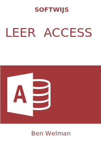
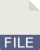

--- 
title: "Leer Microsoft Access"
author: 
  - "Ben Welman"
date: '`r format(Sys.time(), "%d %B %Y")`'
site: bookdown::bookdown_site
documentclass: book
links-as-notes: TRUE
link-citations: yes
#cover-image: images/cover.jpg
#papersize: a4
#geometry: "left=2.5cm, right=2.5cm, top=2.5cm, bottom=2.5cm"
description: |
  Een taakgericht studieboek voor het leren omgaan met Microsoft Access.
  Ontwikkeld voor met name studenten in het middelbaar en hoger onderwijs.
  Veel aandacht voor het maken van queries, formulieren en rapporten.
  Het studieboek bevat veel opgaven.
---

:::{.welcome}

# Welkom {.unnumbered}

```{asis, echo = knitr::is_html_output()}
{.cover width="200"}
Welkom bij de herziene online versie van het studieboek [Leer Access]{.term}.

Ten opzichte van de vorige versie is er inhoudelijk weinig veranderd. De verbeteringen waren er vooral op gericht om het boek aantrekkelijker en gebruikersvriendelijker te maken, zodat het boek nu ook beter leesbaar is op verschillende apparaten.

1. Bij dit studieboek horen hulpbestanden. Je kunt deze steeds via een link downloaden, maar je kunt ook het zipbestand met daarin alle bestanden downloaden.  
   <a href="data/Hulpbestanden-LeerAccess.zip" target="_blank">&nbsp;<strong>Hulpbestanden Leer Access</strong></a>

2. Het boek is ook beschikbaar in PDF- en ePub-formaat, welke je via Gumroad voor €6,99 kunt kopen. De online versie blijft gratis beschikbaar.  
   <a href="https://gum.co/ZxRTE" target="_blank">&nbsp;<strong>Koop PDF /ePub</strong></a>

3. Mocht je problemen hebben met het gebruik van het boek of vragen, neem dan contact op:  
   <a href="mailto:softwijsinfo@gmail.com">&nbsp;Email Softwijs</a>

```

## Licentie {.unnumbered}

<a rel="license" href="https://creativecommons.org/licenses/by-nc-sa/4.0/deed.nl"></a><br />Dit werk valt onder een <a rel="license" href="https://creativecommons.org/licenses/by-nc-sa/4.0/deed.nl">Creative Commons Naamsvermelding-NietCommercieel-GelijkDelen 4.0 Internationaal-licentie</a>.

## Over de auteur {.unnumbered}

Ik heb Chemische Technologie gestudeerd aan de THT, de huidige [Universiteit Twente](https://www.utwente.nl/).
Na eerst een aantal jaren scheikunde en wiskunde te hebben gegeven op middelbare scholen ben ik als docent informatica en statistiek gaan werken bij de opleiding Commercieel Technische Bedrijfskunde van de Hogeschool Enschede, nu [Saxion Hogescholen](https://www.saxion.nl/). Van daaruit intern overgestapt naar MeetingPoint dat zich voornamelijk bezighield met het ontwikkelen en ondersteunen van e-learning. In 1993 heb ik [Softwijs](https://softwijs.nl/) opgericht waarmee ik eind 2018 ben gestopt.

Na mijn pensionering heb ik tijd voor mijn hobby's: biljarten, bridgen, bierbrouwen, broodbakken en reizen (vooral met de camper en de fiets mee). Daarnaast hou ik naast het maken van studieboeken nog wat tijd over om me te verdiepen in data analyse en dan vooral met [R](https://en.wikipedia.org/wiki/R_(programming_language)) en wat minder met [Python](https://www.python.org/).

Ben Welman

Andere studieboeken:

+ [Leer Excel](https://leerexcel.netlify.app/)

+ [Data Analyse met Excel](https://excelanalyse.netlify.app/)

:::

